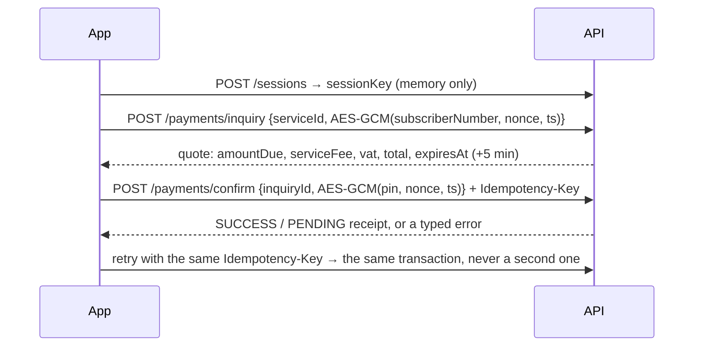
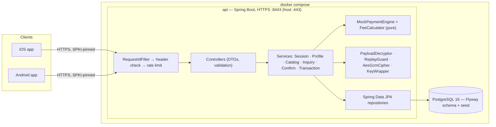

# Momkn Pay — Backend

Simulated bill-payment API for the Momkn Pay internship capstone: electricity, water, gas, internet, mobile top-up and landline. One backend, two native clients (iOS and Android) and one frozen API contract. No real money moves: a deterministic mock engine decides every payment outcome.

> **No authentication module.** Every endpoint is public and the caller names the user with the `X-User-Id` header. This is a deliberate teaching trade-off (see [ADR-001](docs/DECISIONS.md)). **Do not deploy this anywhere real.**

**Stack:** Java 25 · Spring Boot 4 · PostgreSQL 16 · Spring Data JPA · Flyway · Maven · Docker Compose

---

## Contents

1. [Quick start](#quick-start)
2. [What the API does](#what-the-api-does)
3. [Test data and mock rules](#test-data-and-mock-rules)
4. [Architecture](#architecture)
5. [Security model](#security-model)
6. [Known limitations](#known-limitations)
7. [Key decisions](#key-decisions)
8. [Testing and quality gates](#testing-and-quality-gates)
9. [Performance](#performance)
10. [API contract, Postman and mock server](#api-contract-postman-and-mock-server)
11. [Project layout](#project-layout)
12. [Contributing](#contributing)
13. [Documentation](#documentation)

---

## Quick start

**You need:** Docker (Docker Desktop on Windows/macOS), Git, OpenSSL (bundled with Git Bash on Windows), and Node.js 20+ if you want to run the Postman collection. JDK 25 is only needed to build or test outside Docker.

On Windows, run the commands below in **Git Bash**.

```bash
# 1. configuration: copy the template and fill the three blanks
cp .env.example .env
#    DB_PASSWORD=<anything>
#    APP_MASTER_KEY=<output of: openssl rand -base64 32>
#    TLS_KEYSTORE_PASSWORD=<anything>

# 2. TLS certificate, keystore and SPKI pins (written to certs/, never committed)
TLS_KEYSTORE_PASSWORD=<same value as in .env> ./scripts/generate-certs.sh

# 3. start PostgreSQL + the API (migrations and seed data run automatically)
docker compose up --build -d
docker compose ps          # wait until api is "healthy" (~30 s on first start)
```

Check it works:

```bash
curl -k https://localhost/actuator/health
# {"groups":["liveness","readiness"],"status":"UP"}

curl -k https://localhost/v1/services \
  -H "X-Request-Id: 3f6c1d2e-8a4b-4c1e-9f0a-2b7d5e6c8a91" \
  -H "X-Client-Platform: ios" -H "X-Client-Version: 1.0.0"
```

- **Swagger UI:** `https://localhost/docs`
- **Base URL for clients:** `https://api.momknpay.local/v1`. Add `127.0.0.1 api.momknpay.local` to your hosts file (`C:\Windows\System32\drivers\etc\hosts` on Windows, `/etc/hosts` elsewhere). A phone on the same network uses the laptop's IP instead of `127.0.0.1`.
- HTTPS only: there is no HTTP listener. `-k` skips certificate checks for curl; clients pin the certificate instead (see [Certificate and SPKI pins](#certificate-and-spki-pins)).
- Stop with `docker compose down`. Add `-v` to also wipe the database, which is re-seeded on the next start.

Every call needs `X-Request-Id` (a UUID), `X-Client-Platform` (`ios` or `android`) and `X-Client-Version`. Payment calls encrypt the subscriber number and the PIN, so the easiest way to exercise the whole flow is the Postman collection:

```bash
npx newman run postman/momknpay.postman_collection.json --ssl-extra-ca-certs certs/cert.pem
```

In the Postman app: Settings → Certificates → CA certificates → select `certs/cert.pem`, then run `01 Sessions → Create session` first.

### Certificate and SPKI pins

`scripts/generate-certs.sh` writes a self-signed certificate for `api.momknpay.local` (the SAN also covers `localhost`), the PKCS#12 keystore the API loads, an offline backup key, and `certs/pins.txt` with the **live** and **backup** SPKI SHA-256 pins.

A run keeps an existing `certs/key.pem` and only re-issues the certificate, so the live pin stays the same; delete `certs/` to start over with a new key and new pins. The backend track generates the certificate **once**, shares `certs/keystore.p12` privately (never through git), and publishes both pins from `pins.txt` to the iOS and Android tracks and the contract repository. Clients pin both hashes, so the key can later be rotated to the backup. To check a running server against the certificate:

```bash
curl --cacert certs/cert.pem --resolve api.momknpay.local:443:127.0.0.1 https://api.momknpay.local/actuator/health
```

---

## What the API does

| Method | Path | Needs | Purpose |
|---|---|---|---|
| POST | `/v1/sessions` | `X-User-Id` | Create a crypto session: returns the AES-256 `sessionKey` (valid 30 min) |
| DELETE | `/v1/sessions/{id}` | `X-User-Id` | Revoke a session |
| GET | `/v1/profile` | `X-User-Id` | Current user's profile |
| PATCH | `/v1/profile` | `X-User-Id` | Update full name and/or email (mobile is read-only) |
| GET | `/v1/services` | — | Full catalogue (inactive services included, shown disabled) |
| GET | `/v1/services/sync?since=` | — | Delta since the last `syncedAt`, plus `deletedIds` |
| POST | `/v1/payments/inquiry` | `X-User-Id`, `X-Session-Id` | Fees inquiry: encrypted subscriber number → a 5-minute quote |
| POST | `/v1/payments/confirm` | `X-User-Id`, `X-Session-Id`, `Idempotency-Key` | Pay the quote with the encrypted PIN, at most once per key |
| GET | `/v1/payments/transactions?page=&size=` | `X-User-Id` | History, newest first |
| GET | `/v1/payments/transactions/{id}` | `X-User-Id` | Receipt |

- **Money** is always integer piastres (`25320` = 253.20 EGP).
- **Time** is ISO 8601 UTC (`2026-09-20T10:00:00Z`).
- **Errors** always use one envelope: `{"error":{"code","messageEn","messageAr","field"}}`. Clients switch on `code`. All 22 codes are listed in [SRS §4.4](docs/SRS.md).

**The payment flow:**



---

## Test data and mock rules

**Seeded users** (the seed data is identical on every machine):

| User | Mobile | PIN | Purpose |
|---|---|---|---|
| `usr_01` | 01000000001 | 1234 | Happy path; has 6 payments in its history |
| `usr_02` | 01000000002 | 1234 | Fresh account, empty history (keep it that way for demos) |
| `usr_03` | 01000000003 | 9999 | Any other PIN is rejected: the wrong-PIN path |

**Catalogue:** 24 services across all six categories, plus one soft-deleted service:

- **Inactive:** `svc_elec_alex`, `svc_net_etisalat`.
- **Slow:** `svc_elec_canal_slow`, `svc_gas_natgas_slow`.
- **Soft-deleted:** `svc_water_legacy`, which shows up only in `deletedIds`.

**Mock rules**, decided by the **last digit of the subscriber number**:

| Last digit | Inquiry | Confirm |
|---|---|---|
| 0 | 404 `SUBSCRIBER_NOT_FOUND` | — |
| 1–5 | Bill: `amountDue` = digits 3–7 (at least `minAmount`) | `SUCCESS` |
| 6 | Bill above `maxAmount` | 422 `AMOUNT_OUT_OF_RANGE` |
| 7 | Bill | 402 `INSUFFICIENT_BALANCE` (recorded as a declined payment) |
| 8 | Bill | `PENDING`, which becomes `SUCCESS` after 10 s |
| 9 | 409 `BILL_ALREADY_PAID` | — |

Other rules:

- Services whose id ends in `_slow` answer after 8 s.
- Inactive services return 503 `SERVICE_UNAVAILABLE`.
- Three wrong PINs invalidate an inquiry (410 `INQUIRY_INVALIDATED`).
- Quotes expire after 5 minutes (410 `INQUIRY_EXPIRED`).

**Fees**, in piastres and rounded up:

```
serviceFee = max(500, ⌈0.5 % × amountDue⌉)
vat        = ⌈14 % × serviceFee⌉
total      = amountDue + serviceFee + vat
```

Worked example: `svc_elec_cairo` with subscriber `1024750891` gives 24750 + 500 + 70 = **25320** (253.20 EGP).

---

## Architecture



- **Layers:** controller → service → repository. Controllers never see entities or repositories (checked by `ArchitectureTest`).
- **Feature packages:** `session`, `user`, `catalog`, `payment`, `transaction`, plus `common` for errors, web plumbing, crypto, rate limiting and utilities. There are no dependency cycles.
- **One mechanism for each concern:**
  - Errors go through `ApiException` and `GlobalExceptionHandler`.
  - Time comes from `TimeProvider`/`Clock`.
  - Encryption goes through `AesGcmCipher`.
  - Identity comes from `CurrentUserArgumentResolver`.
- **Idempotent confirm:**
  1. Look up the `Idempotency-Key` **before** decrypting, so a retry that resends the same bytes still gets its receipt.
  2. Row-lock the inquiry and look the key up again.
  3. A database unique constraint is the backstop.

Full design: [HLD](docs/HLD.md) (architecture and flows) and [LLD](docs/LLD.md) (schema, classes, algorithms).

---

## Security model

This is a scaled-down **teaching** design. It covers four things, done properly:

| Control | Where |
|---|---|
| **TLS only**, self-signed certificate; clients pin the SPKI hash (live + backup) | Tomcat, `scripts/generate-certs.sh` |
| **AES-256-GCM payload encryption** of the subscriber number and PIN: fresh 12-byte IV per message, 16-byte tag, key per session | `AesGcmCipher`, `PayloadDecryptor` |
| **Replay protection:** `ts` within ±120 s, and each nonce accepted once (a database primary key) | `ReplayGuard`, `used_nonces` |
| **Keys at rest:** session keys are stored wrapped with `APP_MASTER_KEY` (AES-GCM, bound to the session id) | `KeyWrapper` |
| **PIN:** bcrypt cost 12, never stored or logged; 3 wrong PINs invalidate the inquiry | `ConfirmService` |
| **Rate limits:** 5/min per user on `POST /sessions` and `POST /payments/confirm` | `RateLimiter` |
| **Log hygiene:** no PIN, key, payload or full subscriber number in logs (`******0891`) | `LogHygieneIT`, logback config |
| **Secrets:** only in `.env` and `certs/`, both git-ignored; gitleaks scans the history in CI | `.gitleaks.toml`, CI |

---

## Known limitations

Accepted because this is a teaching exercise ([SRS §8](docs/SRS.md)):

1. **No authentication.** `X-User-Id` is trusted, so anyone who can reach the API can act as any user. Real auth would plug into `CurrentUserArgumentResolver` without changing controllers (ADR-002).
2. **Anyone can obtain a session key for any user.** The payload encryption protects data in transit and in logs, not against a malicious caller.
3. **A 4-digit PIN is the only payment control.** The rate limit and the 3-attempt rule only slow brute force down.
4. **The rate limiter is in memory.** It resets on restart and is per instance.
5. **Timeout behaviour is the clients' job.** The mock `_slow` delay makes the server late; it does not simulate a dropped connection.

What a real product adds: real authentication (OAuth2/OIDC), device binding, certificate transparency, App Attest / Play Integrity, an HSM for keys, key rotation, PCI-DSS.

---

## Key decisions

The full list, with causes and alternatives, is in [docs/DECISIONS.md](docs/DECISIONS.md).

| ADR | Decision |
|---|---|
| 001 | No authentication module; every endpoint is public |
| 002 | The user is identified by the `X-User-Id` header |
| 003 | The AES key comes from `POST /sessions` (30 min, wrapped at rest) |
| 004–005 | Users only from seed data; no passwords; the PIN is kept |
| 006 | Rate-limit `/sessions` and `/payments/confirm` |
| 007 | One distinct error code per failure path |
| 008 | Idempotency is checked before decryption |
| 009 | Spring Boot + Java 25 |
| 010 | Confirm gets a 500 ms latency budget; bcrypt stays at cost 12 |
| 011 | ~~No sessions; one static shared payload key~~ — superseded by ADR-012 |
| 012 | Sessions are back: the payload key is issued per session again |

---

## Testing and quality gates

```bash
./mvnw verify    # formatting, unit tests, integration tests (Docker), coverage gate
./mvnw test      # unit tests only
./mvnw verify -Dit.test=ConfirmIT -Dtest=none -Dsurefire.failIfNoSpecifiedTests=false   # one IT
```

| Gate | What it checks |
|---|---|
| Unit tests (`*Test`, 88) | Engine, fees, crypto, replay guard, confirm outcomes, pending resolution, architecture rules, masking |
| Integration tests (`*IT`, 110) | Real PostgreSQL via Testcontainers: every endpoint, every error code, concurrency, rate limits, log hygiene, schema constraints, seed data |
| `OpenApiContractIT` | The generated spec matches the frozen `docs/openapi.yaml`: operations, status codes, headers, parameters, body shapes |
| `ArchitectureTest` (ArchUnit) | Layering, no cycles, no floating-point money, time only from the clock, only `AesGcmCipher` uses `Cipher`, no insecure randomness |
| Spotless | google-java-format (AOSP); `./mvnw spotless:apply` fixes it |
| JaCoCo | Report in `target/site/jacoco` (≈ 94 % lines); the crypto package must stay ≥ 90 % |
| CI (GitHub Actions) | `./mvnw verify` on every pull request and on `main`, plus a gitleaks scan of the full history |

---

## Performance

`node scripts/perf-smoke.js` measures p50/p95/max per endpoint against a running stack. It writes payments, so use a throwaway database: `docker compose up -d`, run it, then `docker compose down -v`. Latest run on a developer laptop (Docker Desktop, 16 vCPU), 200 requests per endpoint at concurrency 10:

| Endpoint | p50 ms | p95 ms | Budget |
|---|---|---|---|
| `GET /services` | 10.1 | 14.8 | 300 |
| `GET /services/sync` | 11.5 | 17.3 | 300 |
| `GET /profile` | 8.8 | 19.0 | 300 |
| `GET /payments/transactions` | 17.1 | 32.4 | 300 |
| `GET /payments/transactions/{id}` | 11.7 | 20.6 | 300 |
| `POST /payments/inquiry` | 28.7 | 52.8 | 300 |
| `POST /payments/confirm` (10 samples, rate-limited) | 233.8 | 236.3 | 500 |

Confirm is dominated by the bcrypt cost-12 PIN check, which takes about 230 ms by itself. That is a deliberate security cost (ADR-010).

---

## API contract, Postman and mock server

The contract is [`docs/openapi.yaml`](docs/openapi.yaml) (OpenAPI 3.1). It is mirrored to the `momknpay-contract` repository together with [`postman/momknpay.postman_collection.json`](postman/momknpay.postman_collection.json).

- **Frozen since day 3.** A change needs an issue, sign-off from both client tracks, and a new changelog row inside `info.description` with a version bump. `OpenApiContractIT` fails the build if the code drifts from the file.
- **Lint:** `npx @redocly/cli lint docs/openapi.yaml`
- **Mock server** for client teams, no backend needed: `npx @stoplight/prism-cli mock docs/openapi.yaml` → `http://127.0.0.1:4010`
- **Postman collection:** every endpoint and every mock rule, in folders 01–06. It verifies the server certificate, spreads confirm calls across users to respect the rate limit and leaves `usr_02` empty.
  - Encrypted payloads come from `postman/momkn-encrypt.js`, AES-256-GCM in plain JavaScript, because the Postman sandbox has none.
  - After editing that file, run `node scripts/verify-postman-crypto.js && node scripts/sync-postman-crypto.js`.

---

## Project layout

```
├── src/main/java/com/momknpay/
│   ├── common/        config, error envelope, web filters/interceptors, crypto, rate limit, util
│   ├── session/       crypto sessions, payload decryption, replay guard, cleanup jobs
│   ├── user/          profile, current-user resolver
│   ├── catalog/       services catalogue and delta sync
│   ├── payment/       inquiry, confirm, mock engine, fee calculator
│   ├── transaction/   history, receipts, pending resolution
│   └── db/migration/  V3__SeedUsers (Java migration: bcrypt PINs)
├── src/main/resources/db/migration/   V1 schema · V2 services · V4 history · V5 drop sessions · V6 restore sessions
├── src/test/java/…    unit tests (*Test), integration tests (*IT), support helpers
├── docs/              SRS, HLD, LLD, coding standards, milestones, decisions, openapi.yaml
├── postman/           collection + AES-GCM helper
├── scripts/           certificates, perf smoke test, Postman crypto verify/sync
├── Dockerfile · docker-compose.yml · .env.example · .gitleaks.toml
```

---

## Contributing

- `main` is protected. Every change goes through a pull request with one peer approval, one mentor approval and a green CI check.
- One slice (see [Milestones](docs/MILESTONES.md)) = one branch = one pull request, at most about 400 changed lines.
- **Branch names:** `feature/<slice-id>-<short-name>` (for example `feature/M1-S3-error-envelope`) or `fix/<ticket>-<short-name>`.
- **Commit messages** follow [Conventional Commits](https://www.conventionalcommits.org/): `type(scope): summary`, for example `feat(payment): return stored transaction for repeated idempotency key`. The scope is the feature package.
- Before committing, run `./mvnw spotless:apply`. `./mvnw verify` must pass.
- The rules for code are in [CODING_STANDARDS.md](docs/CODING_STANDARDS.md). The review checklist is in the pull request template.

---

## Documentation

| Document | Purpose |
|---|---|
| [SRS](docs/SRS.md) | Requirements, error codes, mock rules, limitations |
| [HLD](docs/HLD.md) | Architecture and runtime flows |
| [LLD](docs/LLD.md) | Schema, classes, API details, algorithms |
| [Coding standards](docs/CODING_STANDARDS.md) | How code is written here |
| [Milestones](docs/MILESTONES.md) | Delivery plan and progress |
| [Decisions](docs/DECISIONS.md) | Why things are the way they are |
| [OpenAPI contract](docs/openapi.yaml) | The frozen API contract |
| [Release notes](docs/RELEASE.md) | Clean-machine rehearsal and release checklist |
| [Demo guide](docs/DEMO_GUIDE.md) | Demo runbook, security Q&A, reflection template |
| [Changelog](CHANGELOG.md) | What changed in each version |
