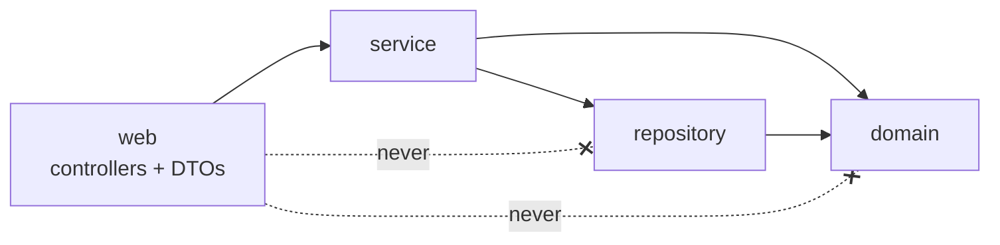

# Momkn Pay Backend — Coding Standards

| Item | Value |
|---|---|
| Document | Coding standards |
| Applies to | Every file in `momknpay-backend` (Java, SQL, YAML, tests) |
| Stack | Java 25 · Spring Boot · PostgreSQL · Spring Data JPA · Flyway · Maven |
| Related | [SRS.md](SRS.md) · [HLD.md](HLD.md) · [LLD.md](LLD.md) · [DECISIONS.md](DECISIONS.md) · [MILESTONES.md](MILESTONES.md) |

The rules use **MUST** (a pull request is blocked if it breaks the rule), **SHOULD** (the default; deviations need a reason in the pull request) and **MAY** (optional). Rules marked 🔧 are enforced by tooling in CI (§15), so you don't have to remember them. The rest are checked in code review (§16).

---

## Table of contents

1. [Principles](#1-principles)
2. [Formatting](#2-formatting)
3. [Naming](#3-naming)
4. [Project structure and layering](#4-project-structure-and-layering)
5. [Java language usage](#5-java-language-usage)
6. [Spring conventions](#6-spring-conventions)
7. [API and DTOs](#7-api-and-dtos)
8. [Error handling](#8-error-handling)
9. [Money and time](#9-money-and-time)
10. [Security](#10-security)
11. [Persistence (JPA and Flyway)](#11-persistence-jpa-and-flyway)
12. [Logging](#12-logging)
13. [Testing](#13-testing)
14. [Git and pull requests](#14-git-and-pull-requests)
15. [Tooling and enforcement](#15-tooling-and-enforcement)
16. [Code review checklist](#16-code-review-checklist)

---

## 1. Principles

1. **Correctness before cleverness.** This is a payment app. Code that is obviously right beats code that is short.
2. **The contract is law.** The OpenAPI spec is frozen (SRS C-7). Code follows the contract, never the other way round, unless there is an agreed version bump.
3. **One way to do each thing.** One error mechanism (§8), one clock (§9), one crypto class (§10), one place for identity (`CurrentUserArgumentResolver`). Do not add a second.
4. **Small and readable.** Clear names over comments, small methods over long ones, no dead code.
5. **Not over-engineered.** No interface with a single implementation "just in case", no generic frameworks, no abstraction without two real uses. The brief grades "sensible abstractions that are not over-engineered".

---

## 2. Formatting

| Rule | Level |
|---|---|
| Follow **Google Java Style**, formatted automatically by Spotless (`google-java-format`, AOSP variant: 4-space indent). | MUST 🔧 |
| Run `mvn spotless:apply` before every commit. CI runs `spotless:check`. | MUST 🔧 |
| Line length: 120 characters. | MUST 🔧 |
| One top-level type per file. | MUST 🔧 |
| No wildcard imports (`import java.util.*`). | MUST 🔧 |
| Files end with a newline and use UTF-8 and LF line endings (set in `.gitattributes`, since the team works on Windows). | MUST 🔧 |
| Member order in a class: constants → fields → constructors → public methods → private helpers. | SHOULD |
| SQL: uppercase keywords, lowercase `snake_case` identifiers, one column per line in `CREATE TABLE`. | SHOULD |
| YAML: 2-space indent, no tabs. | MUST |

---

## 3. Naming

### 3.1 Java

| Element | Convention | Example |
|---|---|---|
| Package | lowercase, singular, by feature | `com.momknpay.payment.service` |
| Class / record / enum | `PascalCase` noun | `ConfirmService`, `InquiryResponse` |
| Interface | `PascalCase`, **no** `I` prefix | `EncryptedPayload` |
| Method | `camelCase` verb | `calculate`, `findForUpdate`, `resolveIfDue` |
| Boolean method / field | `is` / `has` / `can` prefix | `isExpired`, `hasSettledTransaction` |
| Constant | `UPPER_SNAKE_CASE` | `IV_LEN`, `TAG_BITS` |
| Local variable / field | `camelCase`, no abbreviations except well-known ones (`id`, `dto`, `txn`) | `amountDue`, not `amt` |
| Type parameter | single capital letter | `<T>` |
| Test class | `<ClassUnderTest>Test` (unit), `<Feature>IT` (integration) | `FeeCalculatorTest`, `PaymentFlowIT` |
| Test method | `camelCase` sentence describing behaviour | `threeWrongPinsInvalidateInquiry` |

### 3.2 Class name suffixes (by role)

| Suffix | Role | Example |
|---|---|---|
| `Controller` | HTTP adapter (`@RestController`) | `PaymentController` |
| `Service` | Business logic (`@Service`, owns transactions) | `InquiryService` |
| `Repository` | Spring Data interface | `TransactionRepository` |
| `Request` / `Response` | API DTO records | `ConfirmRequest`, `ReceiptResponse` |
| `Payload` | Decrypted payload records | `ConfirmPayload` |
| `Mapper` | Entity ↔ DTO conversion | `TransactionMapper` |
| `Job` | `@Scheduled` component | `NonceCleanupJob` |
| `Config` / `Properties` | Spring configuration | `WebConfig`, `AppProperties` |
| `Exception` | Exceptions | `ApiException` |

JPA entities have **no** suffix: `Inquiry`, `Transaction`, `BillerService`. `BillerService` is used instead of `Service` to avoid clashing with Spring's `@Service` (LLD §3.1).

### 3.3 Names that cross the wire or the database

| Where | Convention | Example |
|---|---|---|
| JSON fields | `camelCase` | `amountDue`, `expiresAt` |
| Query parameters | `camelCase` | `since`, `page`, `size` |
| Custom headers | `X-Pascal-Case` | `X-User-Id`, `X-Request-Id` |
| Error codes | `UPPER_SNAKE_CASE` | `INQUIRY_EXPIRED` |
| Status enums on the wire | `UPPER_CASE` | `SUCCESS`, `PENDING` |
| Category enum on the wire | lowercase | `electricity` |
| Tables | plural `snake_case` | `used_nonces` |
| Columns | `snake_case` | `amount_due`, `pending_until` |
| Indexes / constraints | `ix_<table>_<cols>`, `ux_…` (unique), `ck_…` (check) | `ux_txn_idempotency` |
| IDs | prefixed strings | `usr_01`, `inq_8f21…`, `txn_5521` |

---

## 4. Project structure and layering

### 4.1 Package layout
Organise **by feature, then by layer** (LLD §3.1):

```
com.momknpay.<feature>.{web, web.dto, service, domain, repository}
com.momknpay.common.{config, error, web, crypto, ratelimit, util}
```

Features: `user`, `payload`, `catalog`, `payment`, `transaction`. Shared code goes in `common` only when **two or more** features use it.

### 4.2 Layer rules



| Rule | Level |
|---|---|
| Controllers call **services only**. Never a repository, never `EntityManager`. | MUST 🔧 (ArchUnit) |
| Controllers never receive or return entities. They use DTO records only. | MUST 🔧 (ArchUnit) |
| Services own business rules and transactions. | MUST |
| Repositories contain queries only, no business logic. | MUST |
| `common` never depends on a feature package. | MUST 🔧 (ArchUnit) |
| No package cycles. Allowed direction: `payment → payload, catalog, user, transaction → common` (HLD §6). | MUST 🔧 (ArchUnit) |
| Pure logic (`FeeCalculator`, `MockPaymentEngine`) has no Spring, database or I/O dependencies, so it can be tested without a context. | MUST |

### 4.3 Controllers stay thin

```java
// ✅ Good: map HTTP to a service call, nothing else
@PostMapping("/payments/inquiry")
InquiryResponse inquiry(@CurrentUser UserRef user,
                        @Valid @RequestBody InquiryRequest request) {
    return inquiryService.inquire(user.id(), request);
}

// ❌ Bad: business logic and repository access in the controller
@PostMapping("/payments/inquiry")
InquiryResponse inquiry(...) {
    var service = serviceRepository.findById(request.serviceId()).orElseThrow();
    if (!service.isActive()) { ... }
}
```

---

## 5. Java language usage

| Rule | Level |
|---|---|
| Use **records** for DTOs, payloads, value objects and results (`Fees`, `UserRef`). | MUST |
| Use **sealed interfaces** + records for closed result sets (`ConfirmOutcome`), and handle them with exhaustive `switch` pattern matching. No `default` branch on sealed types. | SHOULD |
| Use switch **expressions** (`->`) instead of `switch` statements with `break`. | SHOULD |
| Fields are `private final` unless there is a reason to mutate them. JPA entities are the exception. | MUST |
| `var` only when the type is obvious from the right-hand side (`var list = new ArrayList<String>()`). Never for primitives or method results whose type is unclear. | SHOULD |
| Never return `null` from a public method. Return `Optional<T>` for "maybe one", an empty collection for "none". | MUST |
| `Optional` is for return types only. Never use it for fields, parameters or collections. | MUST |
| Never call `Optional.get()`. Use `orElseThrow(() -> new ApiException(...))`. | MUST 🔧 |
| Prefer immutable collections (`List.of`, `stream().toList()`). | SHOULD |
| No `System.out` / `System.err` / `printStackTrace()`. Use the logger. | MUST 🔧 |
| Use text blocks (`"""`) for multi-line strings such as JPQL queries. | SHOULD |
| Use `Math.addExact`, `Math.ceilDiv` and similar for arithmetic that must not overflow or round wrongly. | MUST (money) |
| Methods SHOULD be ≤ 30 lines and have ≤ 4 parameters. Group more parameters in a record. | SHOULD 🔧 (Checkstyle warning) |
| No commented-out code. Git keeps history. | MUST |
| Comments explain **why**, not what. Every public class in `service`, `common.crypto` and `payment.engine` has a one-line Javadoc summary. | SHOULD |
| `TODO` comments must reference a ticket: `// TODO(MP-42): …`. | MUST |

---

## 6. Spring conventions

| Rule | Level |
|---|---|
| **Constructor injection only.** No `@Autowired` on fields or setters. A single constructor needs no annotation. | MUST 🔧 |
| Beans are package-private where possible. Keep public only what other packages use. | SHOULD |
| `@Transactional` goes on **service** methods only, never on controllers or repositories. Use `readOnly = true` for queries. | MUST |
| Do not call a `@Transactional` method from the same class and expect a transaction (the proxy is bypassed). Use `TransactionTemplate` or a separate bean. | MUST |
| `spring.jpa.open-in-view=false`. All lazy loading happens inside a service transaction. | MUST |
| Configuration values go through the typed `AppProperties` (`@ConfigurationProperties("app")`, `@Validated`). No `@Value` scattered across classes. | MUST |
| Durations in configuration use ISO-8601 (`PT5M`), bound to `java.time.Duration`. | MUST |
| `@Scheduled` jobs are idempotent and safe to run twice. | MUST |
| No blocking `Thread.sleep` except in `SlowServiceDelay` (the mock `_slow` rule), which runs outside any transaction. | MUST |

---

## 7. API and DTOs

| Rule | Level |
|---|---|
| Every endpoint, field and error must match the frozen OpenAPI spec (LLD §6). A change needs an issue, sign-off from both client tracks and a version bump. | MUST |
| Controllers are prefixed with `/v1` through `WebConfig`. Do not write `/v1` in `@RequestMapping`. | MUST |
| Request DTOs validate at the boundary with Bean Validation (`@NotBlank`, `@Size`, `@Pattern`, `@Email`) and are received with `@Valid`. | MUST |
| Validation lives on the DTO, not in `if` statements in the controller. Business rules that need the database (email uniqueness, inquiry state) live in the service. | MUST |
| Unknown JSON properties are rejected (`fail-on-unknown-properties: true`). Do not add `@JsonIgnoreProperties(ignoreUnknown = true)`. | MUST |
| Response DTOs are built by a mapper or a static factory (`ReceiptResponse.from(txn)`), not field by field in the controller. | SHOULD |
| Status codes: `200` for reads, inquiry and confirm. Errors per SRS §4.4. | MUST |
| Swagger annotations (`@Operation`, `@ApiResponse` with the error codes) on every endpoint. | MUST |

---

## 8. Error handling

| Rule | Level |
|---|---|
| Business errors are signalled with **`ApiException(ErrorCode, field)`** only. | MUST |
| The **only** place that builds an error response is `GlobalExceptionHandler`. | MUST |
| No `try/catch` just to change the response. Catch only to translate a *specific* low-level exception into an `ApiException`, for example `AEADBadTagException` → `DECRYPTION_FAILED`, or `DataIntegrityViolationException` → an idempotent replay. | MUST |
| Never catch `Exception` or `Throwable`, except in the global handler's fallback. | MUST 🔧 |
| Never swallow an exception. A `catch` either rethrows, translates or handles it meaningfully, with a comment explaining why. | MUST |
| A new failure case needs a new `ErrorCode` with EN and AR messages, added to SRS §4.4 and the OpenAPI spec through the contract process. Do not reuse a code with a different meaning. | MUST |
| Error messages never contain internal details (SQL, class names, stack traces, input values). | MUST |
| Set `field` whenever the error concerns one input (a body property, header or query parameter). | MUST |

```java
// ✅ Good
Inquiry inquiry = inquiryRepository.findForUpdate(id, userId)
        .orElseThrow(() -> new ApiException(ErrorCode.INQUIRY_NOT_FOUND));

// ❌ Bad: generic exception, becomes a 500 with no code
Inquiry inquiry = inquiryRepository.findById(id).orElseThrow();
```

---

## 9. Money and time

### 9.1 Money

| Rule | Level |
|---|---|
| Money is **`long` piastres** in Java and **`BIGINT`** in SQL. `4550` = 45.50 EGP. | MUST |
| **Never** use `double`, `float` or `BigDecimal` for money, not even temporarily in a calculation. | MUST 🔧 (Checkstyle bans `double`/`float` in `payment`, `transaction` and `catalog`) |
| Rounding is always **up**, with integer arithmetic: `Math.ceilDiv(amount, 200)`, never `Math.ceil(amount * 0.005)`. | MUST |
| Use `Math.addExact` / `Math.multiplyExact` for sums of money. | MUST |
| The server never formats money for display (no `"253.20"` strings). Clients do. | MUST |
| Name money variables and fields after what they hold (`amountDue`, `serviceFee`), never `amount1` or `value`. | MUST |

### 9.2 Time

| Rule | Level |
|---|---|
| Use `java.time.Instant` for timestamps, `YearMonth` for `billMonth`, `Duration` for lengths of time. Never `Date`, `Calendar`, `LocalDateTime` or `long` millis. | MUST 🔧 |
| Get "now" **only** from the injected `TimeProvider` / `Clock` bean. Never call `Instant.now()`, `LocalDate.now()` or `System.currentTimeMillis()` directly. | MUST 🔧 |
| Timestamps are UTC and truncated to seconds (LLD §1). Database columns are `TIMESTAMPTZ`. | MUST |
| Compare instants with `isBefore` / `isAfter`, and spell out the boundary: expiry means `now.isAfter(expiresAt)`. | MUST |

```java
// ✅ Good
boolean isExpired(Instant now) { return now.isAfter(expiresAt); }
// ❌ Bad: untestable, hidden time source
boolean isExpired() { return Instant.now().isAfter(expiresAt); }
```

---

## 10. Security

These rules are what the security part of the grade looks for (brief: *Security implementation*, 15 points; below 50% there is a fail).

### 10.1 Secrets

| Rule | Level |
|---|---|
| No secret, key, password, keystore or private key in the repository, ever. Use environment variables and `.env.example`. | MUST 🔧 (gitleaks in CI) |
| `.env`, `certs/` and `*.p12` / `*.pem` / `*.key` are in `.gitignore`. | MUST |
| No default values for secrets in `application.yml` (`${APP_PAYLOAD_KEY:}`, never `${APP_PAYLOAD_KEY:abc}`). | MUST |

### 10.2 Cryptography

| Rule | Level |
|---|---|
| All AES-GCM goes through **`AesGcmCipher`**. No other class calls `Cipher.getInstance`. | MUST 🔧 (ArchUnit) |
| Transformation is exactly `AES/GCM/NoPadding`, with a 12-byte IV, a 128-bit tag and a 256-bit key. Never ECB, never CBC, never custom padding or MAC. | MUST |
| A **fresh random IV for every encryption**, from `SecureRandom`. Never a constant, counter or reused IV. | MUST |
| Randomness for keys, IVs, nonces and IDs comes only from `SecureRandom`. Never `Random` or `Math.random`. | MUST 🔧 |
| Key byte arrays are zeroed (`Arrays.fill(key, (byte) 0)`) after use. | SHOULD |
| Never write your own crypto primitive or hashing. PINs use `BCryptPasswordEncoder(12)`. | MUST |

### 10.3 Sensitive data

| Data | Store | Log | Return in API |
|---|---|---|---|
| PIN | bcrypt hash only | **never** | **never** |
| Payload key (`APP_PAYLOAD_KEY`) | environment only, never in the database | **never** | **never** |
| Encrypted payload (`payload`) | **never** | **never** | **never** |
| Decrypted payload | **never** (in memory only) | **never** | **never** |
| Subscriber number | plain (needed for the receipt) | **masked** (`******0891`) | on the receipt only |
| DB password, keystore password | environment only | **never** | **never** |

| Rule | Level |
|---|---|
| Records that hold sensitive fields (`ConfirmPayload`, `InquiryPayload`, `AppProperties`) override `toString()` to mask them. | MUST |
| Never log request or response bodies, even at DEBUG. | MUST |
| Every lookup of user-owned data filters by the user ID (`findByIdAndUserId`), and returns `…_NOT_FOUND` for another user's data. | MUST |
| Validate every regular expression from data (`inputPattern`) once and cache the compiled `Pattern`. | SHOULD |

---

## 11. Persistence (JPA and Flyway)

### 11.1 Flyway migrations

| Rule | Level |
|---|---|
| Every schema change is a new Flyway migration: `V<n>__<snake_case_description>.sql` (for example `V5__add_index_on_inquiries_service.sql`). | MUST |
| **Never edit a migration that has been merged to `main`.** Fix it with a new migration. | MUST 🔧 (Flyway checksum validation) |
| `spring.jpa.hibernate.ddl-auto=validate`. Hibernate never creates or changes tables. | MUST |
| Constraints live in the database as well as in code: `NOT NULL`, `CHECK`, `UNIQUE`, foreign keys. Idempotency relies on `ux_txn_idempotency`, not only on Java code. | MUST |
| Seed data is deterministic: fixed IDs, fixed timestamps, no `random()`. | MUST |

### 11.2 JPA

| Rule | Level |
|---|---|
| Associations are `fetch = LAZY`. Load what you need explicitly (`JOIN FETCH` or an entity graph). | MUST |
| Enums are persisted as strings (`@Enumerated(STRING)` or a converter), never ordinals. | MUST |
| Entities do not leave the service layer. | MUST |
| Entities have protected no-arg constructors for JPA and meaningful methods (`inquiry.registerWrongPin()`), not only setters. | SHOULD |
| Use `PESSIMISTIC_WRITE` (`findForUpdate`) whenever a read decides a write that must happen once (confirm). | MUST |
| No N+1 queries in list endpoints. Check the SQL count in the integration test or with `spring.jpa.show-sql` locally (never committed as `true`). | SHOULD |
| Native SQL only where JPQL cannot express the query (`nextval`). | SHOULD |

---

## 12. Logging

| Rule | Level |
|---|---|
| Use SLF4J: `private static final Logger log = LoggerFactory.getLogger(X.class);` | MUST |
| Use parameterised messages (`log.info("inquiry.created inquiryId={}", id)`), never string concatenation. | MUST 🔧 |
| Business events use a dotted `event.name` followed by `key=value` pairs: `payment.confirmed txnId=… status=…`. | MUST |
| Levels: `ERROR` for unexpected failures that need a human, `WARN` for suspicious but handled cases (replayed nonce, rate-limited), `INFO` for business events, `DEBUG` for development detail (off by default). | MUST |
| Expected business errors (`SUBSCRIBER_NOT_FOUND`, wrong PIN) are **not** `ERROR`. | MUST |
| Every log line carries the request ID through the MDC. Do not add it by hand. | MUST |
| Log IDs and masked values only. Never the sensitive data in §10.3. | MUST 🔧 (`LogHygieneTest`) |

---

## 13. Testing

| Rule | Level |
|---|---|
| Every pull request that changes behaviour includes or updates tests. | MUST |
| Unit tests: JUnit 5 + AssertJ + Mockito. No Spring context for pure logic. | MUST |
| Integration tests: `@SpringBootTest` + **Testcontainers PostgreSQL** + MockMvc. Never H2. Behaviour differs from Postgres (partial indexes, `FOR UPDATE`). | MUST |
| Tests use a fixed or mutable `Clock`. **No `Thread.sleep` in tests** to wait for expiry or pending resolution. Advance the clock instead. | MUST |
| One behaviour per test, named as a sentence (`idempotentReplayReturnsSameTransaction`). Structure: *given / when / then* with blank lines between the parts. | SHOULD |
| Assert on behaviour and contract (status, error `code`, `field`, JSON fields), not on implementation details. | MUST |
| Assert error responses by `code`, never by message text. | MUST |
| Use the brief's seeded data and worked example (`1024750891` → 25 320) as fixtures, so tests match what clients see. | SHOULD |
| Encrypted requests in tests go through `TestCrypto`, which mirrors the client (fresh IV, nonce and `ts`). | MUST |
| Tests are independent and order-free. Each integration test cleans up or uses unique data. | MUST |
| Coverage is a signal, not a goal. Target ≥ 80% line coverage on `payment`, `payload` and `common.crypto` (JaCoCo report). No "coverage theatre" tests without assertions. | SHOULD |
| The required tests from LLD §12 (U1–U19, I1–I10) must exist and pass before `v1.0`. | MUST |

```java
@Test
void threeWrongPinsInvalidateInquiry() {
    // given
    var inquiry = openInquiryFor("usr_03");

    // when
    repeat(3, () -> assertApiError(confirm(inquiry, "1234"), VALIDATION_ERROR, "pin"));

    // then
    assertApiError(confirm(inquiry, "9999"), INQUIRY_INVALIDATED, null);
}
```

---

## 14. Git and pull requests

| Rule | Level |
|---|---|
| `main` is protected. No direct pushes. | MUST |
| One slice = one ticket = one branch = one pull request (see [MILESTONES.md](MILESTONES.md)). | MUST |
| Branch names: `feature/<slice-id>-<short-name>` or `fix/<ticket>-<short-name>` (for example `feature/M3-S5-idempotency`). | MUST |
| **Conventional Commits**: `type(scope): summary` in the imperative mood, ≤ 72 characters. Types: `feat`, `fix`, `test`, `refactor`, `docs`, `chore`, `build`, `ci`. Scope = feature package (`payment`, `session`, `catalog`, …). | MUST 🔧 (commitlint) |
| Pull requests are ≤ ~400 changed lines (excluding generated files and migrations of seed data). Larger ones are split. | MUST |
| Pull request description: what and why, the linked ticket, test evidence (test names, Postman run or screenshot), and any contract impact. | MUST |
| One peer approval + one mentor approval, and CI green, before merging. | MUST |
| Squash-merge. The squash commit message follows Conventional Commits. | SHOULD |
| Rebase on `main` before requesting review. No merge commits from `main` into feature branches. | SHOULD |

```
feat(payment): return stored transaction for repeated idempotency key
fix(payload): reject payloads with ts older than 120 seconds
test(crypto): assert fresh IV per encryption
```

---

## 15. Tooling and enforcement

Everything below runs in `mvn verify` locally and in CI on every pull request. A red check blocks the merge.

| Tool | What it enforces | Section |
|---|---|---|
| **Spotless** (`google-java-format`, AOSP) | Formatting, imports, line endings | §2 |
| **Checkstyle** | Naming, no wildcard imports, no `System.out`, no field injection, method length, banned types (`double`/`float` in money packages, `java.util.Date`, `Random`), banned calls (`Instant.now()`, `Optional.get()`) | §3, §5, §6, §9, §10 |
| **ArchUnit** tests (`ArchitectureTest`) | Layer rules, no cycles, `common` independence, only `AesGcmCipher` uses `Cipher` | §4, §10 |
| **Error Prone** (compiler plugin) | Common bug patterns (unused results, wrong equals, …) | §5 |
| **JaCoCo** | Coverage report (reported, not gating, except the crypto package) | §13 |
| **Flyway validate** | Migration checksums unchanged | §11 |
| **gitleaks** | No secrets committed | §10 |
| **commitlint** | Conventional Commit messages | §14 |
| **OpenAPI diff** | Generated `/v3/api-docs` matches the frozen `docs/openapi.yaml` | §7 |
| **OWASP Dependency-Check** or `mvn versions` report | Known-vulnerable dependencies (weekly) | — |

Example ArchUnit rules:

```java
@ArchTest static final ArchRule controllersDoNotUseRepositories =
    noClasses().that().resideInAPackage("..web..")
        .should().dependOnClassesThat().resideInAPackage("..repository..");

@ArchTest static final ArchRule onlyAesGcmCipherUsesCipher =
    noClasses().that().doNotHaveSimpleName("AesGcmCipher")
        .should().dependOnClassesThat().haveFullyQualifiedName("javax.crypto.Cipher");

@ArchTest static final ArchRule noPackageCycles =
    slices().matching("com.momknpay.(*)..").should().beFreeOfCycles();
```

IntelliJ setup: install the *google-java-format* plugin (AOSP style), enable *Optimize imports on the fly*, and import the Checkstyle configuration from `config/checkstyle/checkstyle.xml`.

---

## 16. Code review checklist

Copy this into the pull request template. The reviewer ticks each item or leaves a comment.

**Contract and behaviour**
- [ ] Matches the frozen OpenAPI spec (paths, fields, status codes, error codes)
- [ ] Every new failure path has a distinct `ErrorCode` and sets `field` when relevant
- [ ] Linked ticket's **Done when** is met

**Design**
- [ ] Controller → service → repository. No entity or repository in the web layer
- [ ] No duplicated mechanism (error, clock, crypto, identity)
- [ ] No over-engineering: no single-use interfaces or speculative abstractions

**Correctness**
- [ ] Money is `long` piastres, with integer-only rounding up
- [ ] Time comes from the injected clock, in UTC
- [ ] Idempotency and concurrency covered by DB constraints and locks where a write must happen once
- [ ] User-owned data is always filtered by user ID

**Security**
- [ ] No secrets in code, config defaults or tests
- [ ] No PIN, key, payload or full subscriber number in logs or `toString()`
- [ ] Crypto only through `AesGcmCipher`, with a fresh IV

**Quality**
- [ ] Tests added or updated, named as behaviours, no `Thread.sleep`
- [ ] `mvn verify` green (Spotless, Checkstyle, ArchUnit, tests)
- [ ] Names are clear, no dead or commented-out code, `TODO`s reference a ticket
- [ ] Pull request ≤ ~400 lines with a clear description
