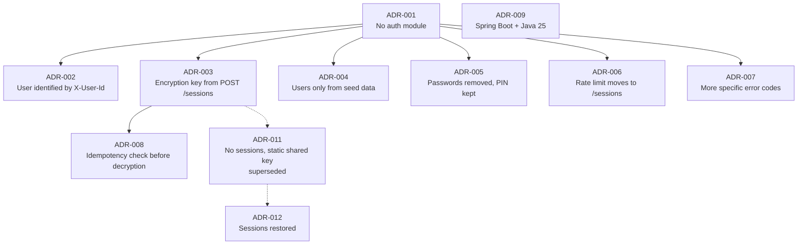

# Momkn Pay Backend — Decision Record

| Item | Value |
|---|---|
| Document | Architecture Decision Records (ADR) |
| Product | Momkn Pay — Backend API |
| Date | 2026-09-30 |
| Related | [SRS.md](SRS.md) · [HLD.md](HLD.md) · [LLD.md](LLD.md) · [MILESTONES.md](MILESTONES.md) |

This file records **what** was decided when the project dropped the authentication module, **why** it was decided, and **what it costs**. Each decision follows the same shape: context → decision → cause → alternatives considered → consequences.

The first decision (ADR-001) is the root. Every other decision here follows from it.

## Index

| ADR | Title | Status |
|---|---|---|
| [001](#adr-001--build-the-backend-without-an-authentication-module) | Build the backend without an authentication module | Accepted |
| [002](#adr-002--identify-the-user-with-the-x-user-id-header) | Identify the user with the `X-User-Id` header | Accepted |
| [003](#adr-003--issue-the-encryption-key-from-post-sessions) | Issue the encryption key from `POST /sessions` | Accepted (reinstated by ADR-012) |
| [004](#adr-004--users-come-only-from-seed-data) | Users come only from seed data | Accepted |
| [005](#adr-005--remove-passwords-keep-the-pin) | Remove passwords, keep the PIN | Accepted |
| [006](#adr-006--move-the-login-rate-limit-to-post-sessions) | Move the login rate limit to `POST /sessions` | Accepted |
| [007](#adr-007--add-specific-error-codes-for-the-new-failure-paths) | Add specific error codes for the new failure paths | Accepted |
| [008](#adr-008--check-idempotency-before-decrypting) | Check idempotency before decrypting | Accepted |
| [009](#adr-009--spring-boot-and-java-25) | Spring Boot and Java 25 | Accepted |
| [010](#adr-010--confirm-gets-a-500-ms-latency-budget-bcrypt-stays-at-cost-12) | Confirm gets a 500 ms latency budget; bcrypt stays at cost 12 | Accepted |
| [011](#adr-011--remove-sessions-encrypt-payloads-with-one-static-shared-key) | Remove sessions; encrypt payloads with one static shared key | **Superseded by ADR-012** |
| [012](#adr-012--bring-sessions-back-the-payload-key-is-issued-per-session-again) | Bring sessions back: the payload key is issued per session again | Accepted |

---

## ADR-001 — Build the backend without an authentication module

**Status:** Accepted · **Date:** 2026-09-30 · **Affects:** SRS §1.2, §8, §10; every endpoint

### Context
The capstone brief asks for register, login, refresh and logout with JWT access tokens (15 min), rotating refresh tokens (7 days), bcrypt passwords, and a 401 → silent refresh → forced logout flow on the clients. The backend track is on the **critical path**: if it is late in week 1, both client tracks stall (brief, *Mentor notes*).

### Decision
The backend has **no authentication module**. Every endpoint is public. There is no registration, login, refresh, logout, JWT or password.

### Cause
1. **Time.** Four weeks, about 6 hours a day, 2–3 backend interns. Auth (hashing, JWT issue/verify, refresh rotation, revocation, 401 handling, tests) is roughly a full week of backend work in the brief's own plan (week 1). Removing it gives that week back to the parts that are unique to this project.
2. **Focus on what the project is for.** The brief says the point is the contract between three teams and *"something that behaves correctly when things go wrong"*: the inquiry → confirm → receipt flow, idempotency, AES-GCM payload encryption, replay protection and the mock failure cases. Auth is a well-understood, widely documented problem, so it teaches less here than the payment flow does.
3. **Less risk on the critical path.** Auth is the first thing both clients need, so a delay in it blocks everyone. Without it, the clients can call real endpoints from the first days.
4. **Simpler integration and demos.** Without token expiry and refresh, there is no class of "works for 15 minutes, then fails" bugs during the Wednesday integration sessions and the Friday demos.
5. **It can be added later without a rewrite.** Identity is resolved in one place (`CurrentUserArgumentResolver`, see ADR-002). Real auth can replace that one component later without touching controllers or services.

### Alternatives considered
| Option | Why not chosen |
|---|---|
| Full auth as in the brief | Costs about a week of the critical path. That time goes to the payment flow instead. |
| Static API key shared by all clients | Adds a secret to manage without identifying a user, so the profile and history still need a user ID anyway. |
| Basic auth (mobile + password on every call) | Still needs passwords, hashing and credential storage on the clients, but gives none of the learning value of tokens. |

### Consequences
- ✅ About a week of backend time is freed for payments, encryption, idempotency and tests.
- ✅ Clients integrate against real endpoints earlier.
- ❌ **Anyone who can reach the API can act as any user.** This is accepted only because this is a teaching environment with simulated money. It is stated in SRS §8 (L-1), the README and the final review.
- ❌ The client tracks lose the brief's secure token storage and 401-refresh learning goals. Secure storage still applies to the session key (memory only).
- ➡️ Leads to ADR-002 to ADR-008.

---

## ADR-002 — Identify the user with the `X-User-Id` header

**Status:** Accepted · **Affects:** FR-COM-4, HLD §10.3, LLD §7.5

### Context
Without login there is no token to tell the server who is calling. Profile, payments and history still belong to a user.

### Decision
User-scoped endpoints require an `X-User-Id` header (for example `usr_01`), and the server trusts it. It is resolved in one place, `CurrentUserArgumentResolver`, into a `UserRef` that the controllers receive.

### Cause
- It keeps the **paths identical to the brief's contract** (`/profile`, `/payments/transactions`), so the client teams' screens and routing need no change.
- A header is where an `Authorization` token would have gone, so later swapping the header for a verified token is a change to one class, not to every endpoint.
- Clients already send custom headers on every call (`X-Request-Id`, `X-Client-Platform`), so this adds no new mechanism.

### Alternatives considered
| Option | Why not chosen |
|---|---|
| User ID in the path (`/users/{id}/profile`) | Changes every path in the contract and spreads the identity logic into every controller. |
| One hard-coded demo user | Could not test the brief's three seeded accounts (history, empty history, wrong PIN). |

### Consequences
- ✅ Contract paths unchanged, and one replaceable place to add auth later.
- ❌ The header can be forged (see ADR-001).
- The server still checks that the user exists (`USER_NOT_FOUND`) and that sessions, inquiries and transactions belong to that user. A caller cannot mix another user's data into its own requests by mistake.

---

## ADR-003 — Issue the encryption key from `POST /sessions`

**Status:** Accepted — superseded by ADR-011 on 2026-10-01, reinstated by ADR-012 on 2026-10-06 · **Affects:** FR-SES-1…6, HLD §8.1, §10, LLD §8

### Context
In the brief, the AES-256 `sessionKey` is returned by **login** and used to encrypt the two sensitive fields: the subscriber number on inquiry and the PIN on confirm. With login removed, nothing hands out that key.

### Decision
Add a public endpoint `POST /sessions` (with `X-User-Id`) that returns `{ sessionId, sessionKey, expiresAt }`. The key is 32 random bytes and lives 30 minutes. Inquiry and confirm send `X-Session-Id` so the server knows which key to decrypt with. `DELETE /sessions/{id}` revokes the key (it replaces "the key dies with logout"). The server stores the key only wrapped (encrypted) with a master key from the environment.

### Cause
- **Keeps a core learning goal of the brief:** AES-256-GCM encryption end to end, a fresh IV per message, the nonce and timestamp replay check, and "why encrypt on top of TLS?" (defence in depth against an intermediary that terminates TLS).
- A key **per session** limits damage: a leaked key expires in 30 minutes and covers one user's session, not everyone.
- It mirrors the brief's lifecycle (issue → use in memory → discard), so the client crypto code stays the same as the brief describes.

### Alternatives considered
| Option | Why not chosen |
|---|---|
| One static key from an environment variable, built into the apps | One key for all clients, never rotated, and extractable from any app build. It teaches the wrong pattern. |
| Drop payload encryption, rely on TLS only | Loses one of the brief's four security learning goals and its "encrypted payloads round-trip" definition-of-done item. |

### Consequences
- ✅ The encryption, replay-protection and key-lifecycle learning goals stay intact.
- ❌ One extra endpoint and table (`sessions`) plus a master key to configure.
- ❌ Because anyone can create a session for any user (ADR-001), the encryption protects data **in transit and in logs**, not against a malicious caller. This is documented in SRS §8 (L-2).

---

## ADR-004 — Users come only from seed data

**Status:** Accepted · **Affects:** FR-SEED-2, FR-PRO, LLD §11.2

### Context
Registration (feature F1 in the brief) creates accounts with passwords so users can log in. With no login, a newly registered account could never be used securely.

### Decision
No registration endpoint. The three accounts from the brief are created by the seed migration: `usr_01` (has history), `usr_02` (empty history) and `usr_03` (PIN `9999`, for the wrong-PIN test). Profile view and edit (name and email) stay.

### Cause
- Registration without login adds work and nothing to test that the seeded accounts do not already cover.
- The brief's test plan is built on exactly these three accounts, so every team tests the same cases with the same data.
- Fixed seed data keeps demos predictable on every machine.

### Alternatives considered
| Option | Why not chosen |
|---|---|
| Keep registration | Creates accounts that have no login to protect them. Extra validation and conflict handling for little value. |
| Remove profile too | Profile (F5) is still a useful screen and exercises validation and conflict errors (`EMAIL_ALREADY_USED`). |

### Consequences
- ✅ Simpler scope, deterministic test data.
- ❌ Clients drop the Register screen, or keep it as a design-only screen.
- ❌ Mobile-number validation and `MOBILE_ALREADY_USED` are no longer tested through the API.

---

## ADR-005 — Remove passwords, keep the PIN

**Status:** Accepted · **Affects:** SRS §10, LLD §4.1 (`users` table)

### Context
Passwords exist in the brief only to log in and to change the password. The PIN is a separate secret that authorises each payment.

### Decision
No password column, and no `/profile/change-password` endpoint. The PIN stays, stored as a bcrypt hash (cost 12), and is checked on every confirm. Three wrong PINs on one inquiry invalidate it.

### Cause
- A password that nothing checks is dead data and a false sense of security.
- The PIN is part of the **payment flow**, which is the focus of the project (ADR-001), and it is the only secret still standing between a caller and a payment.

### Consequences
- ✅ No unused secret stored.
- ❌ The PIN becomes the only payment control. A 4-digit PIN is guessable, which is why ADR-006 matters. Documented in SRS §8 (L-3).

---

## ADR-006 — Move the login rate limit to `POST /sessions`

**Status:** Accepted · **Affects:** FR-SES-6, FR-PAY-11, LLD §7.6

### Context
The brief rate-limits `/auth/login` and `/payments/confirm` to 5 attempts per minute per user. Login no longer exists.

### Decision
Rate-limit `POST /sessions` and `POST /payments/confirm` to 5 per minute per `X-User-Id`, and return `429 RATE_LIMITED` with a `Retry-After` header.

### Cause
- `POST /sessions` is the closest thing to login: it is the step that starts a user's secure activity. Limiting it stops a script from creating unlimited keys.
- The confirm limit, together with "3 wrong PINs invalidate the inquiry", slows down PIN guessing, which now matters more (ADR-005).

### Consequences
- ✅ The brief's rate-limiting requirement is kept in spirit.
- ❌ The limit is keyed on a forgeable header, so it slows down honest mistakes and simple scripts, not a determined attacker. The limiter is in memory, so it resets on restart (SRS §8, L-4).

---

## ADR-007 — Add specific error codes for the new failure paths

**Status:** Accepted · **Affects:** SRS §4.4, LLD §7.1

### Context
Removing auth deletes `INVALID_CREDENTIALS`, `TOKEN_EXPIRED` and `MOBILE_ALREADY_USED`. Sessions, header-based identity and stricter confirm rules create new failure paths. The brief requires clients to switch on the error `code`, never on the message.

### Decision
Remove the three auth-only codes. Add one code per new failure path, among them `USER_NOT_FOUND`, `SESSION_NOT_FOUND`, `SESSION_EXPIRED`, `INQUIRY_INVALIDATED`, `INQUIRY_ALREADY_CONFIRMED`, `IDEMPOTENCY_CONFLICT` and `AMOUNT_OUT_OF_RANGE`. The full list is in SRS §4.4.

### Cause
- The brief's design rule, *"every error is a designed state"*, needs a distinct code for each case. Otherwise clients would have to guess from the HTTP status or read message text.
- `SESSION_EXPIRED` in particular replaces what `TOKEN_EXPIRED` did: it tells the client to get a new key and retry.

### Consequences
- ✅ Every failure has one unambiguous code for both apps.
- ❌ Clients have a few more cases to map to UI states.

---

## ADR-008 — Check idempotency before decrypting

**Status:** Accepted · **Affects:** FR-PAY-2, HLD §8.4, LLD §9.4

### Context
Each encrypted payload carries a single-use nonce, and the server rejects a nonce it has seen before (ADR-003). A client that times out on confirm retries with the **same bytes**, so the same nonce and the same `Idempotency-Key`.

### Decision
On `POST /payments/confirm`, the server first looks up the transaction by (`X-User-Id`, `Idempotency-Key`). If one exists, it returns it and never decrypts the payload.

### Cause
If the server decrypted first, the replay check would reject the genuine retry as an attack, and the user would never get their receipt, even though the payment went through. This conflict only exists because of the session-key encryption kept in ADR-003.

### Consequences
- ✅ A retry gets the original transaction, and a replayed payload still cannot create a second payment.
- ❌ The order of checks matters and must be protected by tests (`ConfirmServiceTest`, `ConcurrencyIT`).

---

## ADR-009 — Spring Boot and Java 25

**Status:** Accepted · **Affects:** HLD §15

### Context
The brief allows three stacks: NestJS, Spring Boot or .NET 8. This decision was made at the same time as the auth decisions, but does not depend on them.

### Decision
Spring Boot + Java 25, PostgreSQL, Spring Data JPA, Flyway, springdoc-openapi.

### Cause
- The project is already set up in IntelliJ with JDK 25.
- Java 25 virtual threads make the mock 8-second `_slow` delay cheap.
- Spring provides validation, a global exception handler, JPA locking and OpenAPI generation, which are all required by the brief.

### Consequences
- ✅ Fits the existing environment and every backend requirement in the brief.
- ❌ The stack is fixed for the project (brief: "pick one on day 1 and do not change it").

---

## ADR-010 — Confirm gets a 500 ms latency budget; bcrypt stays at cost 12

**Status:** Accepted · **Date:** 2026-09-30 · **Affects:** SRS NFR-PER-1, NFR-SEC-5

### Context
The performance smoke test (M4-S3) measured every endpoint well under the 300 ms p95 budget except `POST /payments/confirm`: p50 ≈ 240 ms, p95 278–358 ms over two runs. A benchmark on the same machine showed why: one bcrypt check takes 57 ms at cost 10, 115 ms at cost 11 and **231 ms at cost 12**. The brief requires cost ≥ 12 for the PIN hash (NFR-SEC-5); the 300 ms figure is our own (NFR-PER-1).

### Decision
Keep bcrypt at cost 12. Give `POST /payments/confirm` its own p95 budget of **500 ms**; every other endpoint keeps 300 ms.

### Cause
- bcrypt is slow on purpose: the cost is what makes a stolen PIN hash expensive to brute-force, and a 4-digit PIN has only 10 000 values. Lowering the cost to meet a latency number we chose ourselves would trade a security requirement from the brief for a cosmetic one.
- Confirm is a deliberate, once-per-payment user action behind a PIN keypad and a spinner; 250–350 ms is not noticeable there, unlike the catalogue or history, which stay fast.

### Alternatives considered
| Option | Why not chosen |
|---|---|
| bcrypt cost 10–11 | Breaks NFR-SEC-5 from the brief, and halves or quarters the brute-force cost of a leaked hash. |
| Cache "PIN verified" per session | Adds state that would bypass the PIN on later payments; the brief wants the PIN on every confirmation. |
| Argon2id | Also memory-hard and similarly slow by design; no latency gain, extra dependency. |

### Consequences
- ✅ PIN hashing keeps the strength the brief requires.
- ❌ Confirm is the slowest non-`_slow` endpoint; CPU per confirm is ~230 ms, which also bounds throughput per core (fine at 5 confirms/min/user).
- `scripts/perf-smoke.js` checks confirm against 500 ms and everything else against 300 ms.

## ADR-011 — Remove sessions; encrypt payloads with one static shared key

**Status:** Superseded by [ADR-012](#adr-012--bring-sessions-back-the-payload-key-is-issued-per-session-again) on 2026-10-06 · **Date:** 2026-10-01 · **Supersedes:** ADR-003 · **Amends:** ADR-006, ADR-007 · **Affects:** contract v2.0.0, SRS §3.2 (FR-ENC), HLD §8.1 and §10, LLD §4.1.1 and §8

> Kept for history. Contract v2.0.0 ran without sessions and with one static key from `APP_PAYLOAD_KEY`; v3.0.0 restored `POST /sessions`.

### Context
ADR-003 kept the brief's per-login `sessionKey` by adding `POST /sessions`: a client asked for a 30-minute AES key, sent its id in `X-Session-Id`, and the server stored the key wrapped with a master key. It worked, but it was machinery around something that protects nothing here: anyone could ask for a session for any user, because there is no authentication (ADR-001).

### Decision
The application has **no sessions at all**.

- `POST /v1/sessions`, `DELETE /v1/sessions/{sessionId}` and the `X-Session-Id` header are removed (contract **v2.0.0**, a breaking change).
- The subscriber number and the PIN are still sent AES-256-GCM-encrypted, with **one static key** shared by every client. The server reads it from `APP_PAYLOAD_KEY`; the backend track generates it once and gives the same value to both client tracks, who build it into the apps.
- The replay protection stays: each payload's `nonce` is accepted once and its `ts` must be within 120 seconds.
- The PIN check and the `X-User-Id` header are unchanged.
- Removed with it: the `sessions` table and the `session_id` columns (migration V5), the master key and key wrapping, the session cleanup job, the error codes `SESSION_NOT_FOUND` and `SESSION_EXPIRED`, and the rate limit on `/sessions`.

### Cause
The whole application is a mock: there is no authentication module, anyone can pay anything, and no real money moves. A session concept implies a protected relationship between a client and the server that this project deliberately does not have, so it should not exist in the API either.

What follows from that:
- With no login, a per-session key was handed to any caller on request. It added an endpoint, a table, a header, key wrapping and two error states, and all of that protected only against the same things a single shared key protects against (an intermediary that terminates TLS, or a log that records bodies).
- The clients get simpler: no session to create before paying, no session expiry to handle, no key to keep alive in memory across screens.
- The brief's AES-GCM learning goal is kept: the apps still encrypt with a fresh IV per message, and the server still decrypts and rejects replays.

### Alternatives considered
| Option | Why not chosen |
|---|---|
| Keep `POST /sessions` (ADR-003) | Machinery without a security benefit in an API where anyone can request a session for any user. |
| Remove payload encryption entirely | Loses the brief's AES-256-GCM learning goal and the "encrypted payloads round-trip; a replayed nonce is rejected" definition-of-done item. |
| Derive a key per request or per user | Still needs a shared secret to derive from, so it is the static key with extra steps. |

### Consequences
- ✅ A smaller API (8 endpoints instead of 10), one table and about 15 classes fewer, and simpler clients.
- ✅ AES-GCM and replay protection still demonstrated end to end.
- ❌ **Breaking contract change**: both client tracks must drop the session calls and the `X-Session-Id` header and embed the shared key. The contract moves to v2.0.0.
- ❌ One key for everyone, built into the apps: anyone who extracts it from an app build can read and forge payloads. It cannot be rotated without shipping new app builds. Documented as limitation L-2 in the SRS.
- ❌ The brief's "session key issued per login, held in memory only, dies with logout" behaviour is no longer exercised by the clients.
- The key must be distributed to the client tracks the same way as the SPKI pins: once, out of band, never through git.

---

## ADR-012 — Bring sessions back: the payload key is issued per session again

**Status:** Accepted · **Date:** 2026-10-06 · **Supersedes:** ADR-011 · **Reinstates:** ADR-003, and ADR-006 and ADR-007 as first written · **Affects:** contract v3.0.0, SRS FR-SES-1…6, HLD §8.1 and §10, LLD §4.1 and §8

### Context
ADR-011 removed sessions and encrypted payloads with one static key that was also built into both apps. That key is the same for every user and never expires, and it can be read out of an app build. The brief asks for something else: a `sessionKey` that is handed out when the user starts, held in memory only, and dead when the user leaves.

### Decision
Restore the session design of contract v1.0.0 exactly (ADR-003):

- `POST /v1/sessions` (with `X-User-Id`) returns `{ sessionId, sessionKey, expiresAt }`; the key is 32 random bytes and lives 30 minutes. `DELETE /v1/sessions/{sessionId}` revokes it.
- Inquiry and confirm require the `X-Session-Id` header again and are decrypted with that session's key.
- The server stores session keys only wrapped with `APP_MASTER_KEY`. `APP_PAYLOAD_KEY` no longer exists.
- `SESSION_NOT_FOUND` and `SESSION_EXPIRED` are back (22 error codes), and `POST /sessions` is rate-limited again.
- The schema comes back with a new migration, `V6__restore_sessions.sql`. V5 is not edited.

The contract moves to **v3.0.0**, a second breaking change.

### Cause
- A key per session limits a leak to one user for at most 30 minutes; the static key exposed every payload of every user until the backend and both apps were rebuilt.
- Nothing secret is compiled into the apps any more.
- The client tracks practise what the brief wants them to practise: keeping a key in memory only, and handling its expiry.

### Alternatives considered
| Alternative | Why it was rejected |
|---|---|
| Keep the static key (ADR-011) | Simpler, but one leaked or extracted key breaks every payload, and it drops a learning goal of the brief. |
| A new key-exchange design (for example ECDH per app start) | More than the brief asks for, and a third design for the client tracks to learn. Restoring v1.0.0 reuses code and tests that already existed. |

### Consequences
- ✅ The encryption matches the brief again, apart from the key coming from `POST /sessions` instead of login.
- ✅ The v1.0.0 code, tests and Postman requests were restored from git history rather than rewritten.
- ❌ **Breaking contract change** for the second time: both client tracks must call `POST /sessions`, send `X-Session-Id`, and drop the built-in key.
- ❌ There is still no authentication (ADR-001), so anyone can request a session for any user. The key protects payloads in transit and in logs, not against a malicious caller (SRS §8, L-2).

---

## Revisiting these decisions

Revisit ADR-001 if any of the following becomes true:
- the project moves beyond the internship or handles real money or real personal data;
- the backend track finishes the definition of done early (see MILESTONES stretch goal X-2: add JWT behind `CurrentUserArgumentResolver`);
- a mentor or reviewer requires the brief's F1/F2 features for grading.

When auth is added, ADR-002 and ADR-006 are superseded, ADR-003 can move the key back into the login response, and ADR-004 and ADR-005 should be reopened.
