# Momkn Pay Backend — High-Level Design (HLD)

| Item | Value |
|---|---|
| Document | High-Level Design |
| Product | Momkn Pay — Backend API |
| Version | 3.0 (contract v3.0.0, paths under `/v1`) |
| Date | 2026-10-06 |
| Related documents | [SRS.md](SRS.md) (requirements), [LLD.md](LLD.md) (detailed design) |

---

## Table of contents

1. [Purpose and scope](#1-purpose-and-scope)
2. [Architectural drivers](#2-architectural-drivers)
3. [System context](#3-system-context)
4. [Deployment view](#4-deployment-view)
5. [Logical architecture](#5-logical-architecture)
6. [Module breakdown](#6-module-breakdown)
7. [API overview](#7-api-overview)
8. [Key runtime flows](#8-key-runtime-flows)
9. [Data model (conceptual)](#9-data-model-conceptual)
10. [Security architecture](#10-security-architecture)
11. [Error-handling strategy](#11-error-handling-strategy)
12. [Logging and observability](#12-logging-and-observability)
13. [Configuration and secrets](#13-configuration-and-secrets)
14. [Testing strategy](#14-testing-strategy)
15. [Technology choices](#15-technology-choices)
16. [Risks and mitigations](#16-risks-and-mitigations)

---

## 1. Purpose and scope

This document describes the architecture of the Momkn Pay backend: its components, how they interact, where data lives, and how the cross-cutting concerns (security, errors, logging) are handled. It implements the requirements in [SRS.md](SRS.md). Class-level and schema-level details are in [LLD.md](LLD.md).

**Key constraint:** the system has **no authentication module**. Every endpoint is public, and the caller identifies the user with the `X-User-Id` header (SRS C-1, §8).

---

## 2. Architectural drivers

| Driver | Source | Architectural response |
|---|---|---|
| One frozen contract for three teams | SRS C-7 | Code-first OpenAPI (springdoc) exported to the contract repository. DTOs are the single source of the schema. |
| Payment correctness under retries | FR-PAY-2…4 | Idempotency key stored on the transaction with a database unique constraint, plus a row lock on the inquiry. |
| Deterministic, demo-safe outcomes | FR-MCK-1 | A pure `MockPaymentEngine` with no randomness and no I/O. |
| Protect PIN and subscriber number beyond TLS | NFR-SEC-1…4 | A session-scoped AES-256-GCM key, a replay guard, and keys wrapped at rest. |
| Integer money | C-2 | `long` in Java, `BIGINT` in SQL, integer-only fee arithmetic. |
| One-command startup | NFR-OPS-1 | Docker Compose, Flyway migrations and seed data applied at boot. |
| No auth | C-1 | A `CurrentUserArgumentResolver` resolves `X-User-Id` into a user. It is the single place to swap in real auth later. |

---

## 3. System context

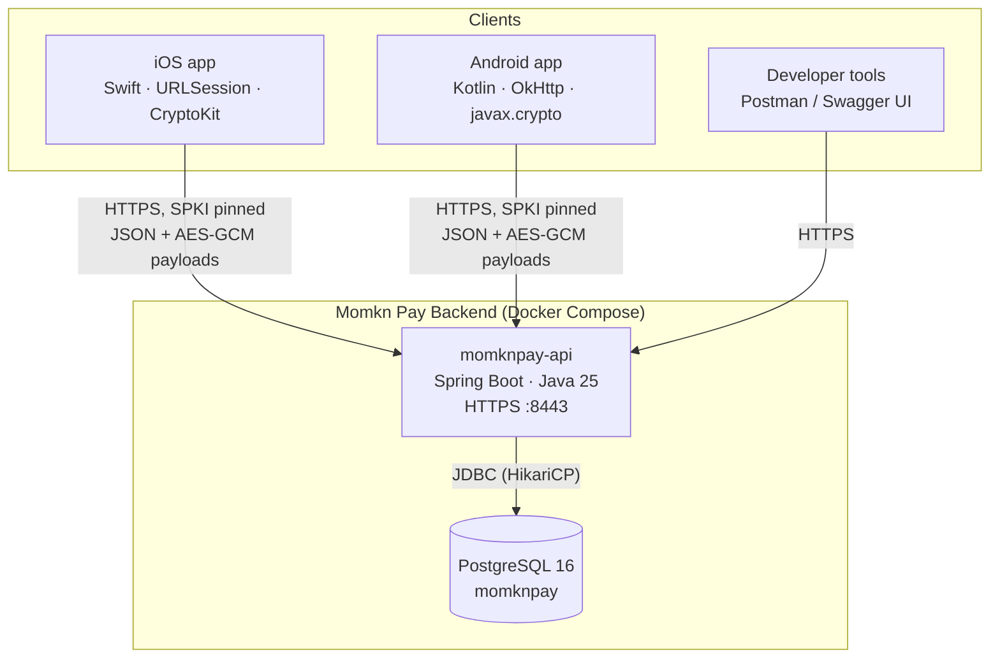

There are no external systems. The payment provider is simulated inside the API by the mock payment engine.

---

## 4. Deployment view

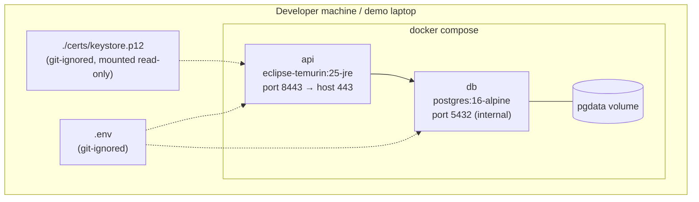

| Aspect | Decision |
|---|---|
| Containers | `api` (multi-stage Dockerfile: Maven build, then JRE runtime) and `db` (PostgreSQL). |
| Networking | `api` publishes `443:8443`. `db` is reachable only on the Compose network. Clients map `api.momknpay.local` to the host IP. |
| TLS | Terminated **inside Spring Boot** (embedded Tomcat) using a PKCS#12 keystore mounted from `./certs`. There is no plain-HTTP connector. |
| Startup order | `api` depends on `db` being healthy (`pg_isready`). On boot, Flyway applies the schema and seed migrations. |
| Health | `/actuator/health` is used by the Compose healthcheck. |
| Scaling | A single instance is enough for the project. The rate limiter is in-memory (SRS L-4). |

---

## 5. Logical architecture

### 5.1 Layers

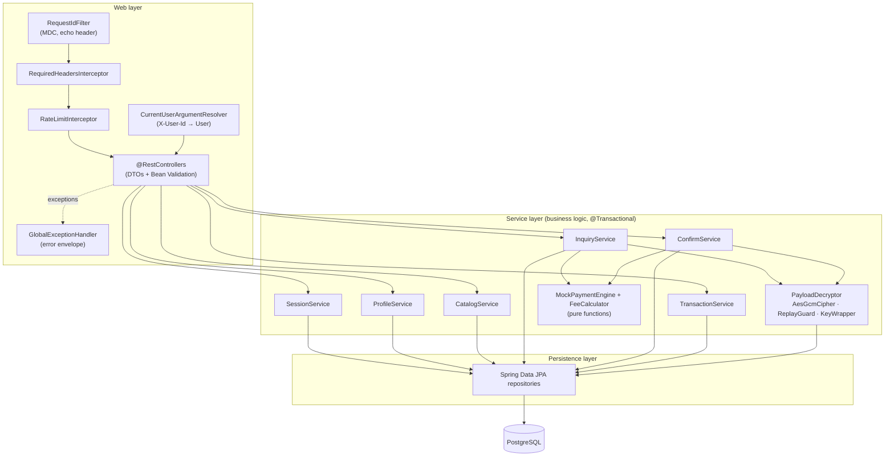

**Rules**

- Controllers only map HTTP to service calls and DTOs. They never touch repositories (SRS C-4).
- Services own transactions (`@Transactional`) and business rules.
- `MockPaymentEngine` and `FeeCalculator` are pure (no I/O). They are easy to unit-test and deterministic.
- Entities never leave the service layer. Mappers convert them to response DTOs.
- Exceptions are the only error-signalling mechanism. The `GlobalExceptionHandler` turns them into the envelope.

### 5.2 Request pipeline

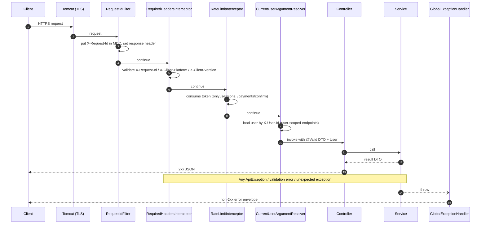

Header checks run in a **HandlerInterceptor**, not a servlet filter, so their exceptions reach `@RestControllerAdvice` and use the same envelope. The request-ID filter only sets MDC and headers and never throws.

---

## 6. Module breakdown

Package root: `com.momknpay`. Each feature module has `web` (controller + DTOs), `service` and `repository`/`domain` sub-packages.

| Module | Responsibility | Main components | Tables owned | SRS |
|---|---|---|---|---|
| `common` | Cross-cutting: errors, web plumbing, crypto, rate limiting, ID generation, clock | `GlobalExceptionHandler`, `ApiException`, `ErrorCode`, `RequestIdFilter`, `RequiredHeadersInterceptor`, `RateLimitInterceptor`, `CurrentUserArgumentResolver`, `AesGcmCipher`, `KeyWrapper`, `IdGenerator` | — | FR-COM, NFR-SEC |
| `user` | Seeded users and profile | `ProfileController`, `ProfileService`, `UserRepository` | `users` | FR-PRO |
| `session` | Crypto sessions, key issuance, payload decryption, replay guard | `SessionController`, `SessionService`, `PayloadDecryptor`, `ReplayGuard` | `sessions`, `used_nonces` | FR-SES, NFR-SEC-1…4 |
| `catalog` | Service catalogue and delta sync | `CatalogController`, `CatalogService`, `BillerServiceRepository` | `services` | FR-CAT |
| `payment` | Inquiry, confirm, mock engine, fee calculation, idempotency | `PaymentController`, `InquiryService`, `ConfirmService`, `MockPaymentEngine`, `FeeCalculator`, `InquiryRepository` | `inquiries` | FR-INQ, FR-PAY, FR-MCK |
| `transaction` | History, receipts, pending resolution | `TransactionController`, `TransactionService`, `PendingResolver`, `TransactionRepository` | `transactions` | FR-TXN |

Dependency direction: `payment → session, catalog, user, transaction → common`. There are no cycles. `common` depends on nothing in the feature modules.

---

## 7. API overview

Base URL `https://api.momknpay.local/v1`. All requests carry `X-Request-Id`, `X-Client-Platform` and `X-Client-Version`.

| Method | Path | Extra headers | Request | Success | Module | SRS |
|---|---|---|---|---|---|---|
| POST | `/sessions` | `X-User-Id` | — | `201` `{sessionId, sessionKey, expiresAt}` | session | FR-SES-1 |
| DELETE | `/sessions/{sessionId}` | `X-User-Id` | — | `204` | session | FR-SES-5 |
| GET | `/profile` | `X-User-Id` | — | `200` Profile | user | FR-PRO-1 |
| PATCH | `/profile` | `X-User-Id` | `{fullName?, email?}` | `200` Profile | user | FR-PRO-2 |
| GET | `/services` | — | — | `200` `{syncedAt, items[]}` | catalog | FR-CAT-1 |
| GET | `/services/sync?since=` | — | — | `200` `{syncedAt, items[], deletedIds[]}` | catalog | FR-CAT-4 |
| POST | `/payments/inquiry` | `X-User-Id`, `X-Session-Id` | `{serviceId, payload}` | `200` Inquiry | payment | FR-INQ |
| POST | `/payments/confirm` | `X-User-Id`, `X-Session-Id`, `Idempotency-Key` | `{inquiryId, payload}` | `200` Confirm result | payment | FR-PAY |
| GET | `/payments/transactions?page=&size=` | `X-User-Id` | — | `200` Page | transaction | FR-TXN-1 |
| GET | `/payments/transactions/{id}` | `X-User-Id` | — | `200` Receipt | transaction | FR-TXN-3 |

Full schemas, examples and per-endpoint error lists are in LLD §6.

---

## 8. Key runtime flows

### 8.1 Create a session (key issuance)

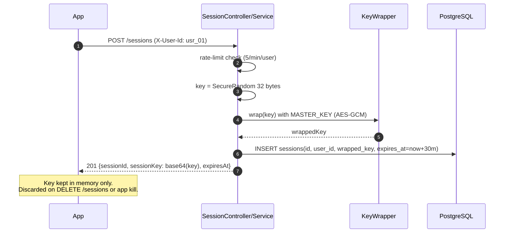

### 8.2 Catalogue: first load and delta sync

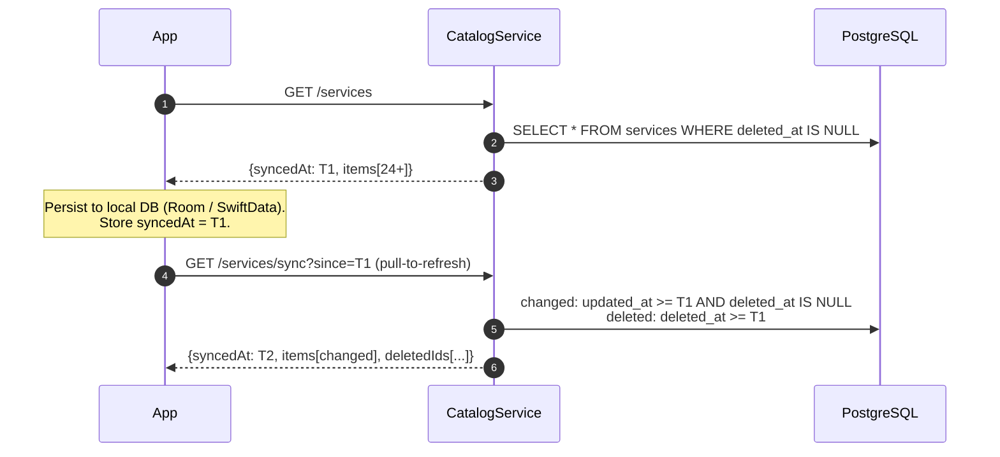

`syncedAt` is captured **before** the queries run, and the filter is `>=`. A row updated during the query, or in the same second as `syncedAt`, shows up again in the next sync instead of being missed. Delivery is at-least-once, and clients upsert.

### 8.3 Fees inquiry

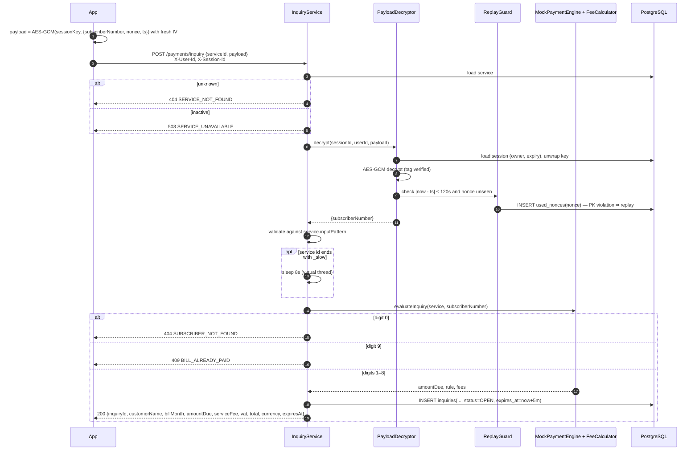

### 8.4 Payment confirmation (idempotent)

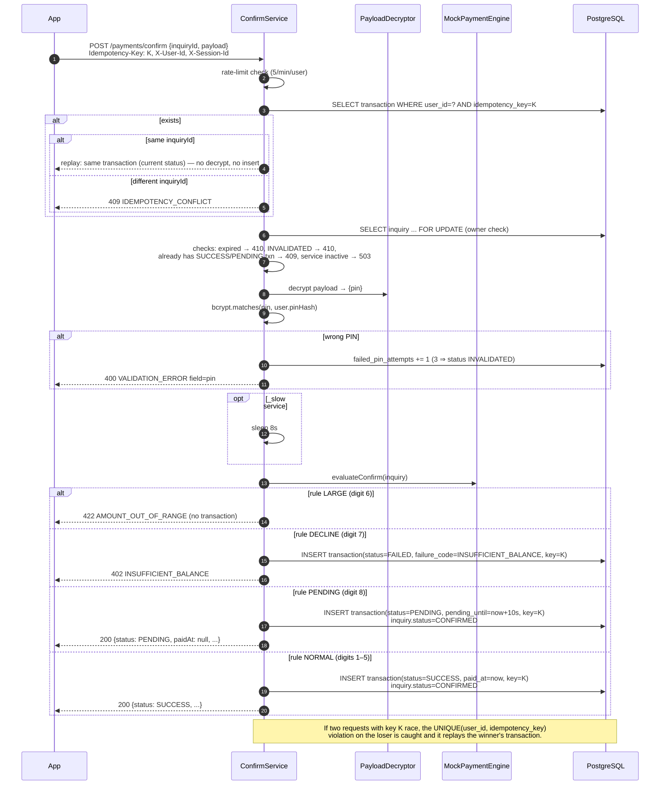

**Why the idempotency lookup happens before decryption:** a genuine client retry resends the *same bytes*, including the same nonce. If the server decrypted first, the replay guard would reject the retry as a replay, and the client would never get its receipt.

### 8.5 Pending resolution

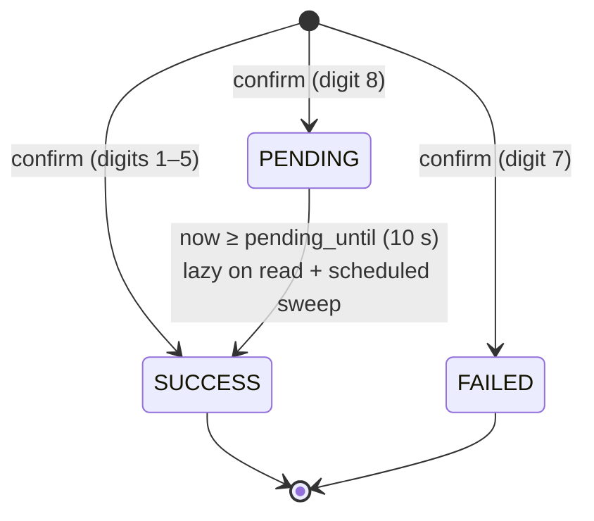

Resolution is **lazy**: every read path (list, receipt, idempotent replay) calls `PendingResolver`, which flips due rows to `SUCCESS`. A `@Scheduled` sweep every 5 s also resolves rows nobody reads. Both are idempotent (`UPDATE … WHERE status='PENDING' AND pending_until <= now()`).

### 8.6 Inquiry lifecycle

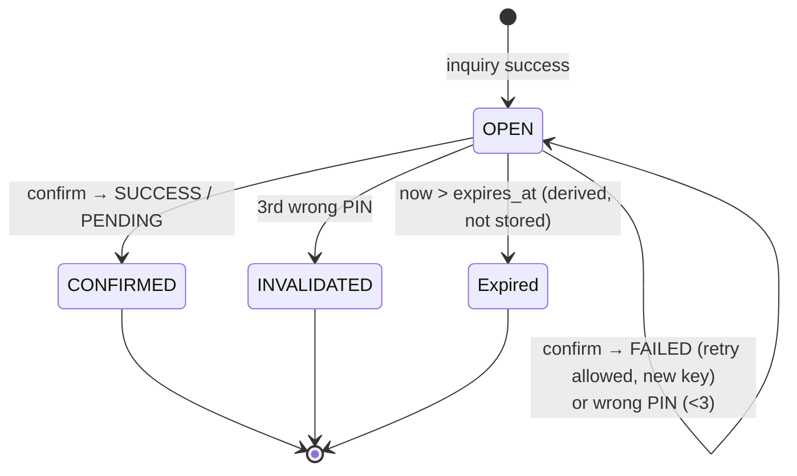

---

## 9. Data model (conceptual)

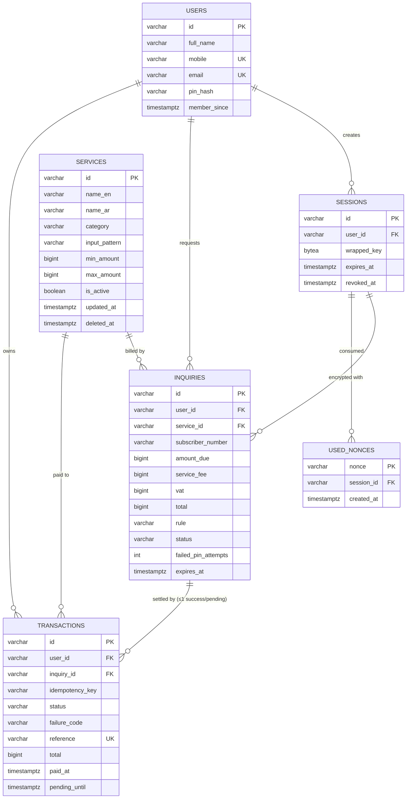

The full DDL, indexes and constraints are in LLD §4.

---

## 10. Security architecture

### 10.1 Layers of protection

| # | Control | Protects against | Where |
|---|---|---|---|
| 1 | TLS 1.2+ with a self-signed certificate. Clients pin the SPKI SHA-256 (live + backup). | Network eavesdropping, MITM with a rogue CA. | Tomcat, clients |
| 2 | AES-256-GCM payload encryption of the subscriber number and PIN. | An intermediary that terminates TLS and logs bodies (proxy, load balancer, APM). | `PayloadDecryptor` |
| 3 | Replay guard: `ts` within ±120 s and single-use `nonce` (kept 5 min). | Captured-payload replay. | `ReplayGuard`, `used_nonces` |
| 4 | Session keys wrapped with `APP_MASTER_KEY` (AES-GCM) at rest, 30-min TTL, owner-bound, revocable. | A database dump that reveals live keys. | `KeyWrapper`, `sessions` |
| 5 | PIN stored as a bcrypt hash (cost 12). 3 wrong PINs invalidate the inquiry. | PIN disclosure, brute force per inquiry. | `ConfirmService` |
| 6 | Rate limits: 5/min/user on `/sessions` and `/payments/confirm`. | PIN brute force, key-issuance abuse. | `RateLimitInterceptor` |
| 7 | Log hygiene: no PIN, key, payload or full subscriber number in logs. | Secrets leaking through logs. | Logback config, `Masking` |
| 8 | Secrets only from the environment. `.env` and `certs/` are git-ignored. | Secrets leaking through the repository. | Config |

### 10.2 Encryption scheme (shared contract)

```
plaintext  = UTF-8 JSON { ...fields, "nonce": <32 hex>, "ts": <unix seconds> }
iv         = 12 random bytes (new for EVERY message)
ct ‖ tag   = AES-256-GCM(key = sessionKey, iv, plaintext), tag = 128 bits, no AAD
wire       = base64( iv ‖ ct ‖ tag )
```

Server decrypt path: base64-decode → length ≥ 12 + 16 → split IV → `Cipher("AES/GCM/NoPadding")` with `GCMParameterSpec(128, iv)` → `AEADBadTagException` ⇒ `DECRYPTION_FAILED` → parse JSON → ts window → nonce insert.

### 10.3 No-auth threat note
Because `X-User-Id` is trusted (SRS L-1), controls 2–6 **do not** stop a malicious caller from acting as another user. They protect data in transit and at rest, and slow down brute force. This is deliberate and documented for the final review. `CurrentUserArgumentResolver` is the single place where real authentication would be added later (for example, resolving the user from a verified JWT instead of a header).

---

## 11. Error-handling strategy

- **One exception type for business errors:** `ApiException(ErrorCode code, String field)`. `ErrorCode` is an enum that carries the HTTP status and the English and Arabic messages.
- **One handler:** `@RestControllerAdvice GlobalExceptionHandler` maps:
  - `ApiException` → its code
  - Bean Validation (`MethodArgumentNotValidException`, `HandlerMethodValidationException`, `ConstraintViolationException`) → `VALIDATION_ERROR` with the first field
  - Malformed JSON or unknown property (`HttpMessageNotReadableException`) → `VALIDATION_ERROR` with the property name when available
  - Missing header or parameter → `VALIDATION_ERROR` with that name
  - `NoResourceFoundException` → `NOT_FOUND`. `HttpRequestMethodNotSupportedException` → `METHOD_NOT_ALLOWED`.
  - `Exception` (fallback) → `INTERNAL_ERROR`, logged with a stack trace and the request ID. The client sees only the envelope.
- Spring Boot's default `/error` whitelabel page is disabled so that even container-level errors return the envelope.

---

## 12. Logging and observability

| Aspect | Decision |
|---|---|
| Format | Logback, one line per event to stdout. Pattern includes `%X{requestId}`, level and logger. |
| Correlation | `RequestIdFilter` puts `X-Request-Id` in the MDC and clears it after the request. |
| Access log | One summary line per request: method, path template, status, duration, platform, version, user ID. **No bodies.** |
| Business events | `inquiry.created`, `payment.confirmed`, `payment.replayed`, `payment.pin_failed`, `session.created`. Each logs IDs and a masked subscriber number (`******0891`) only. |
| Forbidden in logs | PIN, `sessionKey`, `payload` (encrypted or decrypted), `APP_MASTER_KEY`, DB password. |
| Verification | `LogHygieneTest` runs the full payment flow with a captured appender and asserts that the forbidden strings never appear. Interns also `grep` their logs as a review item. |
| Health | Spring Boot Actuator `health` only. No other actuator endpoints are exposed. |

---

## 13. Configuration and secrets

| Variable | Purpose | Example (`.env.example`) |
|---|---|---|
| `DB_HOST`, `DB_PORT`, `DB_NAME`, `DB_USER`, `DB_PASSWORD` | PostgreSQL connection | `db`, `5432`, `momknpay`, `momknpay`, `change-me` |
| `APP_MASTER_KEY` | base64 32-byte key that wraps session keys | `openssl rand -base64 32` |
| `TLS_KEYSTORE_PATH`, `TLS_KEYSTORE_PASSWORD` | PKCS#12 keystore | `/certs/keystore.p12`, `change-me` |
| `APP_SESSION_TTL` | Session lifetime | `PT30M` |
| `APP_INQUIRY_TTL` | Inquiry lifetime | `PT5M` |
| `APP_REPLAY_WINDOW` | Allowed `ts` skew | `PT120S` |
| `APP_SLOW_DELAY` | `_slow` delay | `PT8S` |
| `APP_PENDING_DELAY` | PENDING → SUCCESS delay | `PT10S` |

The application **fails fast at startup** if `APP_MASTER_KEY` is missing or does not decode to 32 bytes.

---

## 14. Testing strategy

| Level | Tooling | Focus |
|---|---|---|
| Unit | JUnit 5, AssertJ, Mockito | `AesGcmCipher` (round-trip, tamper, IV uniqueness), `ReplayGuard`, `FeeCalculator`, `MockPaymentEngine` (every digit, `_slow`, inactive), `ConfirmService` (idempotency, wrong PIN ×3, expiry), `PendingResolver`. The clock is injected (`java.time.Clock`) so expiry can be tested without sleeping. |
| Integration | `@SpringBootTest` + Testcontainers PostgreSQL + MockMvc | Full HTTP flows, error envelope on every path, DB constraints (idempotency race), Flyway + seed, log hygiene. |
| Contract | springdoc `/v3/api-docs` export diffed against the published spec in CI | Stops accidental contract drift after the freeze. |
| Manual / demo | Postman collection, one folder per mock rule | Integration sessions with both client teams. |

The minimum of 8 unit tests from the brief is exceeded. The mapping is in LLD §12.

---

## 15. Technology choices

| Concern | Choice | Rationale |
|---|---|---|
| Language / runtime | Java 25 (LTS) | Matches the IDE project. Virtual threads make the 8 s `_slow` sleep cheap. |
| Framework | Spring Boot (latest stable; pin the version on day 1) | One of the three stacks allowed by the brief. Mature validation, JPA and OpenAPI support. |
| Database | PostgreSQL 16 | Required by the brief. `TIMESTAMPTZ`, partial unique indexes, `BIGINT` money. |
| ORM | Spring Data JPA (Hibernate) | Required layering. Pessimistic locking for confirm. |
| Migrations | Flyway | Versioned SQL checked into the repository (NFR-MNT-3). Seed data is a migration too. |
| API docs | springdoc-openapi, Swagger UI at `/docs` | Generated from code (NFR-DOC-1). |
| Crypto | JCA `javax.crypto` (`AES/GCM/NoPadding`), `SecureRandom` | Platform API named by the brief. No custom crypto. |
| Password/PIN hashing | Spring Security Crypto `BCryptPasswordEncoder(12)` (crypto module only, no Spring Security filter chain) | bcrypt cost ≥ 12, without pulling in auth. |
| Rate limiting | Bucket4j (in-memory) | A simple token bucket per user and endpoint. |
| Build | Maven | Standard. The Dockerfile uses a Maven build stage. |
| Tests | JUnit 5, AssertJ, Mockito, Testcontainers | Real PostgreSQL in integration tests. |
| Container | Docker, Docker Compose | One-command startup (NFR-OPS-1). |

---

## 16. Risks and mitigations

| Risk | Impact | Mitigation |
|---|---|---|
| Backend late in week 1 blocks both clients | High | Publish the OpenAPI spec on day 2. Clients use a Prism mock server from the spec until the backend is up. |
| Contract drift between iOS and Android | Medium | A single OpenAPI source, a CI diff check, and the Wednesday integration session. |
| Idempotency implemented only in application code | High | Database unique constraint plus catching the violation (§8.4). `ConcurrencyIT` fires parallel requests. |
| Money handled as floating point | High | `long` / `BIGINT` only, integer ceil arithmetic, and a review checklist item. |
| IV reuse by a client | High (crypto break) | Documented in the contract. The server cannot detect it, so code review of client crypto covers it. |
| Nonce table grows without bound | Low | Scheduled purge of rows older than 5 min. |
| Replay guard rejects legitimate retries | Medium | Idempotency lookup happens before decryption (§8.4). |
| No auth mistaken for secure design | Medium | Stated in SRS §8, in the README and in the final review. |
