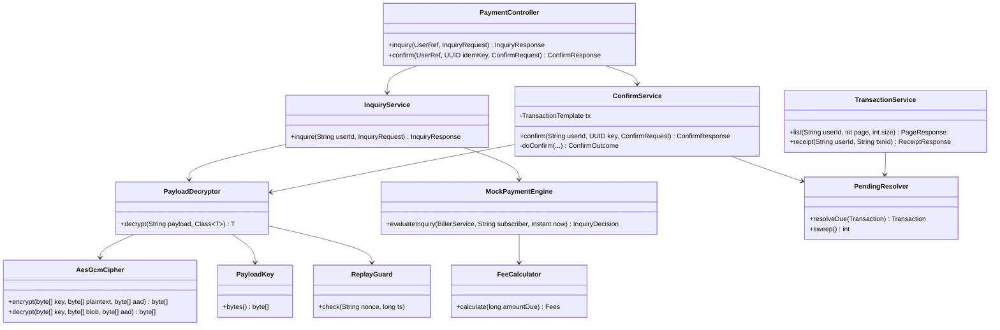

# Momkn Pay Backend — Low-Level Design (LLD)

| Item | Value |
|---|---|
| Document | Low-Level Design |
| Product | Momkn Pay — Backend API |
| Version | 2.0 (contract v2.0.0, paths under `/v1`) |
| Date | 2026-09-30 |
| Related documents | [SRS.md](SRS.md) (requirements), [HLD.md](HLD.md) (architecture) |

---

## Table of contents

1. [Conventions](#1-conventions)
2. [Project layout](#2-project-layout)
3. [Package and class design](#3-package-and-class-design)
4. [Database design](#4-database-design)
5. [Domain model (JPA)](#5-domain-model-jpa)
6. [API specification](#6-api-specification)
7. [Cross-cutting components](#7-cross-cutting-components)
8. [Cryptography components](#8-cryptography-components)
9. [Payment components and algorithms](#9-payment-components-and-algorithms)
10. [Configuration](#10-configuration)
11. [Seed data](#11-seed-data)
12. [Test design](#12-test-design)
13. [Build, run and certificates](#13-build-run-and-certificates)

---

## 1. Conventions

| Topic | Rule |
|---|---|
| Base package | `com.momknpay` |
| API prefix | `/v1`, added to every `@RestController` in `com.momknpay` through `PathMatchConfigurer.addPathPrefix`. Swagger (`/docs`) and actuator stay at the root. |
| Money | `long` in Java, `BIGINT` in SQL, integer piastres. `double`, `float` and `BigDecimal` are never used for money. |
| Time | `java.time.Instant`, `TIMESTAMPTZ`, UTC, **truncated to seconds** (`TimeProvider.now()`), and serialised as `2026-09-20T10:00:00Z`. |
| Clock | A `java.time.Clock` bean is injected everywhere so tests can use a fixed or mutable clock. `Instant.now()` is never called directly. |
| IDs | Prefixed strings: `usr_01`, `svc_elec_cairo`, `inq_<16 hex>`, `txn_<seq>`. Random parts come from `SecureRandom`. |
| DTOs | Java `record`s in `…web.dto`. Requests carry Bean Validation annotations. Entities are never serialised. |
| JSON | camelCase. Unknown properties are rejected (`FAIL_ON_UNKNOWN_PROPERTIES = true`). `null` fields are included (the contract has explicit nulls such as `paidAt`). |
| Enums on the wire | `status`: UPPER_CASE (`SUCCESS`). `category`: lower_case (`electricity`). |
| Transactions | `@Transactional` only on service methods. Repositories are called only from services. |

---

## 2. Project layout

```
momknpay-backend/
├── pom.xml
├── Dockerfile
├── docker-compose.yml
├── .env.example
├── .gitignore                      # .env, certs/, target/
├── README.md
├── certs/                          # git-ignored: keystore.p12, cert.pem, key.pem
├── postman/
│   └── momknpay.postman_collection.json
├── docs/
│   ├── SRS.md  HLD.md  LLD.md
│   └── openapi.yaml                # exported, mirrored to momknpay-contract
└── src/
    ├── main/
    │   ├── java/com/momknpay/...   # see §3
    │   └── resources/
    │       ├── application.yml
    │       ├── logback-spring.xml
    │       └── db/migration/
    │           ├── V1__schema.sql
    │           ├── V2__seed_services.sql
    │           ├── V4__seed_history.sql
    │           └── V5__drop_sessions.sql
    │       (V3__SeedUsers is a Java migration, see §11.2)
    └── test/java/com/momknpay/...  # see §12
```

---

## 3. Package and class design

### 3.1 Package tree

```
com.momknpay
├── MomknPayApplication
├── common
│   ├── config        WebConfig, JacksonConfig, ClockConfig, OpenApiConfig, SchedulingConfig, AppProperties
│   ├── error         ErrorCode, ApiException, ErrorResponse, GlobalExceptionHandler
│   ├── web           RequestIdFilter, RequiredHeadersInterceptor, RateLimitInterceptor,
│   │                 CurrentUser (annotation), UserRef, Headers
│   ├── crypto        AesGcmCipher, PayloadKey, CryptoException
│   ├── ratelimit     RateLimiter, RateLimitPolicy
│   └── util          IdGenerator, TimeProvider, Masking
├── user
│   ├── domain        User
│   ├── repository    UserRepository
│   ├── service       ProfileService, UserLookupService
│   └── web           ProfileController, CurrentUserArgumentResolver, UserWebConfig,
│                     dto/{ProfileResponse, UpdateProfileRequest}
├── payload
│   ├── domain        UsedNonce
│   ├── repository    UsedNonceRepository
│   └── service       PayloadDecryptor, ReplayGuard, NonceCleanupJob, EncryptedPayload
├── catalog
│   ├── domain        BillerService, ServiceCategory, ServiceCategoryConverter
│   ├── repository    BillerServiceRepository
│   ├── service       CatalogService
│   └── web           CatalogController, dto/{ServiceItem, CatalogResponse, SyncResponse}
├── payment
│   ├── domain        Inquiry, InquiryStatus, MockRule
│   ├── repository    InquiryRepository
│   ├── engine        MockPaymentEngine, FeeCalculator, Fees, InquiryDecision, CustomerNames
│   ├── service       InquiryService, ConfirmService, ConfirmOutcome, SlowServiceDelay
│   └── web           PaymentController, dto/{InquiryRequest, InquiryResponse, ConfirmRequest,
│                     ConfirmResponse, ServiceRef, InquiryPayload, ConfirmPayload}
└── transaction
    ├── domain        Transaction, TransactionStatus
    ├── repository    TransactionRepository
    ├── service       TransactionService, PendingResolver, ReferenceGenerator, TransactionMapper
    └── web           TransactionController, dto/{TransactionItem, ReceiptResponse, PageResponse}
```

`BillerService` is used instead of `Service` so it does not clash with Spring's `@Service`.

### 3.2 Class diagram (core payment path)



### 3.3 Service interfaces (signatures)

```java
// payload
public class PayloadKey { byte[] bytes(); }                              // FR-ENC-1, fail-fast at startup
public class PayloadDecryptor {
    <T extends EncryptedPayload> T decrypt(String payloadB64, Class<T> type);  // FR-ENC-2..3
}
public class ReplayGuard {
    @Transactional(propagation = REQUIRES_NEW)
    void check(String nonce, long ts);                           // NFR-SEC-2..3
}

// user
public class UserLookupService { UserRef require(String userId); }       // FR-COM-4
public class ProfileService {
    ProfileResponse get(String userId);                                   // FR-PRO-1
    ProfileResponse update(String userId, UpdateProfileRequest req);      // FR-PRO-2..5
}

// catalog
public class CatalogService {
    CatalogResponse getAll();                                             // FR-CAT-1
    SyncResponse sync(Instant since);                                     // FR-CAT-4
}

// payment
public class InquiryService {
    InquiryResponse inquire(String userId, InquiryRequest req);              // FR-INQ
}
public class ConfirmService {
    ConfirmResponse confirm(String userId, UUID idempotencyKey, ConfirmRequest req);                          // FR-PAY
}

// transaction
public class TransactionService {
    PageResponse<TransactionItem> list(String userId, int page, int size); // FR-TXN-1..2
    ReceiptResponse receipt(String userId, String transactionId);          // FR-TXN-3..4
}
public class PendingResolver {
    Transaction resolveIfDue(Transaction t);                               // FR-TXN-5
    @Scheduled(fixedDelay = 5000) int sweep();
}
```

---

## 4. Database design

### 4.1 `V1__schema.sql`

```sql
-- ============ users ============
CREATE TABLE users (
    id            VARCHAR(32)  PRIMARY KEY,
    full_name     VARCHAR(100) NOT NULL,
    mobile        VARCHAR(11)  NOT NULL UNIQUE
                  CHECK (mobile ~ '^01[0125][0-9]{8}$'),
    email         VARCHAR(254) NOT NULL,
    pin_hash      VARCHAR(72)  NOT NULL,            -- bcrypt, cost 12
    member_since  TIMESTAMPTZ  NOT NULL DEFAULT now(),
    updated_at    TIMESTAMPTZ  NOT NULL DEFAULT now()
);
CREATE UNIQUE INDEX ux_users_email ON users (lower(email));

-- ============ services ============
CREATE TABLE services (
    id             VARCHAR(64)  PRIMARY KEY,
    name_en        VARCHAR(100) NOT NULL,
    name_ar        VARCHAR(100) NOT NULL,
    category       VARCHAR(16)  NOT NULL
                   CHECK (category IN ('electricity','water','gas','internet','mobile','landline')),
    icon_url       VARCHAR(255) NOT NULL,
    input_label    VARCHAR(64)  NOT NULL,
    input_pattern  VARCHAR(128) NOT NULL,
    min_amount     BIGINT       NOT NULL CHECK (min_amount >= 0),
    max_amount     BIGINT       NOT NULL CHECK (max_amount >= min_amount),
    is_active      BOOLEAN      NOT NULL DEFAULT TRUE,
    created_at     TIMESTAMPTZ  NOT NULL DEFAULT now(),
    updated_at     TIMESTAMPTZ  NOT NULL DEFAULT now(),
    deleted_at     TIMESTAMPTZ  NULL                -- soft delete, drives deletedIds
);
CREATE INDEX ix_services_updated_at ON services (updated_at);
CREATE INDEX ix_services_deleted_at ON services (deleted_at) WHERE deleted_at IS NOT NULL;

-- keep updated_at correct even for manual SQL edits (delta sync depends on it)
CREATE FUNCTION set_updated_at() RETURNS trigger AS $$
BEGIN NEW.updated_at := date_trunc('second', now()); RETURN NEW; END;
$$ LANGUAGE plpgsql;
CREATE TRIGGER trg_services_updated_at BEFORE UPDATE ON services
    FOR EACH ROW EXECUTE FUNCTION set_updated_at();

-- ============ sessions ============
CREATE TABLE sessions (
    id           VARCHAR(40) PRIMARY KEY,           -- ses_<32 hex>
    user_id      VARCHAR(32) NOT NULL REFERENCES users(id),
    wrapped_key  BYTEA       NOT NULL,              -- iv(12) || AES-GCM(master, key) || tag(16)
    created_at   TIMESTAMPTZ NOT NULL,
    expires_at   TIMESTAMPTZ NOT NULL,
    revoked_at   TIMESTAMPTZ NULL
);
CREATE INDEX ix_sessions_user ON sessions (user_id);
CREATE INDEX ix_sessions_expires ON sessions (expires_at);

-- ============ used_nonces ============
CREATE TABLE used_nonces (
    nonce       CHAR(32)    PRIMARY KEY,            -- 16 bytes hex, globally single-use
    session_id  VARCHAR(40) NOT NULL REFERENCES sessions(id) ON DELETE CASCADE,
    created_at  TIMESTAMPTZ NOT NULL
);
CREATE INDEX ix_used_nonces_created ON used_nonces (created_at);

-- ============ inquiries ============
CREATE TABLE inquiries (
    id                   VARCHAR(32)  PRIMARY KEY,  -- inq_<16 hex>
    user_id              VARCHAR(32)  NOT NULL REFERENCES users(id),
    service_id           VARCHAR(64)  NOT NULL REFERENCES services(id),
    session_id           VARCHAR(40)  NULL REFERENCES sessions(id) ON DELETE SET NULL,
    subscriber_number    VARCHAR(32)  NOT NULL,
    customer_name        VARCHAR(100) NOT NULL,
    bill_month           CHAR(7)      NOT NULL,     -- YYYY-MM
    amount_due           BIGINT       NOT NULL CHECK (amount_due > 0),
    service_fee          BIGINT       NOT NULL CHECK (service_fee >= 0),
    vat                  BIGINT       NOT NULL CHECK (vat >= 0),
    total                BIGINT       NOT NULL,
    rule                 VARCHAR(16)  NOT NULL
                         CHECK (rule IN ('NORMAL','LARGE','DECLINE','PENDING')),
    status               VARCHAR(16)  NOT NULL DEFAULT 'OPEN'
                         CHECK (status IN ('OPEN','CONFIRMED','INVALIDATED')),
    failed_pin_attempts  SMALLINT     NOT NULL DEFAULT 0
                         CHECK (failed_pin_attempts BETWEEN 0 AND 3),
    created_at           TIMESTAMPTZ  NOT NULL,
    expires_at           TIMESTAMPTZ  NOT NULL,
    CONSTRAINT ck_inquiry_total CHECK (total = amount_due + service_fee + vat)
);
CREATE INDEX ix_inquiries_user ON inquiries (user_id, created_at DESC);

-- ============ transactions ============
CREATE SEQUENCE transaction_seq START WITH 5500;

CREATE TABLE transactions (
    id                 VARCHAR(32)  PRIMARY KEY,    -- txn_<seq>
    seq                BIGINT       NOT NULL UNIQUE,
    user_id            VARCHAR(32)  NOT NULL REFERENCES users(id),
    inquiry_id         VARCHAR(32)  NOT NULL REFERENCES inquiries(id),
    service_id         VARCHAR(64)  NOT NULL REFERENCES services(id),
    idempotency_key    UUID         NOT NULL,
    status             VARCHAR(16)  NOT NULL CHECK (status IN ('SUCCESS','FAILED','PENDING')),
    failure_code       VARCHAR(32)  NULL,
    reference          VARCHAR(32)  NOT NULL UNIQUE, -- MP-YYYYMMDD-NNNN
    subscriber_number  VARCHAR(32)  NOT NULL,
    customer_name      VARCHAR(100) NOT NULL,
    bill_month         CHAR(7)      NOT NULL,
    amount_due         BIGINT       NOT NULL,
    service_fee        BIGINT       NOT NULL,
    vat                BIGINT       NOT NULL,
    total              BIGINT       NOT NULL,
    created_at         TIMESTAMPTZ  NOT NULL,
    paid_at            TIMESTAMPTZ  NULL,
    pending_until      TIMESTAMPTZ  NULL,
    CONSTRAINT ux_txn_idempotency UNIQUE (user_id, idempotency_key),          -- NFR-REL-1
    CONSTRAINT ck_txn_total   CHECK (total = amount_due + service_fee + vat),
    CONSTRAINT ck_txn_failure CHECK ((status = 'FAILED') = (failure_code IS NOT NULL)),
    CONSTRAINT ck_txn_paid    CHECK (status <> 'SUCCESS' OR paid_at IS NOT NULL),
    CONSTRAINT ck_txn_pending CHECK (status <> 'PENDING' OR pending_until IS NOT NULL)
);
-- at most one settled (or settling) transaction per inquiry — NFR-REL-2
CREATE UNIQUE INDEX ux_txn_inquiry_settled ON transactions (inquiry_id)
    WHERE status IN ('SUCCESS','PENDING');
CREATE INDEX ix_txn_user_history ON transactions (user_id, created_at DESC, seq DESC);
CREATE INDEX ix_txn_pending_due  ON transactions (pending_until) WHERE status = 'PENDING';
```

### 4.1.1 `V5__drop_sessions.sql` (ADR-011)

Merged migrations are never edited, so V1 above still creates `sessions`; V5 removes it. After V5 there is no `sessions` table, and `inquiries` and `used_nonces` have no `session_id` column.

```sql
ALTER TABLE inquiries   DROP COLUMN session_id;
ALTER TABLE used_nonces DROP COLUMN session_id;
DROP TABLE sessions;
```

### 4.2 Table notes

| Table | Notes |
|---|---|
| `users` | Created only by the seed migration. `email` is unique case-insensitively. There is no password column (no login). |
| `services` | `deleted_at` soft delete supports `deletedIds`. The trigger bumps `updated_at` on every update. |
| `used_nonces` | A PK violation means a replay. Purged every minute for rows older than 5 minutes. |
| `inquiries` | Expiry is derived (`now > expires_at`) and never stored as a status. `rule` is decided once, at inquiry time. |
| `transactions` | A snapshot of the inquiry amounts, so a receipt never changes. `seq` feeds both the ID and the reference. |

### 4.3 Housekeeping jobs

| Job | Schedule | SQL |
|---|---|---|
| `NonceCleanupJob` | every 60 s | `DELETE FROM used_nonces WHERE created_at < now() - interval '5 minutes'` |
| `PendingResolver.sweep` | every 5 s | `UPDATE transactions SET status='SUCCESS', paid_at=pending_until WHERE status='PENDING' AND pending_until <= now()` |

---

## 5. Domain model (JPA)

```java
public enum ServiceCategory { ELECTRICITY, WATER, GAS, INTERNET, MOBILE, LANDLINE;
    @JsonValue public String wire() { return name().toLowerCase(Locale.ROOT); } }
// persisted lowercase through ServiceCategoryConverter (AttributeConverter<ServiceCategory,String>)

public enum MockRule          { NORMAL, LARGE, DECLINE, PENDING }
public enum InquiryStatus     { OPEN, CONFIRMED, INVALIDATED }
public enum TransactionStatus { SUCCESS, FAILED, PENDING }
```

| Entity | Table | Key fields and behaviour |
|---|---|---|
| `User` | `users` | `id`, `fullName`, `mobile` (`updatable = false`), `email`, `pinHash`, `memberSince`, `updatedAt` |
| `BillerService` | `services` | all columns. `boolean isSlow() { return id.endsWith("_slow"); }` |
| `UsedNonce` | `used_nonces` | `nonce`, `createdAt` |
| `Inquiry` | `inquiries` | `@ManyToOne(fetch = LAZY) BillerService service`, `boolean isExpired(Instant now)`, `void registerWrongPin()` (increments and sets `INVALIDATED` at 3), `void markConfirmed()` |
| `Transaction` | `transactions` | `@ManyToOne(fetch = LAZY) BillerService service`, `boolean resolveIfDue(Instant now)` (PENDING → SUCCESS, `paidAt = pendingUntil`) |

Repositories (Spring Data):

```java
interface UserRepository extends JpaRepository<User, String> {
    boolean existsByEmailIgnoreCaseAndIdNot(String email, String id);
}
interface BillerServiceRepository extends JpaRepository<BillerService, String> {
    List<BillerService> findByDeletedAtIsNullOrderByCategoryAscNameEnAsc();
    List<BillerService> findByDeletedAtIsNullAndUpdatedAtGreaterThanEqual(Instant since);
    @Query("select s.id from BillerService s where s.deletedAt >= :since")
    List<String> findDeletedIdsSince(Instant since);
    Optional<BillerService> findByIdAndDeletedAtIsNull(String id);
}
interface UsedNonceRepository extends JpaRepository<UsedNonce, String> {
    @Modifying @Query("delete from UsedNonce n where n.createdAt < :cutoff") int purgeBefore(Instant cutoff);
}
interface InquiryRepository extends JpaRepository<Inquiry, String> {
    @Lock(LockModeType.PESSIMISTIC_WRITE)
    @Query("select i from Inquiry i where i.id = :id and i.userId = :userId")
    Optional<Inquiry> findForUpdate(String id, String userId);
}
interface TransactionRepository extends JpaRepository<Transaction, String> {
    Optional<Transaction> findByUserIdAndIdempotencyKey(String userId, UUID key);
    Optional<Transaction> findByIdAndUserId(String id, String userId);
    boolean existsByInquiryIdAndStatusIn(String inquiryId, Collection<TransactionStatus> s);
    Page<Transaction> findByUserId(String userId, Pageable p);   // sort: createdAt DESC, seq DESC
    @Query(value = "select nextval('transaction_seq')", nativeQuery = true) long nextSeq();
    @Modifying @Query("""
        update Transaction t set t.status = SUCCESS, t.paidAt = t.pendingUntil
        where t.status = PENDING and t.pendingUntil <= :now""")
    int resolveDuePending(Instant now);
}
```

---

## 6. API specification

Common request headers on every `/v1` call: `X-Request-Id: <uuid>`, `X-Client-Platform: ios|android`, `X-Client-Version: <text>`. Every error uses the envelope in SRS §4.3.

### 6.1–6.2 (removed)

`POST /v1/sessions` and `DELETE /v1/sessions/{sessionId}` were removed in contract v2.0.0 (ADR-011). Payloads are encrypted with the static shared key, so there is nothing to create or revoke. The numbering of the sections below is kept.

### 6.3 `GET /v1/profile`

| | |
|---|---|
| Headers | `X-User-Id` |
| Success | `200` |
| Errors | `400 VALIDATION_ERROR`, `404 USER_NOT_FOUND` |

```json
{ "id": "usr_01", "fullName": "Mina Adel", "mobile": "01000000001",
  "email": "mina@example.com", "memberSince": "2026-09-01T09:00:00Z" }
```

```java
public record ProfileResponse(String id, String fullName, String mobile, String email, Instant memberSince) {}
```

### 6.4 `PATCH /v1/profile`

```json
{ "fullName": "Mina Adel Fawzy", "email": "mina.adel@example.com" }
```

```java
public record UpdateProfileRequest(
    @Size(min = 2, max = 100) @Pattern(regexp = ".*\\S.*") String fullName,
    @Email @Size(max = 254) String email) {
    @AssertTrue(message = "at least one field") boolean isAnyFieldPresent() { return fullName != null || email != null; }
}
```

| | |
|---|---|
| Success | `200` with `ProfileResponse` |
| Errors | `400 VALIDATION_ERROR` (`fullName` / `email` / `mobile` / other unknown field), `409 EMAIL_ALREADY_USED` (`field: "email"`), `404 USER_NOT_FOUND` |

`fullName` is trimmed and `email` is lower-cased before saving.

### 6.5 `GET /v1/services`

| | |
|---|---|
| Headers | common only |
| Success | `200` |

```json
{
  "syncedAt": "2026-09-20T10:00:00Z",
  "items": [
    {
      "id": "svc_elec_cairo",
      "nameEn": "Cairo Electricity",
      "nameAr": "كهرباء القاهرة",
      "category": "electricity",
      "iconUrl": "https://cdn.momknpay.local/icons/electricity.png",
      "inputLabel": "Subscriber number",
      "inputPattern": "^[0-9]{10}$",
      "minAmount": 500,
      "maxAmount": 500000,
      "isActive": true,
      "updatedAt": "2026-09-18T09:00:00Z"
    }
  ]
}
```

```java
public record ServiceItem(String id, String nameEn, String nameAr, ServiceCategory category, String iconUrl,
                          String inputLabel, String inputPattern, long minAmount, long maxAmount,
                          @JsonProperty("isActive") boolean isActive, Instant updatedAt) {}
public record CatalogResponse(Instant syncedAt, List<ServiceItem> items) {}
```

### 6.6 `GET /v1/services/sync?since=<ISO-8601>`

| | |
|---|---|
| Query | `since` (required, ISO-8601 instant) |
| Success | `200` |
| Errors | `400 VALIDATION_ERROR` (`field: "since"`) |

```json
{ "syncedAt": "2026-09-20T12:00:00Z", "items": [ /* ServiceItem changed at or after since */ ],
  "deletedIds": ["svc_water_legacy"] }
```

Delivery is **at-least-once**: the filter is `>= since` (timestamps are second-precision), and `syncedAt` is returned 5 seconds before the server's "now" so a skew between the application clock and the database clock (which stamps `updated_at` through the trigger) can never make a row be missed. A few boundary rows may therefore arrive twice. Clients upsert, so duplicates are harmless.

```java
public record SyncResponse(Instant syncedAt, List<ServiceItem> items, List<String> deletedIds) {}
```

### 6.7 `POST /v1/payments/inquiry`

| | |
|---|---|
| Headers | `X-User-Id` |
| Success | `200` |
| Errors | `400 VALIDATION_ERROR` (`serviceId`, `payload`, `subscriberNumber`, headers), `400 DECRYPTION_FAILED`, `404 USER_NOT_FOUND`, `404 SERVICE_NOT_FOUND`, `503 SERVICE_UNAVAILABLE`, `404 SUBSCRIBER_NOT_FOUND`, `409 BILL_ALREADY_PAID` |

Request and decrypted payload:

```json
{ "serviceId": "svc_elec_cairo", "payload": "<base64(iv‖ct‖tag)>" }
```
```json
{ "subscriberNumber": "1024750891", "nonce": "7f3a9c0e1b2d4f6a8c0e2b4d6f8a0c1e", "ts": 1790000000 }
```

Response (worked example):

```json
{
  "inquiryId": "inq_8f21a0c4d9e7b312",
  "serviceId": "svc_elec_cairo",
  "customerName": "Mina A.",
  "billMonth": "2026-08",
  "amountDue": 24750,
  "serviceFee": 500,
  "vat": 70,
  "total": 25320,
  "currency": "EGP",
  "expiresAt": "2026-09-20T10:05:00Z"
}
```

```java
public record InquiryRequest(
    @NotBlank @Size(max = 64) String serviceId,
    @NotBlank @Size(max = 4096) String payload) {}
public record InquiryPayload(String subscriberNumber, String nonce, Long ts) implements EncryptedPayload {}
public record InquiryResponse(String inquiryId, String serviceId, String customerName, String billMonth,
                              long amountDue, long serviceFee, long vat, long total,
                              String currency, Instant expiresAt) {}
```

**Check order** (the first failing check wins): headers → body DTO → user → service exists → service active → decrypt (blob → tag → JSON → ts → nonce) → `subscriberNumber` matches `inputPattern` → mock rule.

### 6.8 `POST /v1/payments/confirm`

| | |
|---|---|
| Headers | `X-User-Id`, `Idempotency-Key` (UUID, required) |
| Success | `200` (for `SUCCESS` and `PENDING`, first call and replays alike) |
| Errors | `400 VALIDATION_ERROR` (`Idempotency-Key`, `inquiryId`, `payload`, `pin`), `400 DECRYPTION_FAILED`, `402 INSUFFICIENT_BALANCE`, `404 USER_NOT_FOUND`, `404 INQUIRY_NOT_FOUND`, `409 IDEMPOTENCY_CONFLICT`, `409 INQUIRY_ALREADY_CONFIRMED`, `410 INQUIRY_EXPIRED`, `410 INQUIRY_INVALIDATED`, `422 AMOUNT_OUT_OF_RANGE`, `429 RATE_LIMITED`, `503 SERVICE_UNAVAILABLE` |

```json
{ "inquiryId": "inq_8f21a0c4d9e7b312", "payload": "<base64(iv‖ct‖tag)>" }
```
```json
{ "pin": "1234", "nonce": "0a1b2c3d4e5f60718293a4b5c6d7e8f9", "ts": 1790000060 }
```

Response:

```json
{
  "transactionId": "txn_5521",
  "status": "SUCCESS",
  "reference": "MP-20260920-5521",
  "paidAt": "2026-09-20T10:02:11Z",
  "total": 25320,
  "service": { "id": "svc_elec_cairo", "nameEn": "Cairo Electricity", "nameAr": "كهرباء القاهرة" }
}
```

```java
public record ConfirmRequest(@NotBlank @Size(max = 32) String inquiryId,
                             @NotBlank @Size(max = 4096) String payload) {}
public record ConfirmPayload(String pin, String nonce, Long ts) implements EncryptedPayload {}
public record ServiceRef(String id, String nameEn, String nameAr) {}
public record ConfirmResponse(String transactionId, TransactionStatus status, String reference,
                              Instant paidAt, long total, ServiceRef service) {}
```

### 6.9 `GET /v1/payments/transactions?page=0&size=20`

| | |
|---|---|
| Headers | `X-User-Id` |
| Query | `page` ≥ 0 (default 0), `size` 1–50 (default 20) |
| Success | `200`, newest first (`created_at DESC, seq DESC`) |
| Errors | `400 VALIDATION_ERROR` (`page` / `size`), `404 USER_NOT_FOUND` |

```json
{
  "items": [
    {
      "transactionId": "txn_5521",
      "status": "SUCCESS",
      "reference": "MP-20260920-5521",
      "total": 25320,
      "createdAt": "2026-09-20T10:02:11Z",
      "paidAt": "2026-09-20T10:02:11Z",
      "failureCode": null,
      "service": { "id": "svc_elec_cairo", "nameEn": "Cairo Electricity",
                   "nameAr": "كهرباء القاهرة", "category": "electricity" }
    }
  ],
  "page": 0, "size": 20, "totalItems": 1, "totalPages": 1
}
```

### 6.10 `GET /v1/payments/transactions/{id}` — receipt

| | |
|---|---|
| Success | `200` |
| Errors | `404 TRANSACTION_NOT_FOUND` (unknown or foreign), `404 USER_NOT_FOUND` |

```json
{
  "transactionId": "txn_5521",
  "inquiryId": "inq_8f21a0c4d9e7b312",
  "status": "SUCCESS",
  "failureCode": null,
  "reference": "MP-20260920-5521",
  "service": { "id": "svc_elec_cairo", "nameEn": "Cairo Electricity",
               "nameAr": "كهرباء القاهرة", "category": "electricity" },
  "subscriberNumber": "1024750891",
  "customerName": "Mina A.",
  "billMonth": "2026-08",
  "amountDue": 24750,
  "serviceFee": 500,
  "vat": 70,
  "total": 25320,
  "currency": "EGP",
  "createdAt": "2026-09-20T10:02:11Z",
  "paidAt": "2026-09-20T10:02:11Z"
}
```

---

## 7. Cross-cutting components

### 7.1 `ErrorCode` and `ApiException`

```java
public enum ErrorCode {
    VALIDATION_ERROR(400, "Invalid input.", "مدخلات غير صحيحة."),
    DECRYPTION_FAILED(400, "The secure payload could not be read.", "تعذر قراءة البيانات المشفرة."),
    INSUFFICIENT_BALANCE(402, "Payment declined: insufficient balance.", "تم رفض الدفع: الرصيد غير كافٍ."),
    USER_NOT_FOUND(404, "User not found.", "المستخدم غير موجود."),
    SERVICE_NOT_FOUND(404, "Service not found.", "الخدمة غير موجودة."),
    SUBSCRIBER_NOT_FOUND(404, "No bill found for this number.", "لا توجد فاتورة لهذا الرقم."),
    INQUIRY_NOT_FOUND(404, "Inquiry not found.", "الاستعلام غير موجود."),
    TRANSACTION_NOT_FOUND(404, "Transaction not found.", "المعاملة غير موجودة."),
    NOT_FOUND(404, "Resource not found.", "المورد غير موجود."),
    METHOD_NOT_ALLOWED(405, "Method not allowed.", "الطريقة غير مسموح بها."),
    BILL_ALREADY_PAID(409, "This bill is already paid.", "تم سداد هذه الفاتورة بالفعل."),
    EMAIL_ALREADY_USED(409, "This email is already in use.", "البريد الإلكتروني مستخدم بالفعل."),
    IDEMPOTENCY_CONFLICT(409, "Idempotency key already used for another inquiry.", "مفتاح التكرار مستخدم لاستعلام آخر."),
    INQUIRY_ALREADY_CONFIRMED(409, "This inquiry has already been paid.", "تم دفع هذا الاستعلام بالفعل."),
    INQUIRY_EXPIRED(410, "This inquiry has expired.", "انتهت صلاحية الاستعلام."),
    INQUIRY_INVALIDATED(410, "Too many wrong PIN attempts. Start a new inquiry.", "محاولات رقم سري خاطئة كثيرة. ابدأ استعلامًا جديدًا."),
    AMOUNT_OUT_OF_RANGE(422, "The amount is outside the allowed range for this service.", "المبلغ خارج الحد المسموح لهذه الخدمة."),
    RATE_LIMITED(429, "Too many attempts. Try again shortly.", "محاولات كثيرة. حاول مرة أخرى بعد قليل."),
    INTERNAL_ERROR(500, "Something went wrong.", "حدث خطأ ما."),
    SERVICE_UNAVAILABLE(503, "The provider is not responding right now.", "مزود الخدمة لا يستجيب حاليًا.");

    final int status; final String messageEn; final String messageAr;
}

public class ApiException extends RuntimeException {
    private final ErrorCode code; private final String field;      // field nullable
    public ApiException(ErrorCode code) { this(code, null); }
    public ApiException(ErrorCode code, String field) { super(code.name()); this.code = code; this.field = field; }
}

public record ErrorResponse(ErrorBody error) {
    public record ErrorBody(String code, String messageEn, String messageAr, String field) {}
}
```

### 7.2 `GlobalExceptionHandler` (`@RestControllerAdvice`)

| Exception | Code | `field` |
|---|---|---|
| `ApiException` | its code | its field |
| `MethodArgumentNotValidException` | `VALIDATION_ERROR` | first `FieldError.getField()` |
| `HandlerMethodValidationException`, `ConstraintViolationException` | `VALIDATION_ERROR` | parameter or header name |
| `MissingRequestHeaderException` | `VALIDATION_ERROR` | header name |
| `MissingServletRequestParameterException`, `MethodArgumentTypeMismatchException` | `VALIDATION_ERROR` | parameter name |
| `HttpMessageNotReadableException` whose cause is an unrecognised-property exception | `VALIDATION_ERROR` | the property name (for example `mobile`) |
| `HttpMessageNotReadableException` (other) | `VALIDATION_ERROR` | `null` |
| `NoResourceFoundException` | `NOT_FOUND` | — |
| `HttpRequestMethodNotSupportedException` | `METHOD_NOT_ALLOWED` | — |
| `Exception` | `INTERNAL_ERROR` | — (logged at ERROR with the stack trace) |

For `RATE_LIMITED`, the handler also sets `Retry-After`. `server.error.whitelabel.enabled=false`.

### 7.3 `RequestIdFilter` (`OncePerRequestFilter`, highest precedence)

```
id = request.header("X-Request-Id")
MDC.put("requestId", isUuid(id) ? id : "invalid")
response.setHeader("X-Request-Id", id)       // echo, even when invalid
try chain.doFilter() finally MDC.clear()
log access line: method, pattern, status, durationMs, platform, version, userId
```

### 7.4 `RequiredHeadersInterceptor` (`HandlerInterceptor.preHandle`, `/v1/**`)

```
require UUID     X-Request-Id       else ApiException(VALIDATION_ERROR, "X-Request-Id")
require in {ios, android} X-Client-Platform else ApiException(VALIDATION_ERROR, "X-Client-Platform")
require 1..32 chars X-Client-Version   else ApiException(VALIDATION_ERROR, "X-Client-Version")
```

### 7.5 `CurrentUserArgumentResolver`

Resolves a controller parameter `@CurrentUser UserRef user`:

```
id = header("X-User-Id"); if blank or length > 32 → VALIDATION_ERROR("X-User-Id")
return userLookupService.require(id)        // → USER_NOT_FOUND
```

`UserRef` is `record UserRef(String id)`, so controllers never see the entity. **This is the single seam where real authentication would plug in** (HLD §10.3).

### 7.6 `RateLimitInterceptor` and `RateLimiter`

| Policy | Route | Limit | Key |
|---|---|---|---|
| `CONFIRM` | `POST /v1/payments/confirm` | 5 / minute | `X-User-Id` |

```java
Bucket bucket = cache.get(policy + ":" + userId, k ->
    Bucket.builder().addLimit(Bandwidth.builder().capacity(5)
        .refillIntervally(5, Duration.ofMinutes(1)).build()).build());
ConsumptionProbe p = bucket.tryConsumeAndReturnRemaining(1);
if (!p.isConsumed()) throw new RateLimitedException(ceilSeconds(p.getNanosToWaitForRefill())); // → 429 + Retry-After
```

The cache is a Caffeine cache (`expireAfterAccess 10 min`). Without an `X-User-Id` the interceptor does nothing, and the resolver rejects the request anyway.

### 7.7 `WebConfig`

```java
configurePathMatch: addPathPrefix("/v1", HandlerTypePredicate.forBasePackage("com.momknpay"))
addInterceptors:   RequiredHeadersInterceptor → "/v1/**"; RateLimitInterceptor → "/v1/payments/confirm"
(CurrentUserArgumentResolver is registered by user.web.UserWebConfig, so common never depends on a feature package)
```

### 7.8 `Masking`

`Masking.subscriber("1024750891") → "******0891"`. Used in every log statement that mentions a subscriber number.

---

## 8. Cryptography components

### 8.1 `AesGcmCipher`

```java
static final int IV_LEN = 12, TAG_BITS = 128, KEY_LEN = 32;

byte[] encrypt(byte[] key, byte[] plaintext, byte[] aad) {
    byte[] iv = new byte[IV_LEN]; secureRandom.nextBytes(iv);             // fresh IV every call
    Cipher c = Cipher.getInstance("AES/GCM/NoPadding");
    c.init(ENCRYPT_MODE, new SecretKeySpec(key, "AES"), new GCMParameterSpec(TAG_BITS, iv));
    if (aad != null) c.updateAAD(aad);
    return concat(iv, c.doFinal(plaintext));                              // iv ‖ ct ‖ tag
}

byte[] decrypt(byte[] key, byte[] blob, byte[] aad) {
    if (key.length != KEY_LEN || blob.length < IV_LEN + TAG_BITS / 8) throw new CryptoException();
    Cipher c = Cipher.getInstance("AES/GCM/NoPadding");
    c.init(DECRYPT_MODE, new SecretKeySpec(key, "AES"),
           new GCMParameterSpec(TAG_BITS, blob, 0, IV_LEN));
    if (aad != null) c.updateAAD(aad);
    try { return c.doFinal(blob, IV_LEN, blob.length - IV_LEN); }
    catch (AEADBadTagException e) { throw new CryptoException(); }        // tampered / wrong key
}
```

Client payloads use **no AAD** (contract).

### 8.2 `PayloadKey`

```java
PayloadKey(AppProperties p)   // decodes APP_PAYLOAD_KEY; fails startup unless valid base64 of exactly 32 bytes
byte[] bytes()                // a copy, so the caller can zero its buffer after use
```

One static key for every client (ADR-011). It is configured on the server and built into the apps, so it is never issued, stored in the database or returned by an endpoint.

### 8.3 (removed)

`SessionService` was removed with sessions.

### 8.4 `PayloadDecryptor.decrypt`

```
key  = payloadKey.bytes()
try {
    blob  = Base64.getDecoder().decode(payloadB64)                // IllegalArgumentException → DECRYPTION_FAILED
    plain = cipher.decrypt(key, blob, null)                       // CryptoException → DECRYPTION_FAILED
    obj   = objectMapper.readValue(plain, type)                   // bad JSON → DECRYPTION_FAILED
} finally { Arrays.fill(key, 0); Arrays.fill(plain, 0) }
if obj.nonce !~ ^[0-9a-f]{32}$ or obj.ts == null                  → DECRYPTION_FAILED
replayGuard.check(obj.nonce, obj.ts)
return obj
```

The plaintext bytes and the decoded object are never logged. `toString()` of `InquiryPayload` and `ConfirmPayload` is overridden to mask values.

### 8.5 `ReplayGuard.check` — `@Transactional(propagation = REQUIRES_NEW)`

```
nowSec = time.now().getEpochSecond()
if abs(nowSec - ts) > APP_REPLAY_WINDOW (120)                     → DECRYPTION_FAILED
try usedNonceRepo.saveAndFlush(UsedNonce(nonce, now))
catch DataIntegrityViolationException                              → DECRYPTION_FAILED   // replay
```

`REQUIRES_NEW` commits the nonce even if the surrounding business transaction later fails. A payload is therefore single-use no matter what the outcome was. With one key shared by every client, this check is what stops a captured payload from being sent again.

---

## 9. Payment components and algorithms

### 9.1 `FeeCalculator` (integer-only ceil arithmetic)

```java
public record Fees(long amountDue, long serviceFee, long vat, long total) {}

public Fees calculate(long amountDue) {
    long pct   = Math.ceilDiv(amountDue, 200);          // ceil(0.005 × amountDue)
    long fee   = Math.max(500, pct);
    long vat   = Math.ceilDiv(fee * 14, 100);           // ceil(0.14 × fee)
    long total = Math.addExact(Math.addExact(amountDue, fee), vat);
    return new Fees(amountDue, fee, vat, total);
}
```

| amountDue | fee | vat | total | Note |
|---|---|---|---|---|
| 24 750 | max(500, 124) = **500** | ceil(70.0) = **70** | **25 320** | Worked example from the brief |
| 150 000 | max(500, 750) = 750 | ceil(105.0) = 105 | 150 855 | Percentage fee applies |
| 99 999 | max(500, 500) = 500 | 70 | 100 569 | `ceil(499.995) = 500` |
| 510 000 | 2 550 | 357 | 512 907 | Rule 6 for electricity (`max 500000 + 10000`) |

### 9.2 `MockPaymentEngine.evaluateInquiry`

```java
public InquiryDecision evaluateInquiry(BillerService svc, String subscriber, Instant now) {
    int last = subscriber.charAt(subscriber.length() - 1) - '0';
    return switch (last) {
        case 0 -> throw new ApiException(SUBSCRIBER_NOT_FOUND);
        case 9 -> throw new ApiException(BILL_ALREADY_PAID);
        case 6 -> decision(svc, subscriber, now, svc.getMaxAmount() + 10_000, MockRule.LARGE);
        case 7 -> decision(svc, subscriber, now, normalAmount(svc, subscriber), MockRule.DECLINE);
        case 8 -> decision(svc, subscriber, now, normalAmount(svc, subscriber), MockRule.PENDING);
        default -> decision(svc, subscriber, now, normalAmount(svc, subscriber), MockRule.NORMAL); // 1–5
    };
}

long normalAmount(BillerService svc, String s) {
    long digits = Long.parseLong(s.substring(2, 7));      // 1-based positions 3..7
    return Math.max(digits, svc.getMinAmount());           // "00000" → minAmount
}

InquiryDecision decision(svc, s, now, amountDue, rule) {
    return new InquiryDecision(rule, feeCalculator.calculate(amountDue),
        CustomerNames.forSubscriber(s),
        YearMonth.from(now.atZone(UTC)).minusMonths(1).toString());   // billMonth
}
```

Every seeded `inputPattern` requires at least 8 digits, so `substring(2, 7)` is always safe after pattern validation.

**`CustomerNames.forSubscriber`**: `index = (sum of the digits) % 10` into a fixed list:

| idx | name | idx | name |
|---|---|---|---|
| 0 | Ahmed S. | 5 | Salma R. |
| 1 | Fatma H. | 6 | Omar T. |
| 2 | Mohamed K. | 7 | **Mina A.** |
| 3 | Nour E. | 8 | Heba F. |
| 4 | Youssef M. | 9 | Karim N. |

`1024750891` → digit sum 37 → index 7 → **"Mina A."**, which matches the sample UI.

### 9.3 `InquiryService.inquire`

```
svc = serviceRepo.findByIdAndDeletedAtIsNull(req.serviceId)          else SERVICE_NOT_FOUND
try {
    if !svc.isActive                                                  → SERVICE_UNAVAILABLE
    p = decryptor.decrypt(req.payload, InquiryPayload.class)
    if p.subscriberNumber == null or !Pattern.matches(svc.inputPattern, p.subscriberNumber)
                                                                      → VALIDATION_ERROR("subscriberNumber")
    d   = engine.evaluateInquiry(svc, p.subscriberNumber, now)        // may throw 404 / 409
    inq = Inquiry(id = "inq_" + hex(8 bytes), userId, svc, p.subscriberNumber,
                  d.customerName, d.billMonth, d.fees, d.rule, OPEN, 0, now, now + APP_INQUIRY_TTL)
    inquiryRepo.save(inq)                                              // @Transactional
    log.info("inquiry.created inquiryId={} service={} subscriber={} rule={}",
             inq.id, svc.id, Masking.subscriber(p.subscriberNumber), d.rule)
    return map(inq)
} finally {
    slowDelay.applyIf(svc)            // _slow → sleep APP_SLOW_DELAY (8 s) before ANY response for this service
}
```

`inputPattern` values are compiled once and cached (`ConcurrentHashMap<String, Pattern>`).

### 9.4 `ConfirmService.confirm`

The business work runs inside a `TransactionTemplate` and returns a **`ConfirmOutcome`** instead of throwing. Outcomes that must persist state *and* return an error (wrong PIN counter, FAILED transaction) therefore commit first, and are converted to an HTTP error afterwards.

```java
sealed interface ConfirmOutcome {
    record Paid(Transaction txn)                    implements ConfirmOutcome {}  // SUCCESS / PENDING → 200
    record Declined(Transaction txn)                implements ConfirmOutcome {}  // FAILED → 402
    record WrongPin()                               implements ConfirmOutcome {}  // → 400 field=pin
    record Rejected(ErrorCode code)                 implements ConfirmOutcome {}  // 410/409/422/503 without writes
    record Replay(Transaction txn)                  implements ConfirmOutcome {}  // idempotent replay
}
```

```
confirm(userId, key, req):
    // 1. fast replay path — before any decryption (HLD §8.4)
    existing = txnRepo.findByUserIdAndIdempotencyKey(userId, key)
    if existing: return render(replay(existing, req.inquiryId))

    outcome = null; svc = null
    try {
        outcome = txTemplate.execute(s -> doConfirm(userId, key, req))
    } catch (DataIntegrityViolationException e) {         // lost a race on ux_txn_idempotency
        outcome = replay(txnRepo.findByUserIdAndIdempotencyKey(userId, key).orElseThrow(), req.inquiryId)
    } finally {
        slowDelay.applyIf(serviceOf(req.inquiryId))       // _slow → +8 s, after commit, before responding
    }
    return render(outcome)

doConfirm(userId, key, req):                              // inside ONE DB transaction
    inq = inquiryRepo.findForUpdate(req.inquiryId, userId)          else throw INQUIRY_NOT_FOUND
    again = txnRepo.findByUserIdAndIdempotencyKey(userId, key)       // re-check under the lock
    if again: return replay(again, req.inquiryId)
    if inq.status == INVALIDATED:                    return Rejected(INQUIRY_INVALIDATED)
    if inq.status == CONFIRMED:                      return Rejected(INQUIRY_ALREADY_CONFIRMED)
    if inq.isExpired(now):                           return Rejected(INQUIRY_EXPIRED)
    if !inq.service.isActive:                        return Rejected(SERVICE_UNAVAILABLE)

    p = decryptor.decrypt(req.payload, ConfirmPayload.class)                      // throws → rollback (nothing written)
    if p.pin == null or !p.pin.matches("\\d{4}"):    throw VALIDATION_ERROR("pin")  // format error, no counter
    if !bcrypt.matches(p.pin, user.pinHash):
        inq.registerWrongPin()                                         // 3rd → INVALIDATED
        log.info("payment.pin_failed inquiryId={} attempts={}", inq.id, inq.failedPinAttempts)
        return WrongPin()

    if inq.rule == LARGE or inq.amountDue > svc.maxAmount or inq.amountDue < svc.minAmount:
        return Rejected(AMOUNT_OUT_OF_RANGE)

    seq = txnRepo.nextSeq()
    t = Transaction(id = "txn_" + seq, seq, userId, inq, key,
                    reference = ReferenceGenerator.of(now, seq), amounts = snapshot(inq), createdAt = now)
    switch inq.rule:
        NORMAL  → t.status = SUCCESS; t.paidAt = now; inq.markConfirmed()
        PENDING → t.status = PENDING; t.pendingUntil = now + APP_PENDING_DELAY; inq.markConfirmed()
        DECLINE → t.status = FAILED;  t.failureCode = "INSUFFICIENT_BALANCE"   // inquiry stays OPEN
    txnRepo.saveAndFlush(t)                                  // flush → constraint violations surface here
    log.info("payment.confirmed txnId={} status={} inquiryId={}", t.id, t.status, inq.id)
    return t.status == FAILED ? Declined(t) : Paid(t)

replay(txn, inquiryId):
    if !txn.inquiryId.equals(inquiryId):  return Rejected(IDEMPOTENCY_CONFLICT)
    log.info("payment.replayed txnId={}", txn.id)
    return Replay(pendingResolver.resolveIfDue(txn))

render(outcome):
    Paid(t) | Replay(t) with status SUCCESS/PENDING → 200 ConfirmResponse(t)
    Declined(t) | Replay(t) with status FAILED        → throw ApiException(INSUFFICIENT_BALANCE)
    WrongPin                                          → throw ApiException(VALIDATION_ERROR, "pin")
    Rejected(code)                                    → throw ApiException(code)
```

**Why this order:**

| Concern | How it is handled |
|---|---|
| Retry resends the same nonce | The replay check runs before decryption, so the retry never reaches `ReplayGuard`. |
| Two concurrent first-time requests with the same key | The row lock on the inquiry serialises them. The second one sees the first's transaction in the re-check. The unique constraint is the backstop. |
| Same key, different inquiry | `IDEMPOTENCY_CONFLICT`. |
| Wrong-PIN counter must survive the error response | It is returned as an outcome, committed, and only then turned into a 400. |
| DECLINE must be recorded (the Activity screen shows *Declined*) | A `FAILED` transaction is committed. Replaying its key returns the same 402. |
| `_slow` delay must not hold locks or connections | The sleep runs after the transaction commits, on a virtual thread. |

### 9.5 `ReferenceGenerator`

```java
static String of(Instant now, long seq) {
    return "MP-" + DateTimeFormatter.BASIC_ISO_DATE.withZone(UTC).format(now) + "-" + String.format("%04d", seq);
}
// 2026-09-20, seq 5521 → "MP-20260920-5521"
```

### 9.6 `PendingResolver`

```java
@Transactional
public Transaction resolveIfDue(Transaction t) {
    if (t.getStatus() == PENDING && !t.getPendingUntil().isAfter(time.now())) {
        t.setStatus(SUCCESS); t.setPaidAt(t.getPendingUntil());
    }
    return t;
}

@Scheduled(fixedDelayString = "PT5S") @Transactional
public int sweep() { return txnRepo.resolveDuePending(time.now()); }
```

`TransactionService.list` and `.receipt` call `resolveIfDue` on each row before mapping, so a client polling the receipt sees `SUCCESS` as soon as 10 s have passed, without waiting for the sweep.

---

## 10. Configuration

### 10.1 `application.yml`

```yaml
server:
  port: 8443
  ssl:
    enabled: true
    key-store: ${TLS_KEYSTORE_PATH:/certs/keystore.p12}
    key-store-password: ${TLS_KEYSTORE_PASSWORD}
    key-store-type: PKCS12
    key-alias: momknpay
    enabled-protocols: TLSv1.3,TLSv1.2
  error:
    whitelabel:
      enabled: false

spring:
  application:
    name: momknpay-api
  threads:
    virtual:
      enabled: true
  datasource:
    url: jdbc:postgresql://${DB_HOST:localhost}:${DB_PORT:5432}/${DB_NAME:momknpay}
    username: ${DB_USER}
    password: ${DB_PASSWORD}
    hikari:
      maximum-pool-size: 20
  jpa:
    open-in-view: false
    hibernate:
      ddl-auto: validate            # Flyway owns the schema
    properties:
      hibernate.jdbc.time_zone: UTC
  flyway:
    enabled: true
    locations: classpath:db/migration,classpath:com/momknpay/db/migration
  jackson:
    deserialization:
      fail-on-unknown-properties: true
    serialization:
      write-dates-as-timestamps: false
    time-zone: UTC
  mvc:
    problemdetails:
      enabled: false

springdoc:
  swagger-ui:
    path: /docs
  api-docs:
    path: /v3/api-docs

management:
  endpoints:
    web:
      exposure:
        include: health

app:
  payload-key: ${APP_PAYLOAD_KEY:}            # base64 of 32 bytes, shared with the apps
  inquiry-ttl: ${APP_INQUIRY_TTL:PT5M}
  replay-window: ${APP_REPLAY_WINDOW:PT120S}
  nonce-retention: PT5M
  slow-delay: ${APP_SLOW_DELAY:PT8S}
  pending-delay: ${APP_PENDING_DELAY:PT10S}
  rate-limit:
    per-minute: 5
```

`AppProperties` is a `@ConfigurationProperties("app")` record with `@Validated` constraints (for example `@NotBlank payloadKey`).

### 10.2 `.env.example`

```dotenv
# --- database ---
DB_HOST=db
DB_PORT=5432
DB_NAME=momknpay
DB_USER=momknpay
DB_PASSWORD=change-me

# --- crypto --- the AES-256 key that encrypts payloads; the same value is built into the apps
# generate once with: openssl rand -base64 32, then share it with the client tracks
APP_PAYLOAD_KEY=

# --- TLS --- see LLD §13.2
TLS_KEYSTORE_PATH=/certs/keystore.p12
TLS_KEYSTORE_PASSWORD=change-me

# --- optional overrides ---
# APP_INQUIRY_TTL=PT5M
# APP_SLOW_DELAY=PT8S
# APP_PENDING_DELAY=PT10S
```

### 10.3 `logback-spring.xml` (essentials)

```xml
<pattern>%d{yyyy-MM-dd'T'HH:mm:ss.SSSXXX,UTC} %-5level [%X{requestId:-none}] %logger{36} - %msg%n</pattern>
<!-- no request/response body logging anywhere; org.hibernate.SQL and orm.jdbc.bind stay OFF
     (bind logging would print subscriber numbers) -->
```

---

## 11. Seed data

### 11.1 `V2__seed_services.sql` — 24 active or inactive services, plus 1 soft-deleted

Icons: `https://cdn.momknpay.local/icons/<category>.png`. The timestamps are fixed (`2026-09-18T09:00:00Z`) so the data is identical on every machine.

| id | nameEn | nameAr | category | inputLabel | inputPattern | min | max | active |
|---|---|---|---|---|---|---|---|---|
| `svc_elec_cairo` | Cairo Electricity | كهرباء القاهرة | electricity | Subscriber number | `^[0-9]{10}$` | 500 | 500000 | ✔ |
| `svc_elec_alex` | Alexandria Electricity | كهرباء الإسكندرية | electricity | Subscriber number | `^[0-9]{10}$` | 500 | 500000 | **✘** |
| `svc_elec_north_delta` | North Delta Electricity | كهرباء شمال الدلتا | electricity | Subscriber number | `^[0-9]{10}$` | 500 | 500000 | ✔ |
| `svc_elec_south_delta` | South Delta Electricity | كهرباء جنوب الدلتا | electricity | Subscriber number | `^[0-9]{10}$` | 500 | 500000 | ✔ |
| `svc_elec_canal_slow` | Canal Electricity | كهرباء القناة | electricity | Subscriber number | `^[0-9]{10}$` | 500 | 500000 | ✔ (**slow**) |
| `svc_water_cairo` | Greater Cairo Water | مياه القاهرة الكبرى | water | Account number | `^[0-9]{9}$` | 500 | 300000 | ✔ |
| `svc_water_alex` | Alexandria Water | مياه الإسكندرية | water | Account number | `^[0-9]{9}$` | 500 | 300000 | ✔ |
| `svc_water_giza` | Giza Water | مياه الجيزة | water | Account number | `^[0-9]{9}$` | 500 | 300000 | ✔ |
| `svc_water_dakahlia` | Dakahlia Water | مياه الدقهلية | water | Account number | `^[0-9]{9}$` | 500 | 300000 | ✔ |
| `svc_gas_town` | Town Gas | غاز المدن | gas | Customer number | `^[0-9]{8}$` | 500 | 300000 | ✔ |
| `svc_gas_petrotrade` | Petrotrade Gas | بتروتريد للغاز | gas | Customer number | `^[0-9]{8}$` | 500 | 300000 | ✔ |
| `svc_gas_egypt` | Egypt Gas | غاز مصر | gas | Customer number | `^[0-9]{8}$` | 500 | 300000 | ✔ |
| `svc_gas_natgas_slow` | Natgas | ناتجاس | gas | Customer number | `^[0-9]{8}$` | 500 | 300000 | ✔ (**slow**) |
| `svc_net_we` | WE Internet | وي إنترنت | internet | Landline number | `^0[2-9][0-9]{7,8}$` | 1000 | 500000 | ✔ |
| `svc_net_orange` | Orange Home Internet | أورنج إنترنت منزلي | internet | Landline number | `^0[2-9][0-9]{7,8}$` | 1000 | 500000 | ✔ |
| `svc_net_vodafone` | Vodafone Home Internet | فودافون إنترنت منزلي | internet | Landline number | `^0[2-9][0-9]{7,8}$` | 1000 | 500000 | ✔ |
| `svc_net_etisalat` | e& Home Internet | اتصالات إنترنت منزلي | internet | Landline number | `^0[2-9][0-9]{7,8}$` | 1000 | 500000 | **✘** |
| `svc_mob_vodafone` | Vodafone Top-up | شحن فودافون | mobile | Mobile number | `^010[0-9]{8}$` | 500 | 200000 | ✔ |
| `svc_mob_etisalat` | e& Top-up | شحن اتصالات | mobile | Mobile number | `^011[0-9]{8}$` | 500 | 200000 | ✔ |
| `svc_mob_orange` | Orange Top-up | شحن أورنج | mobile | Mobile number | `^012[0-9]{8}$` | 500 | 200000 | ✔ |
| `svc_mob_we` | WE Top-up | شحن وي | mobile | Mobile number | `^015[0-9]{8}$` | 500 | 200000 | ✔ |
| `svc_land_we` | WE Landline | الخط الأرضي وي | landline | Landline number | `^0[2-9][0-9]{7,8}$` | 500 | 300000 | ✔ |
| `svc_land_we_business` | WE Business Landline | الخط الأرضي وي للأعمال | landline | Landline number | `^0[2-9][0-9]{7,8}$` | 500 | 300000 | ✔ |
| `svc_land_prepaid` | WE Prepaid Landline | الخط الأرضي المدفوع مقدمًا | landline | Landline number | `^0[2-9][0-9]{7,8}$` | 500 | 300000 | ✔ |
| `svc_water_legacy` | Legacy Water Board | هيئة المياه القديمة | water | Account number | `^[0-9]{9}$` | 500 | 300000 | deleted (`deleted_at` set) → appears in `deletedIds` |

Every category has at least 3 services. Arabic names are stored **without diacritics**, and clients normalise the search input themselves.

The largest normal `amountDue` (digits 3–7 = `99999`) is below every `maxAmount`, so only rule 6 can trigger `AMOUNT_OUT_OF_RANGE`.

### 11.2 `V3__SeedUsers` — Java-based Flyway migration

This is a Java migration so PIN hashes are generated with the real `BCryptPasswordEncoder(12)` at migration time. No hash literals are committed.

| id | fullName | mobile | email | PIN | memberSince |
|---|---|---|---|---|---|
| `usr_01` | Mina Adel | 01000000001 | mina@example.com | 1234 | 2026-09-01T09:00:00Z |
| `usr_02` | Sara Hassan | 01000000002 | sara@example.com | 1234 | 2026-09-15T09:00:00Z |
| `usr_03` | Omar Khaled | 01000000003 | omar@example.com | 9999 | 2026-09-15T09:00:00Z |

```java
public class V3__SeedUsers extends BaseJavaMigration {
    public void migrate(Context ctx) throws Exception {
        var enc = new BCryptPasswordEncoder(12);
        try (var ps = ctx.getConnection().prepareStatement(
                "INSERT INTO users(id, full_name, mobile, email, pin_hash, member_since) VALUES (?,?,?,?,?,?)")) {
            insert(ps, "usr_01", "Mina Adel",   "01000000001", "mina@example.com", enc.encode("1234"), "2026-09-01T09:00:00Z");
            insert(ps, "usr_02", "Sara Hassan", "01000000002", "sara@example.com", enc.encode("1234"), "2026-09-15T09:00:00Z");
            insert(ps, "usr_03", "Omar Khaled", "01000000003", "omar@example.com", enc.encode("9999"), "2026-09-15T09:00:00Z");
        }
    }
}
```

### 11.3 `V4__seed_history.sql` — history for `usr_01`

Six closed inquiries (`status = CONFIRMED` or `OPEN`, already expired) and their transactions. IDs and references use `nextval('transaction_seq')`:

| Service | Subscriber | amountDue | total | Status | createdAt |
|---|---|---|---|---|---|
| Cairo Electricity | 1024750891 | 24 750 | 25 320 | SUCCESS | 2026-09-20T16:31:00Z |
| Town Gas | 12088008 | 8 800 → fee 500, vat 70 | 9 370 | SUCCESS | 2026-09-20T16:04:00Z |
| Greater Cairo Water | 101426007 | 14 260 | 14 830 | FAILED (`INSUFFICIENT_BALANCE`) | 2026-09-20T14:48:00Z |
| WE Internet | 0231000001 | 31 000 | 31 570 | SUCCESS | 2026-09-18T06:12:00Z |
| Vodafone Top-up | 01050000002 | 5 000 | 5 570 | SUCCESS | 2026-09-17T11:00:00Z |
| North Delta Electricity | 1012345673 | 12 345 | 12 915 | SUCCESS | 2026-09-10T08:30:00Z |

(All totals follow §9.1. For amounts ≤ 100 000 the fee is 500 and the VAT is 70.)

---

## 12. Test design

### 12.1 Unit tests (JUnit 5 + AssertJ + Mockito; fixed `Clock`)

| # | Test | Asserts | SRS |
|---|---|---|---|
| U1 | `AesGcmCipherTest.roundTrip` | encrypt → decrypt returns the original bytes | NFR-SEC-1 |
| U2 | `AesGcmCipherTest.tamperedCiphertextIsRejected` | flipping one bit in the ct or tag throws `CryptoException` | NFR-SEC-1 |
| U3 | `AesGcmCipherTest.ivIsFreshPerMessage` | 1 000 encryptions of the same plaintext produce 1 000 distinct IVs | NFR-SEC-1 |
| U4 | `ReplayGuardTest.reusedNonceIsRejected` | the second `check` with the same nonce throws `DECRYPTION_FAILED` | NFR-SEC-2 |
| U5 | `ReplayGuardTest.staleOrFutureTsIsRejected` | `ts` = now ± 121 s is rejected; ± 120 s is accepted | NFR-SEC-2 |
| U6 | `FeeCalculatorTest.workedExample` | 24 750 → 500 / 70 / 25 320 | §6.3 |
| U7 | `FeeCalculatorTest.percentageFeeAndRounding` | the rows of §9.1 | §6.3 |
| U8 | `MockPaymentEngineTest.lastDigitRules` (parameterised 0–9) | 0 → SUBSCRIBER_NOT_FOUND, 1–5 → NORMAL with digits 3–7, 6 → LARGE, 7 → DECLINE, 8 → PENDING, 9 → BILL_ALREADY_PAID | FR-MCK-1 |
| U9 | `MockPaymentEngineTest.amountBelowMinIsClamped` | `1000000001` → `minAmount` | §6.1 |
| U10 | `InquiryServiceTest.inactiveServiceIsUnavailable` / `slowServiceDelays` | 503, and the delay strategy is invoked with 8 s | FR-MCK-2 |
| U11 | `ConfirmServiceTest.expiredInquiryCannotBePaid` | clock + 5 min 1 s → `INQUIRY_EXPIRED`, no transaction | FR-INQ-8 |
| U12 | `ConfirmServiceTest.idempotentReplayReturnsSameTransaction` | the second call with the same key returns the same `transactionId` and does not decrypt | FR-PAY-2 |
| U13 | `ConfirmServiceTest.idempotencyKeyReusedForOtherInquiry` | `IDEMPOTENCY_CONFLICT` | FR-PAY-3 |
| U14 | `ConfirmServiceTest.threeWrongPinsInvalidateInquiry` | attempts 1–3 → `VALIDATION_ERROR(pin)`, then `INQUIRY_INVALIDATED` | FR-PAY-7 |
| U15 | `ConfirmServiceTest.largeBillRejected` | rule 6 → `AMOUNT_OUT_OF_RANGE`, no transaction | FR-PAY-8 |
| U16 | `ConfirmServiceTest.declineRecordsFailedTransaction` | rule 7 → a FAILED transaction is saved, 402 | §6.1 |
| U17 | `PendingResolverTest.flipsAfterDelay` | +9 s still PENDING; +10 s SUCCESS with `paidAt = pendingUntil` | FR-TXN-5 |
| U18 | `StartupValidationTest` | startup fails without a payload key, with a non-base64 key or with one that is not 32 bytes | FR-ENC-1, NFR-SEC-4 |
| U19 | `ReferenceGeneratorTest` | `MP-20260920-5521` | FR-PAY-9 |

### 12.2 Integration tests (`@SpringBootTest` + Testcontainers PostgreSQL + MockMvc)

| # | Test | Scenario |
|---|---|---|
| I1 | `HeadersIT` | Each missing or invalid common header → 400 with the right `field`. `/docs` and `/actuator/health` work without headers. |
| I2 | `ErrorEnvelopeIT` | Unknown route, wrong method, malformed JSON, unknown property and a forced 500 all return the envelope. |
| I3 | `PayloadDecryptorIT` | Round-trip with the shared key; replayed payload, reused nonce, stale `ts`, tampered blob, another key and malformed plaintext → `DECRYPTION_FAILED`; the nonce stays consumed when the caller rolls back. |
| I4 | `ProfileIT` | GET, PATCH name/email, PATCH with `mobile` → 400 `field=mobile`, duplicate email → 409. |
| I5 | `CatalogIT` | 24 services visible, inactive ones included, `sync` returns changed rows and `deletedIds`, bad `since` → 400. |
| I6 | `PaymentFlowIT` | Full encrypted flow for digits 1, 6, 7, 8 and 9, 0. Receipt and history ordering. PENDING becomes SUCCESS after the clock advances. |
| I7 | `ConcurrencyIT` | 10 parallel confirms with the same key → exactly 1 row, all responses carry the same `transactionId`. 2 keys on the same inquiry → 1 success and 1 `INQUIRY_ALREADY_CONFIRMED`. |
| I8 | `RateLimitIT` | The sixth confirm within a minute → 429 with `Retry-After`. |
| I9 | `SeedDataIT` | 3 users with working PINs, all 6 categories, ≥ 24 visible services, the `_slow` and inactive services present. |
| I10 | `LogHygieneTest` | Runs I6 with a captured appender and asserts that no PIN (`1234`), payload key, `payload`, or full subscriber number (`1024750891`) appears in the logs. |

A test helper `TestCrypto.encrypt(key, json)` mirrors exactly what the clients do, including a fresh nonce and the current `ts`.

---

## 13. Build, run and certificates

### 13.1 `Dockerfile` (multi-stage)

```dockerfile
FROM maven:3-eclipse-temurin-25 AS build
WORKDIR /src
COPY pom.xml .
RUN mvn -q -B dependency:go-offline
COPY src ./src
RUN mvn -q -B package -DskipTests

FROM eclipse-temurin:25-jre
RUN useradd --system --uid 10001 app
WORKDIR /app
COPY --from=build /src/target/momknpay-api.jar app.jar
USER app
EXPOSE 8443
ENTRYPOINT ["java", "-XX:MaxRAMPercentage=75", "-jar", "/app/app.jar"]
```

### 13.2 `docker-compose.yml`

```yaml
services:
  db:
    image: postgres:16-alpine
    environment:
      POSTGRES_DB: ${DB_NAME}
      POSTGRES_USER: ${DB_USER}
      POSTGRES_PASSWORD: ${DB_PASSWORD}
    volumes: [ "pgdata:/var/lib/postgresql/data" ]
    healthcheck:
      test: ["CMD-SHELL", "pg_isready -U ${DB_USER} -d ${DB_NAME}"]
      interval: 5s
      retries: 10
  api:
    build: .
    env_file: .env
    ports: [ "443:8443" ]
    volumes: [ "./certs:/certs:ro" ]
    depends_on:
      db: { condition: service_healthy }
    healthcheck:
      test: ["CMD-SHELL", "curl -skf https://localhost:8443/actuator/health || exit 1"]
      interval: 10s
      retries: 10
volumes:
  pgdata:
```

### 13.3 Certificate and SPKI pins

```bash
# 1. live certificate for api.momknpay.local
mkcert -cert-file certs/cert.pem -key-file certs/key.pem api.momknpay.local
openssl pkcs12 -export -in certs/cert.pem -inkey certs/key.pem \
  -name momknpay -out certs/keystore.p12 -passout pass:"$TLS_KEYSTORE_PASSWORD"

# 2. SPKI SHA-256 pin of the live key (publish to iOS + Android)
openssl x509 -in certs/cert.pem -pubkey -noout \
  | openssl pkey -pubin -outform der \
  | openssl dgst -sha256 -binary | openssl enc -base64

# 3. backup key (NOT deployed; kept offline) and its pin, for rotation
openssl genpkey -algorithm EC -pkeyopt ec_paramgen_curve:P-256 -out certs/backup-key.pem
openssl pkey -in certs/backup-key.pem -pubout -outform der \
  | openssl dgst -sha256 -binary | openssl enc -base64
```

Both pins go in the README and the contract repository. `certs/` is git-ignored.

### 13.4 First run

```bash
cp .env.example .env            # fill DB_PASSWORD, APP_PAYLOAD_KEY, TLS_KEYSTORE_PASSWORD
# generate certs (13.3), add "127.0.0.1 api.momknpay.local" to the hosts file
docker compose up --build
# → https://api.momknpay.local/docs
```

### 13.5 Postman collection layout

```
Momkn Pay v1   (contract v2.0.0; variables: baseUrl, payloadKey, userId)
├── 00 Setup            how to trust certs/cert.pem and set payloadKey (= APP_PAYLOAD_KEY)
├── 01 Profile          get · patch · patch mobile (400) · duplicate email (409)
├── 02 Catalogue        services · sync · sync bad since
├── 03 Inquiry rules    digit 0 · 1 · 6 · 7 · 9 · _slow · inactive · bad pattern · replayed payload
├── 04 Confirm rules    success · replay same key · conflict key · decline · large · wrong PIN ×3 · pending
└── 05 History          list · receipt · foreign receipt (404) · pending receipt · bad size
```
