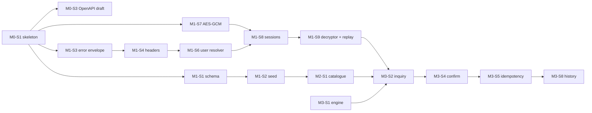

# Momkn Pay Backend — Milestones & Slices

| Item | Value |
|---|---|
| Document | Delivery plan |
| Scope | Backend track only (no auth module; all endpoints public) |
| Duration | 4 weeks (20 working days, ~6 h/day) |
| Related | [SRS.md](SRS.md) · [HLD.md](HLD.md) · [LLD.md](LLD.md) |

---

## How to read this

- A **milestone** ends with a demo. The next milestone does not start until that demo passes (brief: *review gates*).
- A **slice** is one ticket, one branch, one pull request: **≤ ~400 changed lines, ≤ 1 day of work**, and mergeable on its own (the build stays green, and no half-finished endpoint is exposed).
- Branch: `feature/<slice-id>-<short-name>`, for example `feature/M1-S3-error-envelope`. Commits: `feat(payment): …`, `test(crypto): …`.
- Every slice lists **Done when**, which is copied into the ticket as its acceptance criterion.
- `Refs` point to requirement IDs (SRS) and sections (HLD/LLD).
- **Tracking progress:** tick a box by changing `- [ ]` to `- [x]`. GitHub also lets you click the box directly in the rendered file. Tick each task line as it is done, tick the slice when its **Done when** line is ticked and the pull request is merged, and tick the milestone when all its slices are ticked and the exit demo has passed.

### Overview

| Milestone | Days | Theme | Demo (gate) |
|---|---|---|---|
| [M0](#m0--bootstrap-and-contract-freeze-days-12) | 1–2 | Bootstrap and contract freeze | OpenAPI 3.1 published. Clients run a mock server from it. |
| [M1](#m1--platform-foundations-days-35) | 3–5 | Platform, crypto, sessions | `docker compose up` over HTTPS. Create a session. Pinning rejects a proxy. |
| [M2](#m2--catalogue-and-profile-days-610) | 6–10 | Catalogue, sync, profile | Both apps load the catalogue, go offline and still search it. Profile edit works. |
| [M3](#m3--payment-flow-days-1115) | 11–15 | Inquiry, confirm, history | A full encrypted payment, then every mock rule on purpose. |
| [M4](#m4--hardening-and-release-days-1620) | 16–20 | Tests, audit, docs, release | Clean-machine `docker compose up`, `v1.0` tag, final demo. |

### Progress tracker

- [ ] [M0 — Bootstrap and contract freeze](#m0--bootstrap-and-contract-freeze-days-12) (4 slices)
- [ ] [M1 — Platform foundations](#m1--platform-foundations-days-35) (10 slices)
- [ ] [M2 — Catalogue and profile](#m2--catalogue-and-profile-days-610) (6 slices)
- [ ] [M3 — Payment flow](#m3--payment-flow-days-1115) (9 slices)
- [ ] [M4 — Hardening and release](#m4--hardening-and-release-days-1620) (8 slices)
- [ ] [M5 — Remove sessions](#m5--remove-sessions-after-v10) (4 slices, added after v1.0; **reversed by M6**)
- [ ] [M6 — Restore sessions](#m6--restore-sessions-after-v20) (4 slices, added after v2.0)

### Critical path

---

## M0 — Bootstrap and contract freeze (days 1–2)

- [ ] **M0 complete** (all slices done and the exit demo passed)

**Goal:** the clients are never blocked. By the end of day 2 the contract is published and frozen.
**Exit demo:** the OpenAPI 3.1 file is in `momknpay-contract`, and a Prism mock server started from it answers every endpoint.

- [x] **M0-S1 · Project skeleton**
  - [x] Spring Boot + Java 25 Maven project, package `com.momknpay`, `MomknPayApplication`.
  - [x] Dependencies: web, validation, data-jpa, flyway, postgresql, actuator, springdoc, spring-security-crypto, bucket4j, caffeine, testcontainers.
  - [x] `.gitignore` (`.env`, `certs/`, `target/`), `.env.example` (LLD §10.2), empty `README.md`.
  - [x] **Done when:** `mvn verify` passes, and the app starts against a local Postgres with an empty Flyway history.
  - Refs: HLD §15, LLD §2

- [ ] **M0-S2 · Repository hygiene and CI**
  - [ ] Protected `main`, a pull request template (description, test evidence, linked ticket), conventional-commit guideline in the README. *(template and conventions done; branch protection is set on GitHub once the remote exists)*
  - [x] GitHub Actions: `mvn -B verify` on every pull request.
  - [ ] **Done when:** a test pull request shows a green CI check and cannot merge without approval. *(needs the GitHub remote)*
  - Refs: NFR-MNT-5

- [ ] **M0-S3 · OpenAPI draft (contract)**
  - [x] Write `docs/openapi.yaml` by hand from LLD §6: all 10 endpoints, headers, DTO schemas, examples, the error envelope and every error code.
  - [x] Changelog section with `v1.0.0 — initial contract`.
  - [ ] **Done when:** the spec validates (`npx @redocly/cli lint`), Prism serves it, and both client tracks have reviewed it. *(lint and Prism verified; waiting for the client tracks' review)*
  - Refs: SRS §4, LLD §6

- [ ] **M0-S4 · Publish and freeze**
  - [ ] Push to `momknpay-contract`, add the Postman collection skeleton (folders from LLD §13.5), and announce the freeze. *(Postman skeleton done; pushing to `momknpay-contract` and announcing are manual)*
  - [ ] **Done when:** both client leads acknowledge the freeze. From now on every contract change needs an issue, sign-off from both clients and a version bump. *(manual)*
  - Refs: SRS C-7

---

## M1 — Platform foundations (days 3–5)

- [ ] **M1 complete** (all slices done and the exit demo passed) *(all slices merged; the proxy-rejection part of the demo is on the client tracks)*

**Goal:** everything that later features rely on: database, errors, headers, TLS, Docker, crypto, sessions.
**Exit demo:** `docker compose up` → `https://api.momknpay.local/docs` loads. `POST /sessions` returns a key. A client behind mitmproxy fails to connect because of pinning.

- [x] **M1-S1 · Database schema**
  - [x] `V1__schema.sql` exactly as in LLD §4.1 (tables, checks, unique and partial indexes, `transaction_seq`, `updated_at` trigger).
  - [x] JPA entities, enums and converters (LLD §5), `ddl-auto: validate`.
  - [x] **Done when:** the app boots with schema validation passing, and `SchemaIT` (Testcontainers) confirms the constraints exist, including the `ux_txn_idempotency` insert-twice failure.
  - Refs: NFR-REL-1…3, LLD §4–5

- [x] **M1-S2 · Seed: services and users**
  - [x] `V2__seed_services.sql`: 24 visible and 1 soft-deleted service (LLD §11.1).
  - [x] `V3__SeedUsers` Java migration with bcrypt(12) PINs (LLD §11.2).
  - [x] **Done when:** `SeedDataIT` passes: 3 users with working PINs, 6 categories, ≥ 24 visible services, the `_slow` and inactive services present.
  - Refs: FR-SEED-1…3

- [x] **M1-S3 · Error envelope and global handler**
  - [x] `ErrorCode` (all 22 codes, EN/AR messages), `ApiException`, `ErrorResponse`, `GlobalExceptionHandler` with the mapping table from LLD §7.2, whitelabel page off.
  - [x] **Done when:** `ErrorEnvelopeIT` passes: unknown route → `NOT_FOUND`, wrong method → `METHOD_NOT_ALLOWED`, malformed JSON → `VALIDATION_ERROR`, forced exception → `INTERNAL_ERROR` with no stack trace in the body.
  - Refs: FR-COM-3, NFR-REL-4, NFR-SEC-10

- [x] **M1-S4 · Request ID and required headers**
  - [x] `RequestIdFilter` (MDC + echo), `RequiredHeadersInterceptor`, `WebConfig` `/v1` prefix, logback pattern with `requestId`.
  - [x] **Done when:** `HeadersIT` passes: each missing or invalid header → 400 with the right `field`. `/docs` and `/actuator/health` are exempt. Every log line shows the request ID.
  - Refs: FR-COM-1…2, LLD §7.3–7.4, §7.7

- [ ] **M1-S5 · TLS, Dockerfile and Compose**
  - [x] Certificate generation script or README steps (LLD §13.3), `server.ssl.*`, multi-stage Dockerfile, `docker-compose.yml` with healthchecks.
  - [ ] Publish the **live and backup SPKI pins** to both client tracks. *(pins are generated into `certs/pins.txt`; posting them is manual)*
  - [ ] **Done when:** on a clean clone, `cp .env.example .env` + certs + `docker compose up` starts over HTTPS only (`http://` is refused), and the pins are posted in the contract repository. *(HTTPS-only Compose verified; waiting on the pins being posted)*
  - Refs: NFR-OPS-1…2, NFR-SEC-8, LLD §13

- [x] **M1-S6 · Current-user resolver**
  - [x] `@CurrentUser`, `UserRef`, `UserLookupService`, `CurrentUserArgumentResolver`.
  - [x] **Done when:** unit tests: missing `X-User-Id` → `VALIDATION_ERROR(X-User-Id)`, unknown → `USER_NOT_FOUND`, valid → `UserRef`. *(plus `CurrentUserIT`)*
  - Refs: FR-COM-4, LLD §7.5

- [x] **M1-S7 · AES-GCM cipher and key wrapper**
  - [x] `AesGcmCipher` (fresh IV per call, 128-bit tag), `KeyWrapper` with AAD = session ID, fail-fast check on `APP_MASTER_KEY`.
  - [x] **Done when:** U1, U2, U3 and U18 pass (round-trip, tamper, IV uniqueness, AAD binding), and startup fails with a bad master key.
  - Refs: NFR-SEC-1, NFR-SEC-4, LLD §8.1–8.2

- [x] **M1-S8 · Sessions API**
  - [x] `SessionService.create/revoke`, `SessionController` (`POST /v1/sessions`, `DELETE /v1/sessions/{id}`), `SessionCleanupJob`.
  - [x] **Done when:** `SessionIT`: create → 201 with a 32-byte key. Revoke → 204, idempotent. The key is never in the logs and never readable again. Foreign session → 404.
  - Refs: FR-SES-1…5, LLD §6.1–6.2, §8.3

- [x] **M1-S9 · Payload decryptor and replay guard**
  - [x] `PayloadDecryptor`, `ReplayGuard` (`REQUIRES_NEW`), `NonceCleanupJob`, a `TestCrypto` helper that mirrors the clients.
  - [x] **Done when:** U4 and U5 pass. `SessionIT` also covers expired → `SESSION_EXPIRED`, a bad blob → `DECRYPTION_FAILED`, and a replayed nonce → `DECRYPTION_FAILED`. *(covered in `PayloadDecryptorIT`)*
  - Refs: FR-SES-2, NFR-SEC-2…3, LLD §8.4–8.5

- [x] **M1-S10 · Rate limiter**
  - [x] `RateLimiter`, `RateLimitInterceptor` on `/v1/sessions` and `/v1/payments/confirm`, `Retry-After` header.
  - [x] **Done when:** `RateLimitIT`: the sixth `POST /sessions` in a minute → 429 with `Retry-After`. A different user is unaffected.
  - Refs: FR-SES-6, FR-PAY-11, NFR-SEC-9, LLD §7.6

---

## M2 — Catalogue and profile (days 6–10)

- [ ] **M2 complete** (all slices done and the exit demo passed) *(all backend slices merged; the offline/search demo runs on the client apps)*

**Goal:** the endpoints behind the offline-first list, search and profile screens.
**Exit demo:** both apps do a first load, then airplane mode, cold start, and the list and search still work. Pull-to-refresh uses `sync`. Profile edit round-trips.

- [x] **M2-S1 · `GET /v1/services`**
  - [x] `CatalogService.getAll`, `ServiceItem` / `CatalogResponse` DTOs, a mapper, and ordering by category then `nameEn`.
  - [x] **Done when:** `CatalogIT`: 24 items, inactive ones included with `isActive: false`, the deleted one absent, money as integers, `syncedAt` in ISO UTC.
  - Refs: FR-CAT-1…3, FR-CAT-7, LLD §6.5

- [x] **M2-S2 · `GET /v1/services/sync`**
  - [x] `since` parsing and validation, `>=` filters, `deletedIds`, `syncedAt` captured before the queries.
  - [x] **Done when:** `CatalogIT`: `since` before the seed → all rows. `since` = now → empty. Updating a row in SQL then calling sync → the row appears. The soft-deleted ID is in `deletedIds`. A bad `since` → 400 `field=since`. *(`syncedAt` is returned 5 s early to absorb app/DB clock skew — see LLD §6.6)*
  - Refs: FR-CAT-4…6, LLD §6.6

- [x] **M2-S3 · `GET /v1/profile`**
  - [x] `ProfileService.get`, `ProfileController`, `ProfileResponse`.
  - [x] **Done when:** `ProfileIT`: `usr_01` returns the seeded data. Missing or unknown user → the right errors.
  - Refs: FR-PRO-1, LLD §6.3

- [x] **M2-S4 · `PATCH /v1/profile`**
  - [x] `UpdateProfileRequest` validation, trimming and lower-casing, the email uniqueness check, unknown-property rejection (`mobile`).
  - [x] **Done when:** `ProfileIT`: update name, update email, empty body → 400, `mobile` in the body → 400 `field=mobile`, duplicate email → 409 `EMAIL_ALREADY_USED`.
  - Refs: FR-PRO-2…5, FR-COM-5, LLD §6.4

- [x] **M2-S5 · Swagger annotations and Postman (catalogue and profile)**
  - [x] `@Operation` / `@ApiResponse` with examples so the generated spec matches `docs/openapi.yaml`, and the Postman folders 01–03.
  - [x] **Done when:** the generated `/v3/api-docs` diffs clean against the frozen spec for these endpoints, and the Postman folders run green. *(`OpenApiContractIT` + Newman run, 9/9 assertions)*
  - Refs: NFR-DOC-1…3

- [ ] **M2-S6 · Wednesday integration fixes (buffer)**
  - [ ] Reserved for mismatches logged at the integration session. Each one is an issue, and any contract change goes through the version bump. *(no integration session has happened yet)*
  - [ ] **Done when:** every issue from the session is closed or scheduled.

---

## M3 — Payment flow (days 11–15)

- [ ] **M3 complete** (all slices done and the exit demo passed) *(all slices merged, Newman 38/38 green; the on-device payment demo is on the client apps)*

**Goal:** inquiry → confirm → receipt with encryption, idempotency and every mock rule. This is the heaviest week, so protect it.
**Exit demo:** a full payment with `1024750891` (total 25 320) on both devices, then digits 0, 6, 7, 8, 9, a `_slow` service, an inactive service, wrong PIN ×3, an expired inquiry and a retry with the same key.

- [x] **M3-S1 · Fee calculator and mock engine (pure)**
  - [x] `FeeCalculator` (`Math.ceilDiv`), `MockPaymentEngine`, `InquiryDecision`, `CustomerNames`, billMonth logic.
  - [x] **Done when:** U6–U9 pass: worked example 24750 → 500/70/25320, percentage fee rows, every last digit 0–9, the min-amount clamp. No database, no Spring context.
  - Refs: FR-MCK-1, SRS §6, LLD §9.1–9.2

- [x] **M3-S2 · `POST /v1/payments/inquiry`**
  - [x] `InquiryService.inquire` with the check order from LLD §6.7, pattern cache, persistence with a 5-min expiry, masked logging.
  - [x] **Done when:** `PaymentFlowIT` (inquiry part): the digit-1 happy path returns the exact contract JSON. Digit 0 → 404, 9 → 409, a bad pattern → 400 `subscriberNumber`, unknown service → 404, inactive → 503. *(`PaymentFlowIT` was split into `InquiryIT`, `ConfirmIT`, `ConfirmFailuresIT`, `PendingIT` and `TransactionIT`)*
  - Refs: FR-INQ-1…9, LLD §9.3

- [x] **M3-S3 · `_slow` delay**
  - [x] `SlowServiceDelay` (injectable, so tests can check it without sleeping), applied in a `finally` after the transaction. Virtual threads on.
  - [x] **Done when:** U10 passes. Manually, `svc_elec_canal_slow` takes ≈ 8 s while other requests stay fast. *(0.2 s in tests; the Newman run confirms ≈ 8 s against Docker)*
  - Refs: FR-MCK-2, NFR-PER-2

- [x] **M3-S4 · `POST /v1/payments/confirm` — happy path**
  - [x] `ConfirmService` with a `TransactionTemplate` and the `ConfirmOutcome` model, row lock on the inquiry, PIN check, `ReferenceGenerator`, and `SUCCESS` for digits 1–5.
  - [x] **Done when:** `PaymentFlowIT`: inquiry → confirm → 200 `SUCCESS`, `reference` in the form `MP-YYYYMMDD-NNNN`, inquiry `CONFIRMED`. Confirming again with a new key → `INQUIRY_ALREADY_CONFIRMED`. U19 passes.
  - Refs: FR-PAY-1, FR-PAY-5, FR-PAY-9…10, LLD §9.4–9.5

- [x] **M3-S5 · Idempotency**
  - [x] Replay lookup before decryption, re-check under the lock, catching the unique-constraint violation, `IDEMPOTENCY_CONFLICT`.
  - [x] **Done when:** U12 and U13 pass. `ConcurrencyIT`: 10 parallel confirms with the same key → 1 row and the same `transactionId` everywhere. A retry of the same bytes (same nonce) returns the receipt instead of `DECRYPTION_FAILED`.
  - Refs: FR-PAY-2…4, NFR-REL-1…2, HLD §8.4

- [x] **M3-S6 · Failure outcomes on confirm**
  - [x] Wrong PIN counter (3 → `INVALIDATED`), expired inquiry, `AMOUNT_OUT_OF_RANGE` (digit 6), a `FAILED` transaction plus 402 (digit 7), inactive service → 503.
  - [x] **Done when:** U11 and U14–U16 pass. Replaying the digit-7 key returns the same 402. `usr_03` with PIN `1234` → `VALIDATION_ERROR(pin)`.
  - Refs: FR-PAY-5…8, SRS §6.1

- [x] **M3-S7 · PENDING and its resolution**
  - [x] `PENDING` for digit 8 with `pendingUntil = now + 10s`, `PendingResolver.resolveIfDue` and the `sweep` job.
  - [x] **Done when:** U17 passes. `PaymentFlowIT`: confirm → `PENDING` with `paidAt: null`. After the clock advances 10 s, the receipt shows `SUCCESS` and `paidAt = pendingUntil`. *(the tests move `pending_until` into the past instead of advancing a clock)*
  - Refs: FR-TXN-5, HLD §8.5, LLD §9.6

- [x] **M3-S8 · History and receipt**
  - [x] `V4__seed_history.sql` (6 transactions for `usr_01`), `TransactionService.list/receipt`, `PageResponse`, pagination validation.
  - [x] **Done when:** `PaymentFlowIT`: `usr_01` history is newest first with correct paging totals. `usr_02` → empty list. Receipt fields match LLD §6.10. Another user's receipt → 404 `TRANSACTION_NOT_FOUND`. `size=51` → 400.
  - Refs: FR-TXN-1…4, FR-SEED-4, LLD §6.9–6.10, §11.3

- [x] **M3-S9 · Postman: every mock rule**
  - [x] Folders 04–06 with the pre-request encrypt helper, and one request per rule and error.
  - [x] **Done when:** a Postman or Newman run of the whole collection is green on a fresh `docker compose up`. *(Newman on a fresh stack: 39 requests, 38 assertions, 0 failures)*
  - Refs: FR-MCK-3, NFR-DOC-3

---

## M4 — Hardening and release (days 16–20)

- [ ] **M4 complete** (all slices done and the exit demo passed) *(all backend work done and `v1.0` tagged; the recording, the final demo and the reflections are manual)*

**Goal:** prove it, document it, ship it. **Days 18–19 are a feature freeze:** only fixes, tests and docs after that.
**Exit demo (day 20):** a clean machine runs `docker compose up` successfully the first time, the full happy path plus three failure cases are shown, and each intern answers one security question about their own code.

- [x] **M4-S1 · Log-hygiene audit**
  - [x] `LogHygieneTest` (I10), plus a manual `grep` of real logs for `1234`, `sessionKey`, `payload` and the full subscriber number. Hibernate bind logging confirmed off.
  - [x] **Done when:** the test is green and the grep results are attached to the pull request. *(the grep results are in the M4-S1 commit message: 0 hits)*
  - Refs: NFR-SEC-6, HLD §12

- [x] **M4-S2 · Test gap sweep**
  - [x] Fill any missing items from LLD §12 (U1–U19, I1–I10). Remove flaky sleeps in favour of a mutable `Clock`.
  - [x] **Done when:** `mvn verify` is green in CI with ≥ 8 unit tests (target: all of U1–U19) and every integration test listed. *(green locally: 88 unit + 110 IT; CI on GitHub needs the remote)*
  - Refs: NFR-MNT-4

- [x] **M4-S3 · Performance smoke test**
  - [x] A simple load script (k6 or JMeter) on the catalogue, inquiry and confirm. *(`scripts/perf-smoke.js` in Node instead of k6, reusing the verified AES-GCM helper)*
  - [x] **Done when:** p95 < 300 ms for non-`_slow` endpoints on a laptop, with results recorded in the README. *(all ≤ 50 ms p95 except confirm at 278 ms, whose budget is 500 ms because of bcrypt cost 12 — ADR-010)*
  - Refs: NFR-PER-1

- [x] **M4-S4 · Final OpenAPI and contract diff**
  - [x] Export `/v3/api-docs`, diff it against the frozen `docs/openapi.yaml`, and reconcile every difference (code fix, or version bump with client sign-off). Add the CI diff check.
  - [x] **Done when:** there is no unexplained diff and the contract changelog is up to date. *(no differences; the contract is unchanged since the freeze, so it stays v1.0.0)*
  - Refs: NFR-DOC-1…2, HLD §14

- [x] **M4-S5 · README**
  - [x] Setup steps a stranger can follow, the architecture diagram (from the HLD), decisions taken, known limitations (SRS §8, especially *no auth*), SPKI pins, seeded accounts, the mock-rule cheat sheet.
  - [x] **Done when:** someone outside the backend track follows it on a clean machine without asking questions. *(proven by the M4-S6 rehearsal)*
  - Refs: NFR-DOC-4

- [x] **M4-S6 · Clean-machine rehearsal**
  - [x] A fresh clone on a machine that has never run the project: follow the README only.
  - [x] **Done when:** `docker compose up` works the first time and the Postman collection is green. Fix anything that needed a workaround.
  - Refs: NFR-OPS-1

- [ ] **M4-S7 · Release `v1.0`**
  - [ ] Tag `v1.0`, export the final spec and Postman collection to `momknpay-contract`, and record the 5-minute screen recording (happy path plus 3 failures). *(`v1.0` tagged locally; the export to `momknpay-contract` and the recording are manual — see docs/RELEASE.md)*
  - [ ] **Done when:** the tag is pushed, the artifacts are published and the recording is shared. *(needs the remote and the recording)*

- [ ] **M4-S8 · Reflection and demo prep**
  - [ ] One-page reflection per intern. Rehearse the security questions: why AES-GCM on top of TLS, why a fresh IV, why the idempotency check comes before decryption, why no auth is not secure. *(docs/DEMO_GUIDE.md prepares the security questions and gives a reflection template)*
  - [ ] **Done when:** the reflections are submitted and the demo has been rehearsed once end to end. *(manual)*

---

## M5 — Remove sessions (after v1.0)

- [ ] **M5 complete** (all slices done; both client tracks have moved to contract v2.0.0)

> **Reversed by [M6](#m6--restore-sessions-after-v20)** (ADR-012). The ticked lines below record what was done for v2.0.0, not current behaviour; M5-S4 was never rolled out and is no longer needed.

**Goal:** the application has no sessions at all (ADR-011). Payloads stay AES-256-GCM-encrypted, with one static shared key.
**Exit demo:** a payment from both apps with no session call, using the shared key; `POST /v1/sessions` returns 404.

- [x] **M5-S1 · Remove sessions from the API and the code**
  - [x] Contract v2.0.0: drop `POST`/`DELETE /sessions`, `X-Session-Id`, `SESSION_NOT_FOUND`, `SESSION_EXPIRED`; changelog row.
  - [x] `V5__drop_sessions.sql`; remove the session entity, service, controller, cleanup job, key wrapping and master key.
  - [x] `PayloadKey` (static key from `APP_PAYLOAD_KEY`, fail-fast), `PayloadDecryptor` and `ReplayGuard` without sessions; package `session` → `payload`.
  - [x] Rate limit only on `/payments/confirm`.
  - [x] **Done when:** `./mvnw verify` is green, `OpenApiContractIT` matches v2.0.0, and an existing database upgrades in place. *(87 unit + 99 IT)*
  - Refs: ADR-011, SRS FR-ENC, LLD §4.1.1 and §8

- [x] **M5-S2 · Postman, scripts and certificate verification**
  - [x] Collection without session requests, key from the `payloadKey` variable, folders renumbered 01–05.
  - [x] Every request verifies the server certificate; default `baseUrl` is `https://localhost/v1`.
  - [x] `perf-smoke.js` without sessions.
  - [x] **Done when:** Newman passes with `--ssl-extra-ca-certs certs/cert.pem` and fails without it. *(34/34; refused without the certificate)*
  - Refs: NFR-DOC-3, NFR-SEC-8

- [x] **M5-S3 · Documents and version 2.0.0**
  - [x] ADR-011 (supersedes ADR-003, amends ADR-006); SRS, HLD, LLD, coding standards, demo guide, README, CLAUDE.md.
  - [x] Version 2.0.0 and CHANGELOG with the client migration note.
  - [x] **Done when:** no living document describes sessions as current behaviour.
  - Refs: NFR-DOC-2, NFR-DOC-4

- [ ] **M5-S4 · Roll out to the client tracks** *(manual)*
  - [ ] Tell both client tracks about contract v2.0.0 and get their sign-off.
  - [ ] Give them the shared payload key privately (not through git).
  - [ ] **Done when:** both apps pay without a session call.

---

## M6 — Restore sessions (after v2.0)

- [ ] **M6 complete** (all slices done; both client tracks have moved to contract v3.0.0)

**Goal:** the payload key is dynamic again: issued per session by `POST /v1/sessions`, valid 30 minutes, revoked on logout (ADR-012), exactly as in v1.0.
**Exit demo:** both apps create a session on start, pay with its key, and get `SESSION_EXPIRED` after revoking it.

- [x] **M6-S1 · Sessions back in the API and the code**
  - [x] Contract v3.0.0: `POST`/`DELETE /sessions`, `X-Session-Id`, `SESSION_NOT_FOUND`, `SESSION_EXPIRED`; changelog row.
  - [x] Session entity, service, controller, cleanup job, key wrapping and `APP_MASTER_KEY` restored from v1.0; `PayloadKey` and `APP_PAYLOAD_KEY` removed; package `payload` → `session`.
  - [x] `V6__restore_sessions.sql` (V5 untouched).
  - [x] Tests restored (`SessionIT`, `KeyWrapperTest`, session cases in the payment tests); the later review fixes are kept.
  - [x] **Done when:** `./mvnw clean verify` is green, `OpenApiContractIT` matches v3.0.0, and an existing v2.0.0 database upgrades in place. *(88 unit + 110 IT)*
  - Refs: ADR-012, ADR-003, SRS FR-SES-1…6, LLD §4.1 and §8

- [x] **M6-S2 · Postman and scripts**
  - [x] Collection with the session requests (folders 01–06, 38 requests), keeping `https://localhost/v1` and certificate verification.
  - [x] `perf-smoke.js` with sessions.
  - [x] **Done when:** Newman passes with certificate verification on, and the performance budgets hold. *(38/38; confirm p95 236 ms)*
  - Refs: NFR-DOC-3, NFR-PER-1

- [x] **M6-S3 · Documents and version 3.0.0**
  - [x] ADR-012 (supersedes ADR-011, reinstates ADR-003); SRS, HLD, LLD, coding standards, demo guide, README, CLAUDE.md.
  - [x] Version 3.0.0 and CHANGELOG with the client migration note.
  - [x] **Done when:** no living document describes the static shared key as current behaviour.
  - Refs: NFR-DOC-2, NFR-DOC-4

- [ ] **M6-S4 · Roll out to the client tracks** *(manual)*
  - [ ] Tell both client tracks about contract v3.0.0 and get their sign-off.
  - [ ] **Done when:** both apps pay with a session key and hold no built-in key.

---

## Definition of done — backend (from the brief, adapted)

- [ ] Every endpoint in SRS §4.6 works against the Dockerised backend and is used by both apps *(the backend side is done and proven by Newman; the apps are the client tracks')*
- [x] Every error code in SRS §4.4 is reachable, and each one returns the envelope
- [x] Encrypted payloads round-trip, and a replayed nonce is rejected
- [ ] Idempotency is proven by `ConcurrencyIT` and by a kill-and-retry from a real device *(`ConcurrencyIT` ✅; the kill-and-retry on a real device is a client-track demo)*
- [x] No secrets in git history, and no PIN, key or payload in the logs
- [ ] ≥ 8 unit tests passing, CI green *(green locally; CI on GitHub needs the remote)*
- [x] Swagger at `/docs` matches the published contract
- [x] README: how to run, architecture, decisions, known limitations
- [ ] All pull requests reviewed and merged, `v1.0` tagged *(`v1.0` tagged; pull request review needs the remote)*

## Stretch (only after the definition of done is fully green)

- [ ] **X-1** · Redis-backed rate limiter and nonce store (removes SRS L-4)
- [ ] **X-2** · Add real auth behind `CurrentUserArgumentResolver` (JWT), without changing controllers
- [ ] **X-3** · Cursor-based pagination for history
- [ ] **X-4** · Prometheus metrics (`/actuator/prometheus`) for payment outcomes
