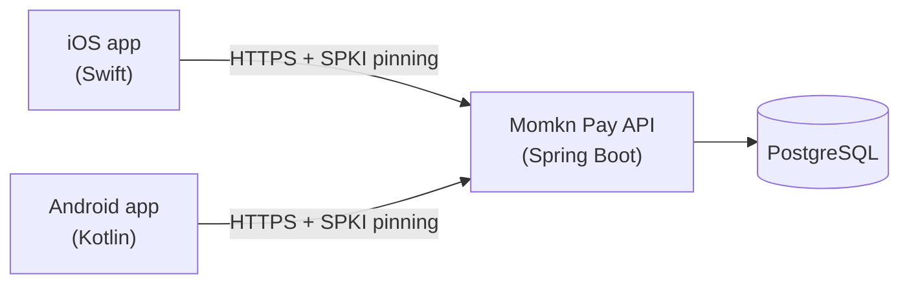

# Momkn Pay Backend — Software Requirements Specification (SRS)

| Item | Value |
|---|---|
| Document | Software Requirements Specification |
| Product | Momkn Pay — Backend API |
| Version | 3.0 (contract v3.0.0, paths under `/v1`) |
| Date | 2026-10-06 |
| Status | Draft for contract freeze |
| Related documents | [HLD.md](HLD.md), [LLD.md](LLD.md), *Momkn Pay — Internship Capstone Project Brief* (PDF), *Design.pdf* (sample UI) |

---

## Table of contents

1. [Introduction](#1-introduction)
2. [Overall description](#2-overall-description)
3. [Functional requirements](#3-functional-requirements)
4. [External interface requirements](#4-external-interface-requirements)
5. [Non-functional requirements](#5-non-functional-requirements)
6. [Mock payment rules (business rules)](#6-mock-payment-rules-business-rules)
7. [Seed data requirements](#7-seed-data-requirements)
8. [Out of scope and known limitations](#8-out-of-scope-and-known-limitations)
9. [Traceability matrix](#9-traceability-matrix)
10. [Changes from the original brief](#10-changes-from-the-original-brief)

---

## 1. Introduction

### 1.1 Purpose
This document states **what** the Momkn Pay backend must do. It is the reference that the backend track builds against and that the iOS and Android tracks integrate against. The High-Level Design ([HLD.md](HLD.md)) describes the architecture, and the Low-Level Design ([LLD.md](LLD.md)) describes the implementation.

### 1.2 Scope
Momkn Pay is a **simulated** bill-payment system for Egyptian utility services: electricity, water, gas, internet, mobile top-up and landline. The backend:

- serves a bilingual (Arabic/English) catalogue of payable services, with delta sync for offline-first clients;
- performs a **fees inquiry** for a subscriber number and returns an itemised, time-limited quote;
- **confirms payments** idempotently against that quote, using a PIN;
- keeps a **transaction history** with receipts;
- decides every payment outcome with a **deterministic mock payment engine**. No real money, payment service provider (PSP), card scheme or NFC is involved;
- protects the two sensitive fields (subscriber number and PIN) with **AES-256-GCM payload encryption** on top of TLS.

> **This project has no authentication module. Every endpoint is public.** There is no registration, login, JWT, refresh token or logout. A caller says which user it acts for with the `X-User-Id` header (see §2.5 and §8).

### 1.3 Definitions, acronyms and abbreviations

| Term | Meaning |
|---|---|
| **Piastre** | 1/100 of an Egyptian pound (EGP). All money is an integer number of piastres. `4550` = 45.50 EGP. |
| **Service** | A payable biller in the catalogue, for example *Cairo Electricity*. |
| **Subscriber number** | The customer's account number at the biller. Its format is given by the service's `inputPattern`. |
| **Inquiry** | A server-computed quote for one subscriber at one service. It is valid for 5 minutes. |
| **Confirm** | Paying an open inquiry with a PIN. It creates one transaction. |
| **Transaction** | The record of a payment attempt, with status `SUCCESS`, `FAILED` or `PENDING`. |
| **Idempotency key** | A client-generated UUID sent on confirm. The same key always maps to the same transaction. |
| **Session** | A short-lived crypto context created by `POST /sessions`. It holds the AES key used to encrypt payloads. It is *not* an authentication session. |
| **Session key** | 32 random bytes (AES-256 key), returned once in base64 when a session is created. |
| **Nonce** | 16 random bytes (hex) inside each encrypted payload, used to detect replays. |
| **AES-GCM** | Advanced Encryption Standard in Galois/Counter Mode: authenticated encryption. |
| **SPKI** | Subject Public Key Info. Clients pin its SHA-256 hash. |
| **FR / NFR** | Functional requirement / non-functional requirement. |

### 1.4 References
1. *Momkn Pay — Internship Capstone Project Brief*, 2026-09-20 (`docs/Momkn Pay — Internship Capstone Project Brief.pdf`)
2. *Momkn Pay — Capstone Sample UI* (`docs/Design.pdf`)
3. OpenAPI Specification 3.1
4. NIST SP 800-38D — Recommendation for GCM

### 1.5 Document conventions
- **MUST / SHOULD / MAY** follow RFC 2119.
- Requirement IDs: `FR-<area>-<n>` and `NFR-<area>-<n>`. The HLD and LLD refer to these IDs.

---

## 2. Overall description

### 2.1 Product perspective
The backend is one of three deliverables that speak a single frozen API contract:



The backend owns the API contract (OpenAPI 3.1), the database, the mock payment engine, the seed data and the TLS certificate.

### 2.2 Product functions (summary)
| # | Function | Area |
|---|---|---|
| P1 | Create and end crypto sessions | Sessions |
| P2 | View and edit the user profile | Profile |
| P3 | Full catalogue and delta sync | Catalogue |
| P4 | Fees inquiry with encrypted subscriber number | Payments |
| P5 | Idempotent payment confirmation with encrypted PIN | Payments |
| P6 | Transaction history and receipt | Transactions |
| P7 | Deterministic mock outcomes | Mock engine |

### 2.3 User classes and characteristics
| User class | Description |
|---|---|
| Mobile client (iOS / Android) | The main consumer. It calls the API on behalf of a seeded user identified by `X-User-Id`. |
| Intern / QA tester | Uses Swagger UI (`/docs`) and the Postman collection to reach every mock rule. |
| Mentor / reviewer | Reads logs, runs tests and checks the definition of done. |

### 2.4 Operating environment
- Runs in Docker: `docker compose up` starts the API and PostgreSQL with one command.
- Java 25, Spring Boot, PostgreSQL 16+.
- HTTPS only, with a self-signed certificate for `api.momknpay.local`. Base URL: `https://api.momknpay.local/v1`.

### 2.5 Design and implementation constraints
| ID | Constraint |
|---|---|
| C-1 | **No authentication.** All endpoints are publicly reachable. User context comes only from the `X-User-Id` header. |
| C-2 | **Money is integer piastres everywhere** (API, code, database). A float in a money field is a defect. |
| C-3 | All timestamps are ISO 8601 UTC (`2026-09-20T10:00:00Z`). |
| C-4 | Layered architecture: controller → service → repository. Controllers never access the database. |
| C-5 | Stack is fixed for the project: Spring Boot + Java + PostgreSQL + JPA + Flyway. |
| C-6 | No secret, private key or certificate key is committed to git. A `.env.example` is committed instead. |
| C-7 | The contract is frozen after publication. Changes need an issue, agreement from both client tracks and a version bump in the changelog. |
| C-8 | No real PSP, no real money, no NFC. |

### 2.6 Assumptions and dependencies
- A-1: Clients are trusted to send the correct `X-User-Id`. This is a teaching environment, not production (see §8).
- A-2: Clients pin the published SPKI hash and add `api.momknpay.local` to their hosts or DNS configuration.
- A-3: Server and client clocks are within ±120 s (NTP), because the encrypted payload carries a timestamp.
- A-4: Users exist only through the seed script. There is no self-registration.

---

## 3. Functional requirements

Each requirement has acceptance criteria (AC) that a test or Postman request can check.

### 3.1 Common request handling (FR-COM)

| ID | Requirement |
|---|---|
| FR-COM-1 | Every API request MUST carry `X-Request-Id` (UUID), `X-Client-Platform` (`ios` \| `android`) and `X-Client-Version` (non-empty). If one is missing or invalid, the response is `400 VALIDATION_ERROR` with `field` set to the header name. Swagger UI, the OpenAPI JSON and the health endpoint are exempt. |
| FR-COM-2 | The server MUST echo `X-Request-Id` in the response headers and include it in every log line for that request. |
| FR-COM-3 | Every non-2xx response MUST use the error envelope (§4.3), including unhandled exceptions, unknown routes and malformed JSON. |
| FR-COM-4 | User-scoped endpoints (sessions, profile, payments, transactions) MUST require `X-User-Id`. A missing header gives `400 VALIDATION_ERROR` (`field: "X-User-Id"`). An unknown user gives `404 USER_NOT_FOUND`. |
| FR-COM-5 | Unknown JSON properties in request bodies MUST be rejected with `400 VALIDATION_ERROR` naming the property. |

### 3.2 Sessions — encryption key issuance (FR-SES)

The session replaces "session key issued at login" from the brief. It exists only to share the AES-256 key used to encrypt the subscriber number and PIN.

| ID | Requirement |
|---|---|
| FR-SES-1 | `POST /sessions` (with `X-User-Id`) MUST create a session and return `sessionId`, `sessionKey` (base64 of 32 cryptographically random bytes) and `expiresAt`. |
| FR-SES-2 | A session MUST expire 30 minutes after creation. Using an expired session gives `410 SESSION_EXPIRED`. |
| FR-SES-3 | The session key MUST be returned **only once**, in the create response. No endpoint can read it back. |
| FR-SES-4 | A session belongs to the user that created it. Using it with a different `X-User-Id` gives `404 SESSION_NOT_FOUND`, which does not reveal that the session exists. |
| FR-SES-5 | `DELETE /sessions/{sessionId}` MUST revoke the session immediately (`204`). Later use gives `404 SESSION_NOT_FOUND`. |
| FR-SES-6 | `POST /sessions` MUST be rate-limited to 5 requests per minute per `X-User-Id` (`429 RATE_LIMITED`). |

**AC:** Create → use for inquiry → succeeds. Wait for expiry (or revoke) → inquiry fails with the right code. A session of user A used with `X-User-Id` of user B → 404.

### 3.3 Profile (FR-PRO)

| ID | Requirement |
|---|---|
| FR-PRO-1 | `GET /profile` MUST return `id`, `fullName`, `mobile`, `email` and `memberSince` for the `X-User-Id` user. |
| FR-PRO-2 | `PATCH /profile` MUST update `fullName` and/or `email` only. At least one field is required. |
| FR-PRO-3 | `fullName`: 2–100 characters after trimming. `email`: valid address, at most 254 characters, stored lowercase. |
| FR-PRO-4 | `mobile` is read-only. A request body containing `mobile` (or any other unknown field) gives `400 VALIDATION_ERROR` with `field: "mobile"`. |
| FR-PRO-5 | An email already used by another user gives `409 EMAIL_ALREADY_USED` with `field: "email"`. |

### 3.4 Services catalogue (FR-CAT)

| ID | Requirement |
|---|---|
| FR-CAT-1 | `GET /services` MUST return all non-deleted services, **including inactive ones** (clients show them disabled), in the envelope `{ syncedAt, items[] }`. |
| FR-CAT-2 | Each item MUST include `id`, `nameEn`, `nameAr`, `category`, `iconUrl`, `inputLabel`, `inputPattern`, `minAmount`, `maxAmount`, `isActive` and `updatedAt`. |
| FR-CAT-3 | `category` ∈ {`electricity`, `water`, `gas`, `internet`, `mobile`, `landline`}. |
| FR-CAT-4 | `GET /services/sync?since=<ISO-8601>` MUST return `{ syncedAt, items[], deletedIds[] }` where `items` are services created or updated at or after `since` and `deletedIds` are services deleted at or after `since`. Timestamps have one-second precision, so delivery is at-least-once, and clients upsert. |
| FR-CAT-5 | `syncedAt` MUST be the server time at which the snapshot was taken. Clients store it and send it as the next `since`. |
| FR-CAT-6 | A missing or unparseable `since` gives `400 VALIDATION_ERROR` (`field: "since"`). |
| FR-CAT-7 | The catalogue endpoints do not need `X-User-Id`, because the catalogue is public data. |

### 3.5 Fees inquiry (FR-INQ)

| ID | Requirement |
|---|---|
| FR-INQ-1 | `POST /payments/inquiry` MUST accept `{ serviceId, payload }` with headers `X-User-Id` and `X-Session-Id`. `payload` is the AES-GCM-encrypted JSON `{ subscriberNumber, nonce, ts }`. |
| FR-INQ-2 | The server MUST decrypt and validate the payload according to FR-SEC-1…6 before any business logic runs. |
| FR-INQ-3 | `subscriberNumber` MUST match the service's `inputPattern`. Otherwise the response is `400 VALIDATION_ERROR` (`field: "subscriberNumber"`). |
| FR-INQ-4 | An unknown `serviceId` gives `404 SERVICE_NOT_FOUND`. An inactive service gives `503 SERVICE_UNAVAILABLE`. |
| FR-INQ-5 | The outcome MUST follow the mock rules in §6. |
| FR-INQ-6 | A successful response MUST contain `inquiryId`, `serviceId`, `customerName`, `billMonth` (`YYYY-MM`), `amountDue`, `serviceFee`, `vat`, `total`, `currency` (`"EGP"`) and `expiresAt`. |
| FR-INQ-7 | `serviceFee`, `vat` and `total` MUST be computed with the fee formula (§6.3), on the server, in integer piastres. |
| FR-INQ-8 | An inquiry MUST expire 5 minutes after creation (`expiresAt`). |
| FR-INQ-9 | The inquiry MUST be persisted with the user, service, session, subscriber number, amounts, the resolved mock rule and its expiry. |

### 3.6 Payment confirmation (FR-PAY)

| ID | Requirement |
|---|---|
| FR-PAY-1 | `POST /payments/confirm` MUST accept `{ inquiryId, payload }` with headers `X-User-Id`, `X-Session-Id` and **`Idempotency-Key` (UUID, required)**. `payload` decrypts to `{ pin, nonce, ts }`. |
| FR-PAY-2 | **Idempotency:** if a transaction already exists for (`X-User-Id`, `Idempotency-Key`), the server MUST return that transaction, rebuilt from its current state, **without** decrypting the payload or creating a new transaction. A success or pending result returns `200`. A failed result returns the same error envelope as the first time. |
| FR-PAY-3 | Reusing an `Idempotency-Key` with a **different** `inquiryId` gives `409 IDEMPOTENCY_CONFLICT`. |
| FR-PAY-4 | Two concurrent requests with the same key MUST produce exactly one transaction. |
| FR-PAY-5 | An unknown inquiry, or one that belongs to another user, gives `404 INQUIRY_NOT_FOUND`. An inquiry past `expiresAt` gives `410 INQUIRY_EXPIRED`. An inquiry invalidated by wrong PINs gives `410 INQUIRY_INVALIDATED`. An inquiry that already has a `SUCCESS` or `PENDING` transaction gives `409 INQUIRY_ALREADY_CONFIRMED`. |
| FR-PAY-6 | The PIN MUST be exactly 4 digits and MUST be checked against the user's bcrypt PIN hash. A wrong PIN gives `400 VALIDATION_ERROR` with `field: "pin"` and increments the inquiry's failure counter. |
| FR-PAY-7 | **Three wrong PINs in a row** on the same inquiry MUST invalidate it. Later confirms give `410 INQUIRY_INVALIDATED`. |
| FR-PAY-8 | If the inquiry's `amountDue` is outside the service's `[minAmount, maxAmount]` (mock rule 6), the confirm MUST be rejected with `422 AMOUNT_OUT_OF_RANGE`, and no transaction is created. |
| FR-PAY-9 | On a mock outcome, a transaction MUST be created with a unique `transactionId`, a unique `reference` in the form `MP-YYYYMMDD-NNNN`, and all amounts. |
| FR-PAY-10 | A success response MUST contain `transactionId`, `status`, `reference`, `paidAt`, `total` and `service { id, nameEn, nameAr }`. `paidAt` is `null` while the transaction is `PENDING`. |
| FR-PAY-11 | `POST /payments/confirm` MUST be rate-limited to 5 requests per minute per `X-User-Id`. |
| FR-PAY-12 | The PIN MUST never be stored or logged, in plaintext or encrypted form. |

### 3.7 Transactions and receipts (FR-TXN)

| ID | Requirement |
|---|---|
| FR-TXN-1 | `GET /payments/transactions?page=&size=` MUST return the `X-User-Id` user's transactions, **newest first**, paginated. `page` is 0-based (default `0`) and `size` is 1–50 (default `20`). |
| FR-TXN-2 | The page envelope MUST contain `items`, `page`, `size`, `totalItems` and `totalPages`. |
| FR-TXN-3 | `GET /payments/transactions/{id}` MUST return the full receipt: transaction fields, service names, subscriber number, customer name, bill month and itemised amounts. |
| FR-TXN-4 | A transaction that does not exist, or belongs to another user, gives `404 TRANSACTION_NOT_FOUND`. |
| FR-TXN-5 | A `PENDING` transaction whose resolve time has passed MUST be reported as `SUCCESS`, with `paidAt` set, on every read path (list, receipt, idempotent replay). |

### 3.8 Mock payment engine (FR-MCK)

| ID | Requirement |
|---|---|
| FR-MCK-1 | Outcomes MUST be decided deterministically by the rules in §6. There is no randomness. |
| FR-MCK-2 | Services whose `id` ends in `_slow` MUST delay the inquiry and confirm responses by 8 seconds. |
| FR-MCK-3 | Rules MUST be reachable from the Postman collection (one request per rule). |

---

## 4. External interface requirements

### 4.1 Transport
- HTTPS only, TLS 1.2+. No HTTP listener and no fallback.
- Base URL: `https://api.momknpay.local/v1`.
- Content type: `application/json; charset=utf-8`.
- The certificate is self-signed (mkcert or openssl). Its **SPKI SHA-256** hash (and a backup hash) is published to both client tracks.

### 4.2 Headers

| Header | Direction | Required on | Format |
|---|---|---|---|
| `X-Request-Id` | Request and response | All API calls | UUID |
| `X-Client-Platform` | Request | All API calls | `ios` \| `android` |
| `X-Client-Version` | Request | All API calls | Free text, for example `1.0.3` |
| `X-User-Id` | Request | Sessions, profile, payments, transactions | User ID, for example `usr_01` |
| `X-Session-Id` | Request | `/payments/inquiry`, `/payments/confirm` | Session ID |
| `Idempotency-Key` | Request | `/payments/confirm` | UUID |
| `Retry-After` | Response | `429` responses | Seconds |

### 4.3 Error envelope
Every non-2xx response:

```json
{
  "error": {
    "code": "INQUIRY_EXPIRED",
    "messageEn": "This inquiry has expired.",
    "messageAr": "انتهت صلاحية الاستعلام.",
    "field": null
  }
}
```

Clients switch on `code`, never on the message text. `field` names the offending input (a body property, query parameter or header) when there is one.

### 4.4 Error codes

| Code | HTTP | Meaning |
|---|---|---|
| `VALIDATION_ERROR` | 400 | Bad input. `field` names the offending key (including `pin` for a wrong PIN and header names). |
| `DECRYPTION_FAILED` | 400 | Bad blob, wrong key, tampered ciphertext, stale `ts` or replayed `nonce`. |
| `INSUFFICIENT_BALANCE` | 402 | Simulated decline (mock rule 7). |
| `USER_NOT_FOUND` | 404 | `X-User-Id` does not match a user. |
| `SESSION_NOT_FOUND` | 404 | Unknown, revoked or foreign session. |
| `SERVICE_NOT_FOUND` | 404 | Unknown `serviceId`. |
| `SUBSCRIBER_NOT_FOUND` | 404 | No bill for that number (mock rule 0). |
| `INQUIRY_NOT_FOUND` | 404 | Unknown or foreign inquiry. |
| `TRANSACTION_NOT_FOUND` | 404 | Unknown or foreign transaction. |
| `NOT_FOUND` | 404 | Unknown route. |
| `METHOD_NOT_ALLOWED` | 405 | Wrong HTTP method for the route. |
| `BILL_ALREADY_PAID` | 409 | Nothing due (mock rule 9). |
| `EMAIL_ALREADY_USED` | 409 | Profile email conflict. |
| `IDEMPOTENCY_CONFLICT` | 409 | Key reused for a different inquiry. |
| `INQUIRY_ALREADY_CONFIRMED` | 409 | The inquiry already has a successful or pending transaction. |
| `SESSION_EXPIRED` | 410 | Past the session's `expiresAt`. |
| `INQUIRY_EXPIRED` | 410 | Past the inquiry's `expiresAt`. |
| `INQUIRY_INVALIDATED` | 410 | Three wrong PINs on this inquiry. |
| `AMOUNT_OUT_OF_RANGE` | 422 | `amountDue` outside the service's `[minAmount, maxAmount]` (mock rule 6). |
| `RATE_LIMITED` | 429 | Too many attempts. See `Retry-After`. |
| `INTERNAL_ERROR` | 500 | Unexpected server error. No details are leaked. |
| `SERVICE_UNAVAILABLE` | 503 | Inactive service (simulated provider outage). |

### 4.5 Encrypted payload format (shared with clients)
- Algorithm: AES-256-GCM, 12-byte random IV per message, 128-bit tag, no additional authenticated data (AAD).
- Key: the `sessionKey` of the session named in `X-Session-Id`.
- Wire format: `base64( iv(12) ‖ ciphertext ‖ tag(16) )`, standard base64 with padding.
- Plaintext: UTF-8 JSON that always contains `nonce` (32 hex characters = 16 random bytes) and `ts` (Unix seconds).

### 4.6 Endpoint summary

| # | Method | Path | User header | Purpose |
|---|---|---|---|---|
| 1 | POST | `/sessions` | `X-User-Id` | Create a crypto session and return the AES key |
| 2 | DELETE | `/sessions/{sessionId}` | `X-User-Id` | Revoke a session |
| 3 | GET | `/profile` | `X-User-Id` | Current user's profile |
| 4 | PATCH | `/profile` | `X-User-Id` | Update name and email |
| 5 | GET | `/services` | — | Full catalogue |
| 6 | GET | `/services/sync?since=` | — | Delta since a timestamp |
| 7 | POST | `/payments/inquiry` | `X-User-Id`, `X-Session-Id` | Fees inquiry (encrypted body) |
| 8 | POST | `/payments/confirm` | `X-User-Id`, `X-Session-Id`, `Idempotency-Key` | Pay (encrypted body, idempotent) |
| 9 | GET | `/payments/transactions?page=&size=` | `X-User-Id` | History |
| 10 | GET | `/payments/transactions/{id}` | `X-User-Id` | Single receipt |

Tooling endpoints (outside `/v1`, no custom headers needed): `GET /docs` (Swagger UI), `GET /v3/api-docs` (OpenAPI JSON), `GET /actuator/health`.

---

## 5. Non-functional requirements

### 5.1 Security (NFR-SEC)

| ID | Requirement |
|---|---|
| NFR-SEC-1 | Payload encryption MUST use AES-256-GCM with a fresh 12-byte IV per message and a 128-bit tag. The server MUST never write its own padding or MAC and never use ECB mode. |
| NFR-SEC-2 | The server MUST reject a payload whose `ts` differs from server time by more than 120 seconds, or whose `nonce` has already been seen, with `DECRYPTION_FAILED`. |
| NFR-SEC-3 | Seen nonces MUST be retained for at least 5 minutes (longer than the ts window, so a replay can never slip through). |
| NFR-SEC-4 | Session keys MUST be generated with a CSPRNG (`SecureRandom`) and stored **wrapped** (AES-GCM encrypted) with a master key from the environment. They are never stored in plaintext. |
| NFR-SEC-5 | PINs MUST be stored only as bcrypt hashes (cost ≥ 12). |
| NFR-SEC-6 | Logs MUST never contain the PIN, session key, encrypted or decrypted payloads, or the master key. The subscriber number MUST be masked in logs (last 4 digits only). |
| NFR-SEC-7 | No secret, key or certificate private key in the repository. Configuration comes from environment variables, and `.env.example` documents them. |
| NFR-SEC-8 | TLS is mandatory. The SPKI hash of the live key and of a backup key are published for pinning. |
| NFR-SEC-9 | Rate limits: 5/min per user on `/sessions` and `/payments/confirm`. |
| NFR-SEC-10 | Error responses MUST NOT leak stack traces, SQL or internal class names. |

### 5.2 Reliability and data integrity (NFR-REL)

| ID | Requirement |
|---|---|
| NFR-REL-1 | Exactly one transaction per (`user`, `Idempotency-Key`), enforced by a database unique constraint, not only in application code. |
| NFR-REL-2 | At most one `SUCCESS` or `PENDING` transaction per inquiry (database-enforced). |
| NFR-REL-3 | Every money column is `BIGINT` (piastres). There are no floating-point types anywhere in money handling. |
| NFR-REL-4 | A global exception handler maps every error to the envelope. There are no scattered try/catch blocks for response shaping. |
| NFR-REL-5 | Confirm runs in a single database transaction with a row lock on the inquiry. |

### 5.3 Performance (NFR-PER)

| ID | Requirement |
|---|---|
| NFR-PER-1 | p95 latency < 300 ms for every endpoint on a developer laptop, except `_slow` services (by design +8 s) and `POST /payments/confirm`, whose budget is **< 500 ms** because the bcrypt cost-12 PIN check alone takes ~230 ms (NFR-SEC-5 wins; see DECISIONS.md ADR-010). |
| NFR-PER-2 | An 8-second `_slow` delay MUST NOT block other requests. Virtual threads are enabled. |
| NFR-PER-3 | `GET /services` returns at least 24 services in one response, without pagination. |

### 5.4 Maintainability and quality (NFR-MNT)

| ID | Requirement |
|---|---|
| NFR-MNT-1 | Layering: controller → service → repository. DTOs at the boundary. Entities are never serialised directly. |
| NFR-MNT-2 | DTO validation at the boundary (Bean Validation), with field-level errors. |
| NFR-MNT-3 | Database schema changes only through versioned Flyway migrations committed to the repository. |
| NFR-MNT-4 | At least 8 automated unit tests covering: encryption round-trip, replay rejection, idempotency, inquiry expiry, and each mock payment rule. |
| NFR-MNT-5 | Conventional commits, protected `main`, pull requests reviewed. |

### 5.5 Portability and operability (NFR-OPS)

| ID | Requirement |
|---|---|
| NFR-OPS-1 | `docker compose up` on a clean machine (after copying `.env.example` to `.env` and generating the certificate) starts the API and database, runs migrations and seeds data. |
| NFR-OPS-2 | A health endpoint exists for Compose health checks. |
| NFR-OPS-3 | Structured logs to stdout with `requestId` on every line. |

### 5.6 Documentation (NFR-DOC)

| ID | Requirement |
|---|---|
| NFR-DOC-1 | Swagger UI served at `/docs`, generated from code and kept current. |
| NFR-DOC-2 | OpenAPI 3.1 spec exported to the contract repository, with a changelog. |
| NFR-DOC-3 | A Postman (or Bruno) collection covering every endpoint and every mock rule, committed to the repository. |
| NFR-DOC-4 | A README with setup steps, an architecture diagram, decisions and known limitations. |

---

## 6. Mock payment rules (business rules)

### 6.1 Rules by the last digit of the subscriber number

| Last digit | Inquiry result | Confirm result |
|---|---|---|
| 0 | `404 SUBSCRIBER_NOT_FOUND` | — |
| 1–5 | Success, normal bill: `amountDue` = digits 3–7 of the number (piastres) | `SUCCESS` |
| 6 | Success, but `amountDue` = service `maxAmount` + 10 000 (above the maximum) | `422 AMOUNT_OUT_OF_RANGE`. The client must block payment before this. |
| 7 | Success, normal bill | Transaction `FAILED`, response `402 INSUFFICIENT_BALANCE` |
| 8 | Success, normal bill | `PENDING`, which becomes `SUCCESS` 10 seconds after creation |
| 9 | `409 BILL_ALREADY_PAID` | — |

**Digits 3–7** are the 1-based character positions 3 to 7. For `1024750891` they are `24750`. If the result is below the service's `minAmount`, `amountDue` is raised to `minAmount`.

### 6.2 Rules by service

| Condition | Result |
|---|---|
| `id` ends in `_slow` | The response is delayed 8 s (inquiry and confirm). |
| `isActive = false` | `503 SERVICE_UNAVAILABLE` on inquiry and confirm. |

### 6.3 Fee formula (all values in piastres, rounded **up**)

```
serviceFee = max(500, ceil(0.005 × amountDue))
vat        = ceil(0.14 × serviceFee)
total      = amountDue + serviceFee + vat
```

**Worked example:** subscriber `1024750891` → `amountDue = 24750`, `serviceFee = max(500, 124) = 500`, `vat = 70`, `total = 25320` (253.20 EGP). The last digit is 1, so this is the happy path.

### 6.4 Other rules
- `customerName` is deterministic for a subscriber number, so the same number always shows the same name.
- `billMonth` is the calendar month before the inquiry date (UTC).
- A wrong PIN gives `VALIDATION_ERROR` with `field: "pin"`. Three in a row on the same inquiry invalidate it.
- A `FAILED` transaction (rule 7) leaves the inquiry open. The client may retry with a **new** idempotency key until the inquiry expires.

---

## 7. Seed data requirements

| ID | Requirement |
|---|---|
| FR-SEED-1 | At least **24 services** across all six categories, each with Arabic and English names. They MUST include at least one `_slow` service and at least one inactive service. |
| FR-SEED-2 | Three fixed test users: |

| User ID | Mobile | PIN | Purpose |
|---|---|---|---|
| `usr_01` | `01000000001` | `1234` | Happy path, has transaction history |
| `usr_02` | `01000000002` | `1234` | Fresh account, empty history |
| `usr_03` | `01000000003` | `9999` | Any other PIN is rejected, which tests the wrong-PIN path |

| ID | Requirement |
|---|---|
| FR-SEED-3 | Seed data is identical on every machine: fixed IDs and deterministic values. |
| FR-SEED-4 | `usr_01` has at least 5 historical transactions covering `SUCCESS` and `FAILED`. |

---

## 8. Out of scope and known limitations

**Out of scope:** registration, login, logout, JWT, refresh tokens, passwords, change password, real PSPs, card schemes, NFC, wallet balances, certificate transparency, App Attest / Play Integrity, HSM, key-rotation protocols, PCI-DSS.

**Known limitations (accepted because this is a teaching exercise):**

| # | Limitation | Consequence | What a real product would do |
|---|---|---|---|
| L-1 | No authentication. `X-User-Id` is trusted. | Anyone who can reach the API can act as any user, read their profile and history, and create sessions for them. | OAuth2/OIDC or JWT with short-lived access tokens and refresh rotation. |
| L-2 | The session key is issued over TLS to any caller. | The payload encryption protects against an intermediary that terminates TLS and logs bodies. It does **not** protect against a malicious caller. | Bind the key to an authenticated session or derive it via ECDH. |
| L-3 | The PIN is the only secret that authorises a payment. | A 4-digit PIN is guessable. The limits (3 wrong PINs per inquiry, 5 confirms/min) only slow an attacker down. | Account lockout, device binding, step-up authentication. |
| L-4 | In-memory rate limiting | Resets on restart and does not work across several instances. | Redis-backed distributed limiter. |

---

## 9. Traceability matrix

| Requirement | Endpoint / component | Verified by (see LLD §12) |
|---|---|---|
| FR-COM-1…3 | `RequiredHeadersInterceptor`, `GlobalExceptionHandler` | `HeadersIT`, `ErrorEnvelopeIT` |
| FR-COM-4 | `CurrentUserArgumentResolver` | `ProfileIT` |
| FR-SES-1…5 | `POST/DELETE /sessions` | `SessionServiceTest`, `SessionIT` |
| FR-SES-6, FR-PAY-11 | `RateLimitInterceptor` | `RateLimitIT` |
| FR-PRO-1…5 | `GET/PATCH /profile` | `ProfileIT` |
| FR-CAT-1…7 | `GET /services`, `GET /services/sync` | `CatalogServiceTest`, `CatalogIT` |
| FR-INQ-1…9 | `POST /payments/inquiry` | `InquiryServiceTest`, `PaymentFlowIT` |
| FR-PAY-1…5 | `POST /payments/confirm` (idempotency) | `ConfirmServiceTest.idempotency*`, `ConcurrencyIT` |
| FR-PAY-6…7 | PIN verification | `ConfirmServiceTest.wrongPin*` |
| FR-PAY-8…10 | Confirm outcome | `MockPaymentEngineTest`, `PaymentFlowIT` |
| FR-TXN-1…5 | `GET /payments/transactions[/{id}]` | `TransactionServiceTest`, `PaymentFlowIT` |
| FR-MCK-1…3, §6 | `MockPaymentEngine`, `FeeCalculator` | `MockPaymentEngineTest`, `FeeCalculatorTest` |
| NFR-SEC-1…3 | `AesGcmCipher`, `ReplayGuard` | `AesGcmCipherTest`, `ReplayGuardTest` |
| NFR-SEC-6 | Logging configuration | `LogHygieneTest` |
| NFR-REL-1…2 | DB constraints | `ConcurrencyIT` |
| FR-SEED-1…4 | Flyway seed migration | `SeedDataIT` |

---

## 10. Changes from the original brief

| Brief | This SRS | Reason |
|---|---|---|
| `POST /auth/register`, `/auth/login`, `/auth/refresh`, `/auth/logout` | **Removed** | The project has no auth module. |
| `sessionKey` issued by login | `POST /sessions` issues `sessionId` + `sessionKey`. Requests send `X-Session-Id`. | The payload-encryption learning goal is kept without login. |
| Logout clears the session key | `DELETE /sessions/{id}` | Same effect. |
| `Authorization: Bearer` on protected calls | `X-User-Id` header | No tokens. |
| `POST /profile/change-password` | **Removed** | Passwords have no use without login. |
| `refresh_tokens` table | `sessions` table | Stores wrapped session keys. |
| `INVALID_CREDENTIALS`, `TOKEN_EXPIRED`, `MOBILE_ALREADY_USED` | **Removed** | Auth-only errors. |
| — | Added `USER_NOT_FOUND`, `SESSION_NOT_FOUND`, `SESSION_EXPIRED`, `SERVICE_NOT_FOUND`, `INQUIRY_NOT_FOUND`, `INQUIRY_INVALIDATED`, `INQUIRY_ALREADY_CONFIRMED`, `IDEMPOTENCY_CONFLICT`, `AMOUNT_OUT_OF_RANGE`, `TRANSACTION_NOT_FOUND`, `EMAIL_ALREADY_USED`, `NOT_FOUND`, `METHOD_NOT_ALLOWED`, `INTERNAL_ERROR` | Every failure path gets a distinct, switchable code. |
| Rate limit on `/auth/login` | Rate limit on `/sessions` | Login no longer exists. `/sessions` is its nearest equivalent. |
